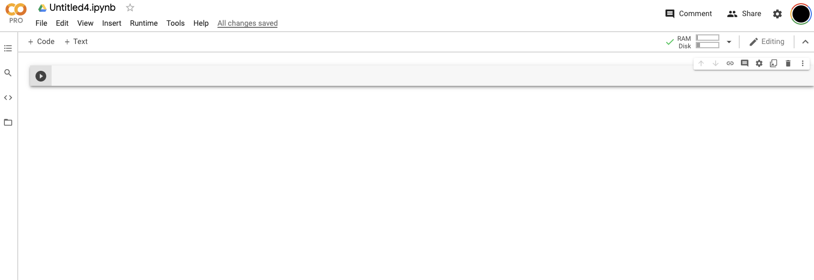
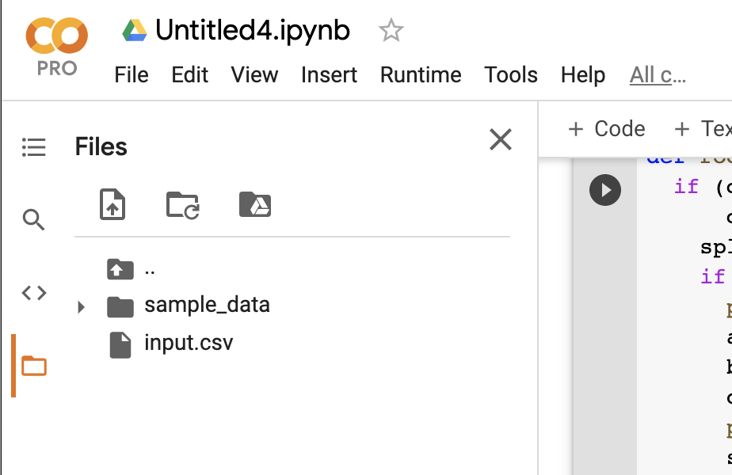

# Chapter 3

Now that we have covered some of the basics of computer science and algorithms, it's time to get into the nitty-gritty of applying those concepts. Just as an astronomer uses a telescope to carry out his or her craft, so does the computer scientist using programming to bring their algorithms and ideas into a reality. The point being that algorithms are a tool for transforming procedural steps into real life. Consequently, we need to understand how to write these programs so that we can get actually useful outputs from an algorithm or (in the coming chapters) an AI program.

Programs themselves are just text files. Text files by themselves do not do anything. Rather we must feed those text files into a another program whose job is to *interpret* those text files, line by line, and produce useful output based on the syntax (arrangement of commands) present in that text file. 

> Side note: Sometimes, the programs that interpret text files may actually do something called *compiling*. A program that compiles something (a *compiler*) will translate that program into machine code (aka assembly language). This representation of your program is almost equivalent to the 1s and 0s that your computer processor (CPU) uses to execute instructions (ie steps) of your program. The big advantage of compiling something is that it should work on almost any machine and it will be very fast (since the program is already in a format that your CPU can understand). Programs that must be interpreted will require that the end user of your program have the interpreting program installed on their machines. There are exceptions to the rules (e.g. programs that interpret segments of code but compile other segments that are used often to save time), but this is the general dichotomy of programs that execute other programs.

But if programs are text files, how do we tell computers what exactly to do. It is pretty clear that you can't just type in "Diagnose this patient with X based on Y characteristics". Rather, programs must be written in a specific format (using some special words) to produce the expected output. There are many different ways to write up instructions in these formats, and each of those different ways is known as a language. There are several programming languages out there such as C, Python, R, Java, and much more. Each of them is optimized for a specific goal: C is generally considered to be used to make very efficient programs. Python is used for scientific computing. R tends to be used for statistics. Java tends to be used to create applications that can be used on any operating system (so long as they have Java installed). For this book, we will be learning how to use **Python** since it is used widely in research and scientific computing tasks involving machine learning and AI in general.

## Getting Started with Python

In order to write python, you do not need anything on your system other than a text editor (on Mac this is TextEdit, on Windows this is Notepad). However, in order to execute (aka "run") python programs, you will need to have the python interpreter installed on your computer. To make things simple (and to help ensure that all readers of this book have a similar experience), I would advise that you instead use Colab by Google. To get that running, go to [https://colab.research.google.com/](https://colab.research.google.com/) and sign in with your google account. 

Then go to the "File" menu (in the upper left hand corner), and click "New Notebook". You should be greated with a blank screen that just contains a single cell gray cell with a play button next to it.



> Side Note: In the case that Colab is not available when you are reading this book, you should do the following (note: the instructions cannot be too specific since standards for how to do the following vary as the years go by). 
1) Download a python installation for your system.
2) Create a folder in your system is the place where you will write your programs.
3) You will need to learn how to use the command line in your system. Look up a tutorial for this. For windows, it is also advised that you enable windows subsystem for linux.
4) Once you do that, open a terminal/command prompt and type in "cd " followed by the path to the folder where you want to write your programs. E.g. if that is on your desktop in a folder called "MyPrograms", I would write `cd ~/Desktop/MyPrograms`. Here the `~` represents the path to the home directory. 
5) With your python installation, you should have something called "pip" installed (this is a package manager which allows you to download programs that other people have made). To verify that you have this installed, in your command prompt type `python -m pip --version`. and you should get some output along the lines `pip X.Y.Z`. 
6) Run `pip install notebook` in your command line.
7) Run `jupyter notebook` and open the web browser.

This is not quite the text files I was talking about earlier. Rather it is a quick prototyping tool known as a notebook. In this setting, you can run single lines of programs without needing to worry about saving files and running things from the command line. This is optimial for creating programs that help in an exploratory analysis of data or creating one-off lines of code.

In the first cell (the thing with the gray block): type in the following

```py
print("Hello world")
```

Then press the Play button on the left or press `Shift + Enter` on your keyboard.

You should see the text "Hello world" printed out. Congratulations, you have written your first program! 

#### What just happened?

The line `print("Hello world")` will execute a function called `print` that exists in the python standard library. This function `print` takes in a single input (called an argument). That input is just the text you would like to be output from the `print` function. Print will then copy that text (aka a "string") over to something called the "standard output". The standard output will display that text to you, the person executing the program.

#### Stepping it up a bit:

Let's try and do something a little bit more complicated, like finding the roots of a quadratic formula. From school, we know that if an equation has the general form of $ax^2 + bx + c$, it will have two solutions $$\frac{-b \pm \sqrt{b^2-4ac}}{2a}$$. 

Let's try an initial shot at how we might do this in python for the equation $x^2 - 8x+ 12$. Maybe we can just type in stuff as we do in a calculator.

Type in the following into the next cell (Click the "+ Code" button if you don't have another cell available). 

```py
(-(-8) + ((-8)^2 - (4*1*12))^(1/2))/(2*1)
```

Then click run: 

You should see something along thes lines of: 

```py
TypeError Traceback (most recent call last)
<ipython-input-4-f7fc0a4be28c> in <module>()
----> 1 (-(-8) + ((-8)^2 - (4*1*12))^(1/2))/(2*1)

TypeError: unsupported operand type(s) for ^: 'int' and 'float'
```


Since we aren't seeing our expected output and we see the word "Error" in the output, we can safely assume we did something wrong. Going to the last line of the output, we see that we have something called a "TypeError" and that we have an unsupported operand types for "^". What does this mean? 

Well...it turns out that in python does not raise something to the power of something else. Rather it actually does a bitwise exclusive OR on what is to the left and what is to the right of the carat (don't worry about what this exactly is). 

After some searching, it turns out that you have to use `**` when taking the power of something in python. Let's try this again: 

**INPUT**

```py
(-(-8) + ((-8)**2 - (4*1*12))**(1/2))/(2*1)
```

**OUTPUT**

```
6.0
```

Great! And to get the other output, let's type in the cell the other form of the equation: 

**INPUT**

```py
(-(-8) + ((-8)**2 - (4*1*12))**(1/2))/(2*1)
(-(-8) - ((-8)**2 - (4*1*12))**(1/2))/(2*1)
```

**OUTPUT**

```
2.0
```

Hmm...so why are we only seeing one output this type. Well this is just an oddity with python notebooks. It will only print out the last line of a set of commands unless you explicitly print out a value before then. So let's just wrap both of our equations in a "print" function like so: 

**INPUT**

```py
print((-(-8) + ((-8)**2 - (4*1*12))**(1/2))/(2*1))
print((-(-8) - ((-8)**2 - (4*1*12))**(1/2))/(2*1))
```

**OUTPUT**

```
6.0
2.0
```

That's great! We get the outputs we expected, but what if someone asks us to get the roots of a different quadratic equation. What if they ask us to get the roots of 100 different quadratic equations. Well...we may be out of luck because we would need to somehow change our program for each of those inputs. Unless there is some other solution out there.

#### Variables, Methods/Functions, String operations, Print String Interpolation Applied: 

It turns out there is such a solution. We can store the values for a, b, and c into something called variables. Variables are just letters or words that can be assigned to some value. We can then just use the variables to carry out our calculations.

Redoing our expression in terms of variables, it would look something like the following. 

**INPUT**

```py
a = 1 # setting a equal to 1
b = -8 # setting b equal to -8
c = 12 # setting c equal to 12
print((-(b) + ((b)**2 - (4*a*c))**(1/2))/(2*a))
print((-(b) - ((b)**2 - (4*a*c))**(1/2))/(2*a))
```

**OUTPUT**

```
6.0
2.0
```

A couple of things to note about the above example. First, lines that have a `# some text` will not be interpreted past the `#` mark. They are used to 'comment' code (i.e., leave a note for people reading the code later on). Second, when we write `a = 1`, we are setting the variable `a` equal to the value of `1`. We can set variables equal to anything, even other variables! 

When we rewrite our expression, we only need to rewrite the explicit numbers in our expression and can instead refer to them by their variables.

Also, it looks like the +/- part of our quadratic equation solver can be cleaned up a bit to not repeat our code (this is a process called "refactoring"). We can instead set the $\sqrt{b-4ac}$ part equal to another variable called `sqrt_part`.

**INPUT**

```py
a = 1 # setting a equal to 1
b = -8 # setting b equal to -8
c = 12 # setting c equal to 12
sqrt_part = ((b)**2 - (4*a*c))**(1/2)
print((-(b) + sqrt_part)/(2*a))
print((-(b) - sqrt_part)/(2*a))
```

**OUTPUT**

```
6.0
2.0
```


Great, we still get our same outputs, and we have cleaned up the code a bit (it looks a bit less like a glob of variables and numbers. 

> Side note: Variables (e.g. `a` and `sqrt_part` can be named anything, but there are some rules as to how they can be named. Typically, they cannot start with a number, cannot contain `?`, `#`, `+`, `-`, `<spaces>`, `' or "` and they usually cannot be part of a set of "reserved words" (e.g. "print") which already refer to functions/syntax in the python ecosystem. A safe bet would be to name your variables only using letters and an underscore `_` to make variable names readable to humans.

But the issue still remains that we must manually specify what a, b, and c are. We can help solve that by making this code cell into a function. This function will accept text (aka a string) containing the quadratic formula we want to solve and output the two solutions. 

To define a function (called a "method" in python), we will wrap our code in that function and specify a single argument to that function (ie the string containing the quadratic formula). 

```py
def root_finder(quadratic):
  a = 1 # setting a equal to 1
  b = -8 # setting b equal to -8
  c = 12 # setting c equal to 12
  sqrt_part = ((b)**2 - (4*a*c))**(1/2)
  print((-(b) + sqrt_part)/(2*a))
  print((-(b) - sqrt_part)/(2*a))
```

Note: In python, we must "indent" the inner body of our function by pressing the "tab" character. 

We can execute this function (i.e. "call" it), by writing `root_finder("some text")` in another cell. Right now, it will not actually interpret our text we input, but it will output the results from the previous quadratic we were working on so far.

To actually go from the text of a quadratic to getting the values of a, b, and c, we need to make some assumptions about how someone will input values into our function. Let's assume that someone will specify the quadratic as `"ax^2 + bx + c = 0"`. We can do the following to get at the values we want: 

1) "Split" the input string into three parts: one containing ax^2, another containing bx, the last containing c. Those three parts are roughly split if we can remove the 

2) For the ax^2 part, remove the "x^2" part of our string and convert the "a" part into a number. For the bx part, remove the "x" part of our string and convert the rest to a number. And for the "c = 0" part of our string, remove the " = 0" part of the string and convert the rest. 

Here's how that would look like in code: 

**INPUT**

```py
def root_finder(quadratic):
  split_result = quadratic.split(" + ")
  print(split_result)
  a = int(split_result[0].replace('x^2', ''))
  b = int(split_result[1].replace('x', ''))
  c = int(split_result[2].replace(' = 0', ''))
  print(f"a = {a}, b = {b}, c = {c}")
  sqrt_part = ((b)**2 - (4*a*c))**(1/2)
  pos_root = (-(b) + sqrt_part)/(2*a)
  neg_root = (-(b) - sqrt_part)/(2*a)
  print(f"Positive root = {pos_root}. Negative root = {neg_root}")
```

**OUTPUT**

```
```

What gives. Why is there no output? Well, what we have defined here is a function. We have not actually called that function. To fix that, insert the line `root_finder("1x^2 + -8x + 12 = 0")` at the bottom of your cell and you should see the following being output: 
**INPUT**

```py
def root_finder(quadratic):
  split_result = quadratic.split(" + ")
  print(split_result)
  a = int(split_result[0].replace('x^2', ''))
  b = int(split_result[1].replace('x', ''))
  c = int(split_result[2].replace(' = 0', ''))
  print(f"a = {a}, b = {b}, c = {c}")
  sqrt_part = ((b)**2 - (4*a*c))**(1/2)
  pos_root = (-(b) + sqrt_part)/(2*a)
  neg_root = (-(b) - sqrt_part)/(2*a)
  print(f"Positive root = {pos_root}. Negative root = {neg_root}")

root_finder("1x^2 + -8x + 12 = 0")
```

**OUTPUT**

```
['1x^2', '-8x', '12 = 0']
a = 1, b = -8, c = 12
Positive root = 6.0. Negative root = 2.0
```

Okay, we see our final output at the end. Now let's dive into our function definition line-by-line so we can see what is happening.

```py
def root_finder(quadratic):
```

This line states that we are naming a function called `root_finder`. It accepts a value (aka an argument) which we will assign to the variable named `quadratic`. 

```py
  split_result = quadratic.split(" + ")
  print(split_result)
```

These two lines will split our input string into something called a `list` based on the locations of the substring ` + `. A `list` is simply a container for multiple other values. We can then access those values individually to read them or even write over them. the `.split(" + ")` syntax is a little bit weird. But basically, all strings in python (which `quadratic` is going to be) have a method associated with them called `split`. It basically acts as a scissor that will cut up a string into parts based on the string (the delimiter) you put in. To call the `split` method, we use the `.` operator since it is part of the methods associated with a general type of variable. There are other methods such as `replace` associated with the string operator as well (we'll see that later on). 

After that, we assign the value from our `split` call to the variable `split_result` and then we print `split_result`. The output of that first print call gets us the first line of output `['1x^2', '-8x', '12 = 0']`. That means that our `split` call gave us a list of 3 elements `'1x^2'`, `'-8x'`, `'12 = 0'`. Note the `'` represents that the value is a string (ie a mix of text, numbers and other characters). 

Next, we have the following:

```py
  a = int(split_result[0].replace('x^2', ''))
  b = int(split_result[1].replace('x', ''))
  c = int(split_result[2].replace(' = 0', ''))
```

Let's start off with the first line. We will take the first element of the list `split_result` (well...in python the first element of a list is actually the "zero-th" element of the list) and we will replace the string `x^2` with an empty string. We will then call the `int` function on whatever is produced from that function call. So what does all of this allow us to do? Let's run it (mentally) on our first value in the split_result array. `split_result[0]` gets us `'1x^2'`. Doing `'1x^2'.replace('x^2', '')` get us `'1'`. We can't do mathematical operations on a piece of text. Rather we need to get the number from that text. We are specifically trying to get out an integer (whole number) from the text, so we call `int(split_result[0].replace('x^2', ''))` or equivalently in our example `int('1')`. to get `a = 1` at the end.

For the other two, we follow a similar pattern: 
* `int(split_result[1].replace('x', ''))` means we go from `int('-8x'.replace('x',''))` to `int('-8')` to `-8`.
* `int(split_result[2].replace(' = 0', ''))` means we go from `int('12 = 0'.replace(' = 0',''))` to `int('12')` to `12`.

Now, a, b and c are all the numbers we want. But to make sure, we call the following function:

```py
  print(f"a = {a}, b = {b}, c = {c}")
```

Looking at the associated output: `a = 1, b = -8, c = 12`, we can see that it isn't quite what we expected (why aren't we printing out the the braces?). It turns out that adding the `f` in front of the string you input into the `print` function gives the print function some special properties. It will actually *interpolate* (i.e. include) the value of variables (wrapped in curly braces) within the string passed to `print` as an argument. As a result we get the values of a, b, and c in our output. 

The rest of our function is relatively the same until the following: 

```py
  sqrt_part = ((b)**2 - (4*a*c))**(1/2)
  pos_root = (-(b) + sqrt_part)/(2*a)
  neg_root = (-(b) - sqrt_part)/(2*a)
  print(f"Positive root = {pos_root}. Negative root = {neg_root}")
```

Here I assign the values of the positive root function and the negative root function to the variables `pos_root` and `neg_root`. I also print out these values at the end (using the string interpolation concept I mentioned before). 

And the last line is just a call to our function with the argument `"1x^2 + -8x + 12 = 0"` where the `"` indiates that the argument is a string.

```py
root_finder("1x^2 + -8x + 12 = 0")
```

> Side Note: Since our function is self contained, we do not need to call it within the same notebook cell. We can actually call this function from a new notebook cell. The only thing to keep in mind is that we need to re-run the notebook cell containing the function definition if we change that function itself. This will write over the previous function stored in the notebook's memory. If you don't re-run the cell, you would be running the old version of the function (which has led to programming snafus in the past). To be safe, just re-run any cells that contain function defintions.

### Minor improvements: If Statements

Congratulations, you have written your own quadratic solver. But there are a few things we should be mindful of. First, we need to make sure that our input is in the right format. By "right format", I mean that it should contain at least two " + " substrings and end with " = 0". It should also contain "x^2 " and "x ". Believe it or not, we can test for these things in our function. 

**INPUT**

```py
def root_finder(quadratic):
  if (quadratic.find("x^2 ") > -1 and quadratic.find("x ") > -1 and
      quadratic.find(" = 0") > -1):
    split_result = quadratic.split(" + ")
    if (len(split_result) == 3):
      print(split_result)
      a = int(split_result[0].replace('x^2', ''))
      b = int(split_result[1].replace('x', ''))
      c = int(split_result[2].replace(' = 0', ''))
      print(f"a = {a}, b = {b}, c = {c}")
      sqrt_part = ((b)**2 - (4*a*c))**(1/2)
      pos_root = (-(b) + sqrt_part)/(2*a)
      neg_root = (-(b) - sqrt_part)/(2*a)
      print(f"Positive root = {pos_root}. Negative root = {neg_root}")
    else:
      print("Malformed input. Expected two ' + ' in string.")
  else:
    print("Malformed input. Excpected x^2, x, and = 0 in string.")
  
root_finder("1x^2 + -8x + 12 = 0") # Expect to get out 6.0 and 2.0
print("SEPARATOR")
root_finder("1x^2 -8x + 12 = 0") # Expect Malformed input.
```

**OUTPUT**

```
['1x^2', '-8x', '12 = 0']
a = 1, b = -8, c = 12
Positive root = 6.0. Negative root = 2.0
SEPARATOR
Malformed input. Expected two ' + ' in string.
```

The major cahnges to our function are the addition of `if` statements. `if` statements allow us to generally do the following:

```
if (this statement is true):
    execute this code
else:
    do something else
```

In our case, our first if statement is the following: 

```py
  if (quadratic.find("x^2 ") > -1 and quadratic.find("x ") > -1 and
      quadratic.find(" = 0") > -1):
```

There are a couple of things to cover here. First `.find` is another method associated with strings in python. It will try to find for the string passed in as an argument and return the *index* of that string (i.e. the starting location of the string you're looking for in the string it is called on, starting numbering as 0). If it doesn't find the string you're looking for in the string you're calling .find on, it will return -1. Effectively, this means that we will be looking for the strings x^2, x, and = 0 in our input (quadratic). 

> Side Note: If I didn't include the space after "x " in the 2nd find call, the function would technically execute, but it wouldn't produce the expected behavior. Why? Let's look at the input: "1x^2 + -8x + 12 = 0". If I ask python to look for "x", it will return 1 because the first time x shows up is at the 1st indexed position (2nd letter in human terms...recall that python starts numbering at 0). Clearly, we want it to be something the 9th index (10th character). We can fix that by including the extra space to the argument since the only time we see an "x" followed by a " " is after -8. 

Now we need to deal with the `and`s in that line. `and` is a logic operator that is basically asking whether the statements to the left and to the right are true or not. For a well formed input, we would expect that the find statements `quadratic.find("x^2 ") > -1`, `quadratic.find("x ") > -1`, and `quadratic.find(" = 0") > -1` are all greater than -1 (ie exist in our string) and satisfy the inequalities (e.g. x^2 exists at index 1 which is > -1, so `quadratic.find("x^2 ") > -1` is `True`). If all of the above are true, then the code block under the `if` (indented one "level" beyond the `if`) is executed. If not, python will look for a keyword `else` or `elif` (aka else if: only used if you want to check another condition before going to the else) at the same level of the `if` statement. To check if something is at the same level as another statement, just visually see if they are vertically aligned with each other or not. If they are, they're at the same level. 

If the input does not have x^2, x, or = 0, then we execute the else that prints out `"Malformed input. Excpected x^2, x, and = 0 in string."`

We also see another if statement further on: 

```py
    if (len(split_result) == 3):
```

This actually helps check to see if we see two " + " substrings within our input format. Why does it do that? Recall that `split_result` will produce a list that cuts of a string when it sees " + ". In our prior example, we showed that split_result will make a list that has three elements. That means that if we have a well formed input, we would expect to see a list that has 3 elements as well. We can check to see if that is true by passing in `len(split_result) == 3` to our `if` statement. `len` is a function that will find the length of whatever is passed to it (usually a list or a string). The `==` is the equality logical operator. It determines if the left side is equal to the right side: 

> Side note: Other common equality operators you'll see are `<` (meaning left is less than right), `<=` (left is less than or equal to right), `>` (left is greater than right), `>=` (left is greater than or equal to right), `==` (left is equal to right), `!=` (left is not equal to right), and `in` (left is contained within right...only to be used when right is something called a "dict" or a list).

Since our normal input will produce a `split_result` list of length 3, we expect the equality check to pass in this case. If not, we go to the `else` at the same level as this `if` and find that it will print out "Malformed input. Expected two ' + ' in string.". 

Last change: 

```
root_finder("1x^2 + -8x + 12 = 0") # Expect to get out 6.0 and 2.0
print("SEPARATOR")
root_finder("1x^2 -8x + 12 = 0") # Expect Malformed input.
```

Here we call `root_finder` twice. The first time we expect to get outputs 6 and 2. We then print the word "SEPARATOR" (just to help visually separate outputs) and then we call `root_finder` on a malformed input that does not have the correct format (we need to see a " + " after the x^2). In our output we see that the if statement for that failed and see the following overall as expected: 

```
Positive root = 6.0. Negative root = 2.0
SEPARATOR
Malformed input. Expected two ' + ' in string.
```
 
### More Improvements: File Input and For Loops/Iteration

Let's say we want the user to also be able to supply a CSV file containing a single column with the header "Formula", then read the csv, then call our function. 

First let's make a csv with some example formulas.

|Formula|
|---|
|1x^2 + -8x + 12 = 0|
|2x^2 + -9x + 12 = 0|
|3x^2 + -8x + 8 = 0|
|4x^2 + -7x + 12 = 0|
|5x^2 + -10x + 12 = 0|

Save this csv file as  "input.csv" file (can be done in Excel, NOTE: make sure that you select the type to be a CSV file). 

In Colab, go to the side bar and click on the folder icon. Click the upload icon and then upload the "input.csv" file. You should see the following in your file menu.



Now, we need to somehow process an input .csv file: 

We can do that by editing our code to the following: 

```py
import csv

def root_finder(quadratic):
  # ...same as before

def read_file(filename):
  with open(filename) as csv_file:
    csv_data = csv.reader(csv_file)
    for idx, row in enumerate(csv_file):
      if (idx > 0): 
        root_finder(row)

read_file("input.csv")
```

If we execute that, we should see the following output: 

```
['1x^2', '-8x', '12 = 0\n']
a = 1, b = -8, c = 12
Positive root = 6.0. Negative root = 2.0
['1x^2', '-9x', '12 = 0\n']
a = 1, b = -9, c = 12
Positive root = 7.372281323269014. Negative root = 1.6277186767309857
['1x^2', '-8x', '8 = 0\n']
a = 1, b = -8, c = 8
Positive root = 6.82842712474619. Negative root = 1.1715728752538097
['1x^2', '-7x', '12 = 0\n']
a = 1, b = -7, c = 12
Positive root = 4.0. Negative root = 3.0
['1x^2', '-10x', '12 = 0']
a = 1, b = -10, c = 12
Positive root = 8.60555127546399. Negative root = 1.3944487245360109
```

It seems like those are the expected outputs. But let's take a deeper look at what we've just done.

In the first line of the block, we have a line that says `import csv`. This line allows us to use some functionality that python does not load by default but is nonetheless included in the python standard library (collection of tools that are useful to have without installing anything else). the `csv` library allows us to read and write csv files without worrying about the complexities associated with validating its format and making the system calls to do so. 

Next we move onto the new function `read_file`. Read file takes an argument `filename` which (as we see in the last line) will be a string of the name of our csv file. 

> **Note**: If we were to put this file in a subfolder, we would need to specify this argument as `"SUBFOLDERNAME/CSVNAME.csv"`. 

Next we have the line: 

```
  with open(filename) as csv_file:
      csv_data = csv.reader(csv_file)
```

This statement actually opens our csv file and the `with` keyword will key python into making sure that we delete its location in memory once we are done using it (otherwise it would stick around forever...or at least until we shut down this notebook). We then ask the `csv` library to read the csv file. It produces a CSV `Reader` object (think of this as a set of functions and variables packed into a single word) that is assigned to the variable `csv_data`.  

> **Side note:** Objects are pervasive throughout programming. They are a construct that allow programmers to easily call and execute functions and get properties that are inter-related to each other. To get an understanding of what objects are, we have to understand how they are made. Objects are made via other things called "Classes". These classes specify the properties and methods that make up an object.
> Here is an example class that holds a name, age, height, and weight for a patient and also calculates a bmi for that patient
> 
> ```py
> # Define the class Patient which has properties age, height, and weight
> class Patient:
>   def __init__(self, name, age, height, weight):
>       self.name = name
>       self.age = age
>       self.height = height
>       self.weight = weight
>   def get_bmi(self):
>       return self.weight / ((self.height)**2)
> 
> # Instantiate a patient object with specific age height and weight
> bob = Patient("bob", 24, 1.76, 63.5)
> # print out bob's BMI
> print(bob.get_bmi()) # outputs: 20.499741735537192
> print(f"Bob's height is {bob.height}m. His weight is {bob.weight}kg.")
> # The above outputs: "Bob's height is 1.76m. His weight is 63.5kg."
> ```
> We define a class (called `Patient` in this case) that has properties name, age, height and weight. The method called `__init__` is in charge of processing the values we use to instantiate (i.e. create) an object using the class. Here all we do is tell python to keep track of the arguments we supply. We do this by assigning properties to `self`. Breaking down this statement further, when we write `self.name = name`, we are telling python "create a *property* called 'name' and set it equal to the argument "name" that I passed into this function). We do this for all the other properties as well (but we could do fancy things like validate our input values. 
> We also create a method on the object called `get_bmi`. By default, all methods that intend to access values associated with a class must have one argument called `self`. We can then use the properties from that object in the method body itself. Here we make a `get_bmi` method that will return a BMI for a patient (based on taking their weight, which can be accessed via self.weight, and dividing it by its height squared). 
> When we run `bob = Patient("bob", 24, 1.76, 63.5)`, we create a instance of the `Patient` class (aka we have made a Patient object) and have assigned it to the variable bob. We can call the `get_bmi` method on the bob instance we made just by typing a `.` followed by the name of the method. We can also get at any other properties on the `self` object by running `variable_of_the_instance.name_of_the_property`. In this case, if we want to access `bob`'s height, we write `bob.height` as we do in our string interpolation statement of this code sample. There are many other things we can do with objects, but this is just the beginning.

Next, we have the following: 

```py
    for idx, row in enumerate(csv_file):
      if (idx > 0): 
        root_finder(row)
```

Now what does this `for` statement do? Think about the structure of our csv file. There is a header which will be present on the first row (or the 0th row in python's counting system). Then each of the rows that follow will contain each of the quadratics we want to evaluate. If we knew how to get our csv file to be equivalent to a list (like we saw earlier), we could just individually enumerate which indices of that list we want to run root_finder on. For example, let's say that the rows in our csv were all in a list called `quads`. `quads[0]` would give us our csv header ("Formula" in this case). `quads[1]` would give us `1x^2 + -8x + 12 = 0`, `quads[2]` would give us `2x^2 + -9x + 12 = 0` and so on. We could call our root finder function just by passing each of these into the method as follows `root_finder(quads[1])`. However, this is inefficient as we don't know ahead of time how many rows are in our csv file. Instead we can use a `for` loop.  This allows us to say "for each item in a list (or some other collection of objects that can be iterated through), do the following". In the example just mentioned, we could write something like 

```
for quad in quads:
    root_finder(quad)
```

This statement allows us to assign each item in our list to the temporary variable `quad`. As we sequentially go through the elements in `quads` (i.e. *iterate* through the list), we assign each variable temporarily to `quad` and then pass use it in the body of the for loop (here we pass `quad` as an argument to `root_finder`). We can also get access to what element number we are on the list by wrapping our list of items in an `enumerate` call and re-writing our for loop as follows:

```
for index, quad in enumerate(quads):
    if index > 0:
        root_finder(quad)
```

Recall the the first element of `quads` would be just the word "Formula" which isn't a valid input to `root_finder`. So we only run `root_finder` if the index is > 0 (i.e. we aren't running it on the first aka zero-th element which is equal to "Formula"). 

We are basically doing the exact same thing with enumerate in our original code. Except in this case, we can actually call `enumerate` on the `csv_file` variable containing the Reader object. We can do this because the reader object has specific implementation properties that make it "iterable" (i.e. a for loop can be used on it). By extension, we can wrap it in an `enumerate` call and temporarily assign the index value we are at in the loop sequence to `idx` and the value of that row to `row`. We then only call our `root_finder` function when  the `idx` is `> 0`. 

The last line of interest just contains `read_file("input.csv")` which calls our `read_file` function with the `input.csv` file name.

### File Output, Dictionaries, List Operations

Currently, we output the results from our `root_finder` call to standard output (i.e. the console). It would be nice if we could output it to a csv file that has one column called "equation", containing the original equation, and "positive root", and another called "negative root" to contain the results. Each row would correspond to the original equation.

Let's see how that would be written out.

```py
import csv

def root_finder(quadratic):
  if (quadratic.find("x^2 ") > -1 and quadratic.find("x ") > -1 and
      quadratic.find(" = 0") > -1):
    split_result = quadratic.split(" + ")
    if (len(split_result) == 3):
      a = int(split_result[0].replace('x^2', ''))
      b = int(split_result[1].replace('x', ''))
      c = int(split_result[2].replace(' = 0', ''))
      sqrt_part = ((b)**2 - (4*a*c))**(1/2)
      pos_root = (-(b) + sqrt_part)/(2*a)
      neg_root = (-(b) - sqrt_part)/(2*a)
      return (pos_root, neg_root)
    else:
      print("Malformed input. Expected two ' + ' in string.")
      return None
  else:
    print("Malformed input. Excpected x^2, x, and = 0 in string.")
    return None

def read_write_file(input_filename, output_filename):
  answers = []
  with open(input_filename) as csv_file:
    csv_data = csv.reader(csv_file)
    for idx, row in enumerate(csv_file):
      if (idx > 0): 
        answer = root_finder(row)
        if answer != None:
          positive_root, negative_root = answer
          answer_dict = {
              "equation": row,
              "positive root": positive_root,
              "negative root": negative_root,
          }
          answers.append(answers_dict)
  if len(answers) > 0:
    with open(output_filename, 'w') as csv_output_file:
      fieldnames = ["equation", "positive root", "negative root"]
      csv_writer = csv.DictWriter(csv_output_file, fieldnames=fieldnames)
      csv_writer.writeheader()
      for a in answers:
        csv_writer.writerow(a)

read_write_file("input.csv", "output.csv")
```

This is complicated, but let's break down what the changes are:

1. In `root_finder`, we have now removed some print statements (kept the ones that print in cases of input errors). And we added `return` statements. Return statements allow us to pass values between functiosn and assign the output of functions to variables. `print` statements that we have been using until now do not enable us to capture the output and assign that to a variable. Here we return either the `pos_root` and `neg_root` in the form of a tuple (data structure that contains two values), or the value `None` which is a reserved word in python that doesn't equal anything except another value/variable equal to `None`. We do this so we can check whether the output is valid or not (if it isn't, the output will be equal to `None`). 

2. We have renamed `read_file` to `read_write_file` since it now contains another function (writing a file). The arguments have changed, we now accept two arguments, the input filename and the output filename. 

Let's dive deeper into the body of the `read_write_file` function. In order to write results to a csv file, we have to keep track of the results that we have accumulated so far. We will use a list to do so. 

> Side Note: Lists are a common structure used to hold data (aka a Data structure) in python. As the name would imply, they typically are just a list of individual objects, variables, or other values. Lists can be assigned to other variables (just as anything else in python) and we can access individual elements of a list by writing `list_variable[index]` where `list_variable` is the variable equal to your list and `index` is the number of the element you want to access. Note that lists always start their numbering at 0, so if you want to get the first element of the list you would write `list_variable[0]`. What if you wanted to get the last element of a list? Well, you would somehow need to know the length of the list itself. That can be accessed by wrapping your `list_variable` in a `len()` call like so `len(list_variable)`. To get the last element of the list we would do `list_variable[len(list_variable)-1]` (we must use the -1 at the end since we start numbering at 0. A shorthand for the above is just to do `list_variable[-1]`.
> In the case that you try and access a list element that does not exist (for example `list_variable[len(list_variable)]`, you may get an error that says something along the lines of an `IndexError` saying that the `list index is out of range`. That usually means that you tried to access an element that doesn't exist and you should go back to your code and make sure you're counting from 0. 
> We can make a new list just by typing in `list_variable = ['element 1', 'element 2']`, but what if we want to add more elements to this list after we initially create it? Well, all we need to do is call `list_variable.append(something)`. This will add a new element (equivalent to `something`) to the end of our list. We can find elements in a list by doing `list_variable.find(value_of_element_you_want_to_find)`. Lastly, you can remove an element from a list by doing `list_variable.remove(value of element to remove)`. 

Each element of the list will have to somehow contain the original equation, the positive root, and the negative root. These values can be packed together in a single construct called `Dictionary`. A dictionary allows us to specify a set of "keys" and "values" in a single contained statement. A "key" is a reference name we use to look up an associated "value". For example, we could make a dict as follows: 

```py
bob = {
    "name": "Bob Jones",
    "height": 1.76,
    "weight": 67.0
}
```

And then access properties by writing the `variable name['key name we want']`. Note: in the below code sample, I write what is outputted as a comment (i.e. words following the `#` symbol). 

```py
print(bob['name']) # Bob Jones
print(bob['height']) # 1.76
print(bob['weight']) # 67.0
``` 

We can also edit the dict as follows: 

```py
bob['gender'] = 'Male' # adds a key "gender" and set it equal to "Male"
bob['height'] = 1.75 # edits the current value of height from 1.76 to 1.75
print(bob) # {'name': 'Bob Jones', 'height': 1.75, 'weight': 67.0, 'gender': 'Male'}
```

In this case, we want to somehow write to an output csv file each of our results from the `root_finder` function. The columns we will output: a positive root, a negative root, and the original equation, correspond to the keys we would use in to make a dictionary with the respective values being derived from the results from the `root_finder` function (for the positive/negative root) or the original input itself (the equation). Hence, in our `read_write_file` method we have the following (read the comments above each code line to understand the flow of the program.

```py
def read_write_file(input_filename, output_filename): 
  # Initialize an empty list called "answers" which we will put results into
  answers = [] 
  # ...then open the csv file
  with open(input_filename) as csv_file: 
    # ...then create a CSV reader object to read the CSV row by row
    csv_data = csv.reader(csv_file) 
    # ...then iterate through the csv file by row
    for idx, row in enumerate(csv_file): 
      # ...after the header row (in the header row idx = 0, we don't want
      # to input that in the root_finder function, so we only look for
      # rows after the header where idx > 0). 
      if (idx > 0):  
        # ...get the result of `root_finder` called on that equation
        answer = root_finder(row)         
        # ...if the input was valid (and we have an answer)
        if answer != None: 
          # ...then get the positive and negative root of that answer
          positive_root, negative_root = answer 
          # ...then create a dictionary with keys equal to the columns we
          # will report
          answer_dict = {
              "equation": row,
              "positive root": positive_root,
              "negative root": negative_root,
          }
          # ...and lastly append that dictionary to the answers list
          answers.append(answers_dict)
  print(answers) # this is new, but allows us to see whats in the answers list
```

Note, the last line of the above code snippet is new, but if you run the function with that new line entered, you should get an output similar to the following: 

```
[
{'equation': '1x^2 + -8x + 12 = 0\n', 'positive root': 6.0, 'negative root': 2.0}, 
{'equation': '1x^2 + -9x + 12 = 0\n', 'positive root': 7.372281323269014, 'negative root': 1.6277186767309857}, 
{'equation': '1x^2 + -8x + 8 = 0\n', 'positive root': 6.82842712474619, 'negative root': 1.1715728752538097}, 
{'equation': '1x^2 + -7x + 12 = 0\n', 'positive root': 4.0, 'negative root': 3.0}, 
{'equation': '1x^2 + -10x + 12 = 0', 'positive root': 8.60555127546399, 'negative root': 1.3944487245360109}
]
```

It will likely appear on a single line for you, but regardless, you should see 5 pairs of opening and closing braces (`{}`) indicating that we have a list of 5 elements. 

Next, we move onto actually writing that list to a file. It turns out that python has a handy way of writing a list of dictionaries to a csv file so long as all of the dictionaries have the same set of keys. We do satisfy that condition since all of our dictionaries have an `equation`, `positive root`, and `negative root` key. 

```py
  # if the answers list is not empty (i.e. we have at least one result)
  if len(answers) > 0:
    # write to the output file we specify
    with open(output_filename, 'w') as csv_output_file:
      # set fieldnames (these will be the columns) equal to the keys of
      # our dictionary.
      fieldnames = ["equation", "positive root", "negative root"]
      # initialize a CSV writer object
      csv_writer = csv.DictWriter(csv_output_file, fieldnames=fieldnames)
      # write the column headers
      csv_writer.writeheader()
      # for each answer (temporarily referred to as 'a') in the answers list
      for a in answers:
        # write a new csv row
        csv_writer.writerow(a)
```

This code snippet looks relatively familiar to reading a csv. The only things different are that in our `open` statement, we must specify that we are writing to a CSV file by passing in a second argument `'w'`. Additionally, since we are writing a CSV file, we also need to specify the fieldnames (aka columns) we will be writing in our csv and also write the column names first (which we do with `csv_writer.writeheader()`. 

### Cutting this down with Pandas

A bit of bad news. What we just spent section doing can be done in about 6 lines of code: 

**INPUT**

```py
import pandas as pd

def read_write_file_with_pandas(input_filename, output_filename):
  df = pd.read_csv(input_filename)
  results = df['Formula'].apply(root_finder)
  results = results.dropna()
  if (len(results) > 0):
    df[['positive root', 'negative root']] = results.tolist()
    df.to_csv(output_filename)
    display(df)
  else:
    print("No valid results")

read_write_file_with_pandas('input.csv', 'output.csv')
```

**OUTPUT**

```

Formula	            positive root	 negative root
1x^2 + -8x + 12 = 0	  6.000000	     2.000000
1x^2 + -9x + 12 = 0	  7.372281	     1.627719
1x^2 + -8x + 8 = 0	  6.828427	     1.171573
1x^2 + -7x + 12 = 0	  4.000000	     3.000000
1x^2 + -10x + 12 = 0  8.605551	     1.394449
```


We can drastically cut down on the code we have to write by importing libraries outside of python's standard library system. One of those libraries is called 'pandas' and it is very good at manipulating datasets of information (especially csv data) and outputting results. 

In the first line, we will import the `pandas` library and assign all of its functionality to the variable `pd` as follows: 

```py
import pandas as pd
```

Next, we will define another read and write function that takes in the same arguments as our previous `read_and_write_file` function.

Then we will use pandas `read_csv` function to read in our CSV files containing our input formulae. We can access the `read_csv` function using `pd.read_csv` (note we prepand library specific methods with the name of the library or the variable we assign to that library, in this case `pd`). We pass in the name of the file we want to read to `pd.read_csv` and store the result in a variable called `df`. 

`pd.read_csv` produces a data structure known as a data frame. It is basically an excel sheet in python's memory and if you were to write `print(df)` or `display(df)` in the body of the function, you would see that the variable contains a table with a single column named `Formula` just as our CSV input sheet contains. 

Next, we will run our `root_finder` function on each of our rows by calling `df['Formula'].apply(root_finder)`. `df['Formula']` gets us the column named "Formula" (which is our only column) in the data frame. The `.apply` method on the `df['Formula']` column is then going to call the function passed to its single argument on each of the rows of the `df['Formula']` column. In this case, we called `.apply(root_finder)` meaning that we run `root_finder` on each of the rows in the formula column. We then store those values to the `results` variable.

Recall that our `root_finder` function outputs a tuple (data structure containing two values) containing the positive and negative roots, or the value `None`. We will first remove any `None` values by calling `results.dropna()`. This will remove (aka "drop") any invalid numbers. We assign the result of that call back to the variable `results` so we can continue to manipulate that variable (but we could have made a new variable name). 

If the length of the `results` variable is greater than 0 (i.e. we have valid results), we will then actually unpack the values in each tuple into corresponding columns `positive root` and `negative root`. Pandas, by default, has no easy way of separating a tuple into distinct columns. Instead, we must convert the `results` variable we have to a `list` (using `.tolist()`) and then assign the resulting lists to column names. Pandas will automatically understand that a list with multiple elements in it should be separated into multiple columns. All we need to do is specify the names of those columns like so. 

```py
# We create two columns 'postiive root' and 'negative root' that
# are equal to the result from `results.tolist()`
df[['positive root', 'negative root']] = results.tolist()
```

Lastly, we write the CSV file to the filename we specified as the output csv file name using `df.to_csv(output_filename)`. And we then display the data frame we have worked with so far to the user using `display(df)`. 

The point of showing the above was to get you introduced to the idea that libraries are potentially useful for helping cut down the code you need to write. The authors of the pandas library have already put in a lot of thought into how to read and manipulate data from CSV files and have probably put in more error checking than we can feasibly do in this chapter. Thus it is advisable to use a library when you can so long as you understand what the library is roughly doing behind the scenes. 

> Side Note: When we imported pandas into our python script, we did so using `import pandas as pd`. We didn't have to install pandas on our system. However, this is only the case in the Colab environment we are working in. Usually, you will have to install a library yourself if you are developing in python directly on your computer (rather than through a cloud interface as we are doing now). In that case, you will need to use a *package manager* such as `pip` to help you install the libraries you need to work with. If we were to install pandas on our local system, we would write in our terminal: `pip install pandas`, and that's it! 

# Review

In this chapter we went through an example where we created a program to solve a quadratic formula and even handle file input. We saw how we can use variables, for loops, if statements, file input and output, dictionaries, objects, and lists to help make this task easier. These programming language constructs within python took us all the way from hardcoding in the individual values to use in our quadratic equation solver to allowing python to handle all the heavy lifting of actually manipulating the numbers. 

As we go forward in this book, each of these individual concepts will become vital to your understanding and usage of machine learning algorithms. File input/output will help you load in large datasets into python. Dictionaries, objects, and lists will help you store and manipulate all of that information in logically arranged pieces. For loops and variables will be used all the time to store information and iteratively process your dataset.

In the next chapter, we will cover machine learning concepts from a "bird's eye view". There won't be much programming in the following chapter, but there will definitely be more after that.