# A brief tour of Machine Learning algorithms

Now that we've covered the basics of how to program and some of the data structures in python, let's switch our focus back to the theoretical and conceptual concepts of machine learning (ML) that were touched upon in the first chapter. This time around, we'll start talking about specifics for each of these algorithms, namely focusing on what their inputs and outputs are and how they work (at a high level...going any lower than that involves a fair amount of math that isn't worth discussing in an introductory book). 

ML algorithms typically go through a process of "training" followed by an evaluation period called "testing". The training process for most algorithms roughly follows the pattern of: 
1. Make algorithm see a subset of data 
2. Make an initial guess for the thing we want to predict from that data (e.g. predict what type of cancer is present in an image, predict whether individual is at risk for diabetes).
3. See how wrong that guess was (if we have "ground-truth" data).
4. Adjust internal structure for how predictions are made, hopefully in a direction that leads to less error.
5. Repeat (usually until there is no marked improvement in results on the dataset we've exposed the algorithm to). 

The training process itself can run multiple times as the ML algorithm will run over a subset of the data you feed it called "training data". Once the algorithm is appropriately trained, it is evaluated on a set of data (called "testing data") that was never exposed to the ML algorithm in the training process. Why do we care about making sure that the algorithm never saw the data before? Well, we want to make sure that the algorithm actually is learning something about the structure of the data rather than just memorizing individual data points (i.e. "overfitting"). By testing on a hold-out set that wasn't used to train the data, we can evaluate the algorithm and get a sense as to how it would perform in the real world. 

> Side note: During the training step of the ML algorithm, we may also want to test out different configurations of the ML algorithm we choose or even compare multiple ML algorithms. One approach to do so would be to train on some subset of our data then evaluate using the remainder of the data. However, this leads to inadvertent overfitting of the testing data since you would be tuning your ML algorithm parameters to perform well on the test set. Ultimately, we should be absolutely blind to the test set until we are ready to evaluate its performance in the last step of development.
>  
> So if we shouldn't evaluate on the test set while trying out different parameters/ML models, how can we compare performance? Well, we can just split up our training set into a training set and validation set. In that case, we would just use the validation set to evaluate our trained network across multiple ML configurations/models, pick out the best one, and then test that out on the testing set as the final step. Often, you'll see something along the lines of a 60% train, 20% validation, and 20% test split of the underlying data. This means that 60% of the data was used to train the ML algorithms, 20% were used to validate/compare configuration/multiple ML models, and the last 20% of the data was used to test the ML algorithm selected after validation. You can split your data in other ways as well (for example: 80% train, 10% validate, 10% test), but you should ensure that you have enough test data to get an accurate sense of how your algorithm performs in "real world" conditions (e.g. only testing on 2 or 3 datapoints wouldn't be that useful since the probability of something working out by pure chance alone is relatively high). 

ML algorithms generally break up into two major categories (there is technically a third category, but we'll skip over that in this book): "Supervised Learning" algorithms and "Unsupervised Learning" algorithms. 

Supervised learning algorithms require that we have "labels" on our data. By a "label", I mean that the data has some outcome that is either a classification or continuous measure (e.g. heart disease status, predicted survival probability). Our data is usually has multiple characteristics (predictors) associated with the final label itself. Accordingly, when we evaluate how well these supervised algorithms do, we compare what the ML algorithm outputs as the label for a given datum point to the actual label for the that point. We can then report the accuracy, sensitivity, specificity, ROC, etc of these algorithms once evaluated on the test set. 

Unsupervised learning algorithms are run on data that does not have labels. Instead, they try to optimize another metric. For example, an unsupervised clustering algorithms may focus on trying to find clusters of data that are closely related to each other. The result to optimize in this case is how closely related the data points are to each other (e.g. the distance between datapoints) within a cluster vs between clusters (we would want data to closely related to each other within a cluster and different from data in other clusters). The algorithm in this case would be trying to optimize how data points are assigned to clusters. Here, we don't need any information about the data itself other than the characteristics that descript a data point (i.e. we don't need anything along the lines of a final diagnosis etc). The outputs from unsupervised learning tasks can be very helpful in exploratory data analysis. For example, in genetics studies, an unsupervised learning algorithm can be used to differentiate samples based on gene expression levels. The resulting separation between samples could yield insights into difference between the samples which yields areas for further investigation. 

The following are brief overviews of individual algorithms in the space of machine learning. Note: the following list isn't meant to be exhaustive by any means. Rather it is meant to give a rough understanding of the different types of ML algorithms that exist and how they work. Very minimal math will be used in these explanations except where absolutely necessary (so this won't be a very rigorous). 

## Regression

This class of ML algorithms deal with trying to go from data points to continuous (i.e. numerical) values. Probably the first regression algorithm people learn is linear regression which focuses on finding a "line of best fit" that goes through the data points on a 2 dimensional scatter plot with an X and Y direction. However, note that any of these regression techniques can work with multi-dimensional data. In terms of ML, we don't try to visualize these multi dimensional data since our data can often be "wide" (i.e. have multiple predictors per datum point). Rather, we will focus on trying to find the best line (for 2D data), plane (for 3D data), or hyperplane (for N-dimensional data where N is any number) to fit our data points. We'll start off our exploration of regression techniques with linear regression. From there, we'll move onto logistic regression which can help predict probability of an outcome (between 1 and 0). Lastly, we'll talk about LASSO and Elastic Net for Regression (these algorithms help ensure that we don't include too many variables in our models). Note: I mention the word "model" several times below: basically, a model is just an instance of an ML algorithm that can be trained or evaluated.

### Linear Regression

Linear regression comes in multiple different flavors. Perhaps the most useful is ordinary least squares (or least squares linear regression). This algorithm operates off of the principle of trying to minimize "the sum of squared residuals". What's that? Well, it is a measure of how "bad" our proposed linear regression equation is. Let's take a simple example: 

Imagine we have patients who have been given a weight loss drug and we want to find out how many pounds they lose while on the drug during a certain time period. The outcome we would like to predict in this case is pounds and the input would be characteristics of the patient, such as their starting weight, age, diabetes status, BMI, and how many minutes of exercise they get in any given week. 

After the linear regression algorithm, the algorithm gives us a predicted value for the amount of weight a patient would lose. This should try to represent the trend while also minimizing how "wrong" it is for individual data points. To do this, the algorithm is set up to minimize a "residual" i.e. how far off was the algorithm's prediction for weight loss compared to the actual weight lost for that patient. It will then square that residual since some of the predicted values will be below the actual value and some will be above (we just want to ensure that values don't cancel each other out). Formally, for each patient $p$, we find $$\text{residual} = (\text{predicted weight lost for p} - \text{actual weight lost for p})^2$$

Then it sums up all of those residual values to come up with a value called the sum of squared residuals. This is the quantity that ordinary least square regression attempts to minimize. Some calculus actually shows there is a "closed form" solution to linear regression using this method (i.e. it can run in one step). Accordingly, the algorithm the appropriate slopes and intercepts. At this point, the model is finished training and we have a general equation that can predict how much weight someone loses after being on a weight loss drug. We need to then interpret how well the algorithm works on real world data (in our held-out test set).

The output from this algorithm is very interpretable. In most python libraries (and even in Excel), you can get a list of the slopes for each of the variables that contribute to the regression along with an intercept, resulting in an equation that looks generally like: 

$$\text{weight lost} = \text{intercept} + \beta_1(\text{starting weight}) + \beta_2(\text{diabetes}) + \beta_3(\text{BMI}) + \beta_4(\text{exercise})$$

where $\beta_n$ represents a slope. If we tried to actually graph the results of this linear regression onto a graph, we may be out of luck since there are 5 dimensions (4 predictor dimensions + 1 output dimension) and it is hard to depict anything above a 3 dimensional graph on a computer. Rather we can take a look at the absolute values for the $\beta_n$ (betas) and see which ones are the largest. From there, we can make a reasonable assumption that the betas that are the largest contribute most to the outcome. In a variety of epidemiological studies, linear regression is widely used especially when trying to quantify the effectiveness of an outcome (e.g. effect of a healthiness campaign on weight loss) given some individual data.

### Logistic Regression

Logistic regression is similar to linear regression in that it can take in multiple possible predictors and find slopes/intercepts that would make a line, slope, or hyper-plane of best fit. However, the primary distinction between linear regression and logistic regression is the range of output values that come from these functions. Linear regression outputs values that can range from negative infinity to positive infinity. However, logistic regression can only output values from 0 to 1. Given the restricted output range of logistic regression, it lends itself very well to applications involving prediction of likelihoods/probabilities and can help predict a binary outcome (e.g. disease vs no disease) since a disease state could be encoded as 1 and a no disease state can be encoded as 0. In medical applications, logistic regression models are typically applied to case control studies since the betas can be interpreted as odds ratios (see side note) once exponentiated, yielding a large degree of interpretability. 

The logistic regression equation we attempt to fit is as follows: 

$$ y = \frac{e^{\beta_0 + \beta_1*X + \beta_2*X ...}}{1 + e^{\beta_0 + \beta_1*X + \beta_2*X ...}} $$
simplifying further
$$\ln(y/(1-y)) = \beta_0 + \beta_1*X + \beta_2*X ...$$
 
The left hand side of this equation is equivalent to what we would normally consider to be the natural log of the "odds" of something (i.e. the probability of something happening, y, divided by the probability the probability of something not happening, 1-y). Accordingly, we can plug in values for $X$ (our predictors for an individual) and find the odds of them having the event $y$. However, in most cases (such as a case-control study) we will not be able to report the odds alone (since a case-control study has preset sizes of the disease i.e. "case" population and the normal i.e. "control" population). Rather, we can take the ratio between two predicted odds of separate individuals and determine an odds ratio. 

For example, if we were predicting probability of developing lung cancer given someone's prior smoking history, we could fit a logistic regression equation on individuals in a case-control study. we would only have two betas in this case, the intercept ($\beta_0$) and $\beta_1$ (for indication of prior smoking history). Let's say that $\beta_0$ equals 1 and $\beta_1$ = 3.27. If we wanted to compare the odds of developing lung cancer for a smoker vs a non smoker, we would calculate $\frac{e^{1 + 3.27*1}}{e^{1 + 3.27*0}} = 26.31$. We can say that an individual who has a history of smoking has 26.31 times the odds of developing lung cancer compared to an individual who has no smoking history. Note I substitute X = 1 in the case that someone has a smoking history and X = 0 if they do not (X acts as an indicator variable here). 

> Side note: Output values from the logistic regression equation can also be thought of as predicting probabilities (i.e. a value ranging from 0 to 1 indicating the how likely something is to happen where 1 = will happen, 0 = will not happen). While logistic regression outputs these values on a continuous scale, we can institute a "threshold" value that would turn the continuous prediction into a binary outcome (less than threshold or more than threshold). This can be useful in tasks such as predicting disease outcomes. However, the value of the threshold is something left up to the programmer. One easy threshold to pick may be 0.5; however, another threshold such as 0.7 may work better (may help us eliminate any false positive predictions at the expense of making some false negative predictions). 
> 
> To see how our logistic regression performs in multiple scenarios, we can generate something called an "ROC curve". The ROC (Receiver-Operator characteristic) curve comes from finding the true positive rate and false positive rate at multiple thresholds. We then plot these data points (x = false positive rate or sensitive, y = true positive rate or 1-specificity) on a graph and connect the points to generate a curve that looks like the following: 
> 
> 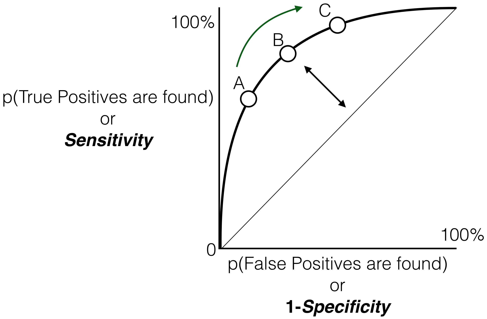
> 
> where points A, B, and C are sensitive/1-specificity pairs generated from different threshold values. We can then calculate an area under the curve (AUC) that can give us a better idea how to compre different classifiers (AUC values range from 0 to 1 where 1 = perfect predictor and 0 = worse than random, higher AUC is generally better). 

In order to actually fit a logistic regression equation, we can use a method called maximum likelihood estimation (MLE) to do that for us. MLE operates in a similar fashion to ordinary least squares regression (i.e. it tries to minimize some function that relies on minimizing how "wrong" it is); however, it does not have a closed form solution. Rather it must attempt to find the optimal set of betas that will fit the equation by trying out multiple betas, seeing which ones minimize how "wrong" it is and then adjusting those betas accordingly to further minimize the error. 

Logistic regression is probably the most useful and interpretable form of regression used in the healthcare space. While it is not considered to be a buzzword in the machine learning space, it is a tried and tested method forhandling predictions involving probability of a certain outcome. 

### LASSO, Ridge, and Elastic Net for Regression, the Bias-Variance Tradeoff

Sometimes we come across the situation where we have so many predictors in our dataset that it may benefit us to try and cut down or minimize the number of predictors we have. The primary benefit of doing so is to aid in the interpretability of the final model itself by distilling down 100s of independent variables to something more manageable such as a few dozen. We can do so through two methods, LASSO or Ridge regression (Elastic Net is a combination of the two). 

Before we get to these algorithms, we need to discuss the Bias-Variance tradoff in Machine Learning. When we train a model, we can prioritize trying to make sure that our best fit line touches all the data points in our training data. While this would minimize all the error in our training data set, we could see huge differences in performance on our test data set since testing data may not necessarily be equivalent to our training data. In this situation, we say that a model has high variance since it's results vary quite a bit depending on the data used to evaluate its performance. We can also say that this model would have low "bias" which means that the line of best makes no assumptions about the underlying structure of the data since it just tries to fit everything given all of the parameters available to it. Alternatively, we could make another line of best fit that just tries to go straight through the points (but not touching all of them). This model would be considered to have high bias since it makes assumptions about the underlying structure of the data (namely that it is linear); however, it may have low variance since the linear line of best fit does a decent job of fitting both the test set and the training set. 

At both extremes, we have a high degree of error in our dataset. When variance is high and bias is low, we have a large degree of error since our test set does not fit to our model (i.e. we have overfit the training data). When bias is high and variance is low we also have a high degree of error since the model may be too simple/makes too many assumptions (i.e. we have underfit the training data). Our goal is to try and find a "sweet spot" that helps us minimize our overall error in these situations. One way to do that is through regularization methods which selectively remove variables from our model (i.e. help minimize variance and while slightly increasing bias) and find a happy medium in the tradeoff. LASSO, Ridge Regression, and Elastic Net are all regularization algorithms.

LASSO works by adding a term to the sum of squared residuals equation we talked about earlier. In addition to calculating the error between predicted and actual values for given data points, LASSO adds a term that is equal to the sum of the absolute value of our betas times a parameter called "lambda" we set ourselves (this parameter is called a **hyperparameter** since we set it rather than letting the computer set it). This extra term is called the "L1 norm". Thinking about what this means, we can see that if we have a large number of beta terms, we're increasing the new sum of squared residuals formula. Since the goal is always to minimize the sum of squared residuals (SSR), the algorithm selectively sets betas equal to 0. Doing so minimizes the additionally added LASSO term. We can also tune how "important" getting rid of betas is in lasso by setting lambda equal to a high value (i.e. more important to get rid of betas) or a low value (i.e. less important to do so). We can also try out a bunch of different lambdas on our validation set within the training set. 

Ridge regression operates similarly to LASSO regression except that it adds the sum of the betas time lambda to the regular SSR formula. This extra term is called the "L2 norm". Ridge regression differs from lasso however since it does not completely set certain betas to 0 (i.e. it does not comletely get rid of them). Rather it keeps all of the features and just reduces the betas for the unimportant ones. 

Elastic regression is a compromise of the two. It adds the L1 norm and the L2 norm to the SSR equation with a separate hyperparameter called "alpha" determining which norm is weighted heavily (as alpha increases, L1 norm/LASSO is more important, as alpha decreases, L2 norm/Ridge is more important). As a result, we get a happy medium between LASSO and ridge regression and help prevent ourselves from overfitting our data. 

In prior studies, Elastic Net has proven to be incredibly useful in helping remove variables from cohort studies that use data containing over 1000 characteristics per data point (i.e. very "wide" data given that there are many columns associated with a single row of data). As a result, we can get a measure of variable importance in the ultimate model that is fit (since unimportant variables are either eliminated or are minimized to near-zero values). To find the optimal value of alpha and lambda for these studies, these studies often undertake a procedure called a "grid search" which means to try out every possible combination of alpha and lambda values (each limited to a certain range) on the training data and then see which produces the best results on the validation set. The model trained with alpha-lambda parameter combination that gives the best results will then be evaluated on the test set. 

> In the real world usage: In 2015, Eichstaedt et al published their model on how twitter could predict county-level heart disease mortality. In this paper, they basically downloaded data from twitter, cleaned the data, and extracted common words and phrases. They used those words and phrases as "independent variables" in a regression model, where the "dependent variable" was the rate of atherosclerotic heart disease incidence in the county the tweet came from. Since this problem was boiled down to a simple regression, they were able to leverage the regularization algorithms we talked about, specifically ridge regression. Applying that algorithm, allowed them to also extract "variable importance" which, in this case, were the words that most influenced the disease incidence rate in the regression formula. They ultimately found that counties where tweets contain angry/depressing words/tones have higher rates of heart disease. Importantly, this predictor, when combined with county demographc statistics, was an incredibly accurate predictor of heart disease incidence.   

While we've been talking about regression, a simple relationship between the varaibles we have and the outcome may not be something that is can be modeled with a simple equation. Rather, we may need to know something about the actual points of data that have gone into training a model to find out what the classification is of a new point. That's why we're going to take a look at some instance learning algorithms.

## Instance learning

Instance learning algorithms try to perform classification or regression by comparing an unknown data point's output directly to values used to train the network. In regression, we saw how we would first try to fit an equation (either a linear equation or logistic equation) and then would predict values from these equations. Outside of helping finding the optimal equation, the underlying points of data aren't actually used in regression techniques. Instance learning algorithms do use training data to determine the class or value of the test point. We'll explore two ways this task can be done: k-nearest neighbors and support vector machines. 

### k-Nearest Neighbors (and scaling in ML)

K-nearest neighbors is an algorithm that is non parametric (i.e. it doesn't make assumptions about the form of the output function). Compared to regression techniques (which make assumptions about the ultimate form of the equation), non parametric methods are much better at handling data that does not have a clear x - y relationship that can be modeled with a simple function. The issue with these methods is that you cannot find ways to reduce the number of parameters needed to find valid predictions.

K-nearest neighbors works as follows:
1. For a given test point, find the k closest points to that test point (where k = a number of points that you specify). These are the k-nearest neighbors.
2. In the case of classification tasks, the predicted class of the test point will be the majority of the classes of the k-nearest neighbors (e.g. if the 4-nearest neighbors were "diabetic", "diabetic", "diabetic", "non-diabetic", the test point's class would be diabetic). In the case of a regerssion task (here "regression" just means to output a continuous value rather than distinct classes), we simply take the average values of the k-nearest neighbors (e.g. if the 4 nearest neighbors to a test point had values of 50, 60, 70, and 80 kgs, the output value for a test point would be (50+60+70+80)/4 = 65 kg). 

There are some additional considerations to take into account: what value of "k" do we use and what type of metric for distance do we use. 

An optimal "k" can be determined by trying out all possible values of k in your training-validation set. Once you find a k that minimizes your objective for error (e.g. accuracy in the class of classification), you can then evaluate your function. For distances, we can use euclidian distances (similar to finding the hypotenuse of a triangle), manhattan distances (similar to getting a "real world" distance between points in a city grid), and much more. Some of these distances may be suited better for certain tasks (e.g. manhattan distances are preferred when handling data that is high dimensional) but you should try out several distances to see which one produces optimal results.

Another important note is that K-nearest neighbors is highly susceptible to changes in scaling. For example, if one dimension of your data measures someone's height (usually constrained between 1-2 meters) and another dimension measures their weight (in the 10s to 100s of kgs), we might have difficulties finding the closest points in each dimension since their scales are so different from each other. We could also be susceptible to the effects of outliers in our data as well. To help solve this issue, we can instead center & scale our data. Doing so basically means to re-assign the values of our dimensions to a z-score (i.e. the original value - mean of values in that dimension / standard deviation of values in that dimension). In that case, most values will be between -2 and 2 (if normally distributed) regardless of the scale.

To aid in interpretability, we can also try and output what the decision boundaries are for classification in k-nearest neighbors at various levels of k. 

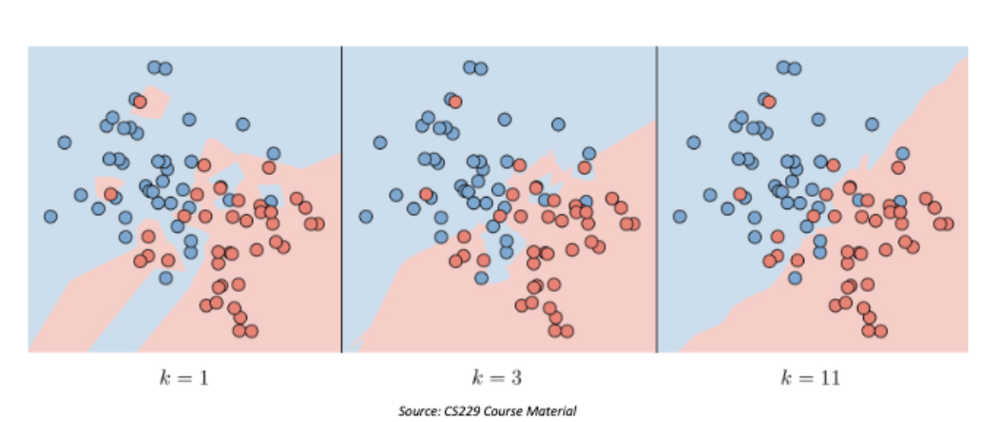

Here, each pixel in the graph is colored the class of the k-nearest neighbors output given a specific k. When k is small, we can see that the boundaries between blue and red areas of the graph are highly irregular which makes sense since fewer points are used to classify an object. When k is large, we see that the decision boundaries are more regularly shaped due to the fact that it takes a larger number of k-nearest neighbors for a class to be in the majority. The larger k values may provide a better understanding of how points are actually separated from each other, but may also misclassify some points. However, when k is small, we may be learning decision boundaries that are not that useful and that may only work on the training data rather than a general situation.  

### Support Vector Machines

I'll only mention this algorithm in brief since it tends to get very math-laden when diving into the details. The support vector machine operates on the assumption that there may be a line, plane, or hyperplane that separates two classes of data. The goal is to find that separation so that the margin between the ultimate plane and the actual data points is the highest it can possibly be (i.e. find the line that can perfectly separate two classes of data aka a "hard margin"). However, in some cases, we can get a larger margin by allowing some data points to be misclassified (this margin is called a "soft margin"). Doing so, we can get a line that still has a large margin that separates data except for a few outliers. 

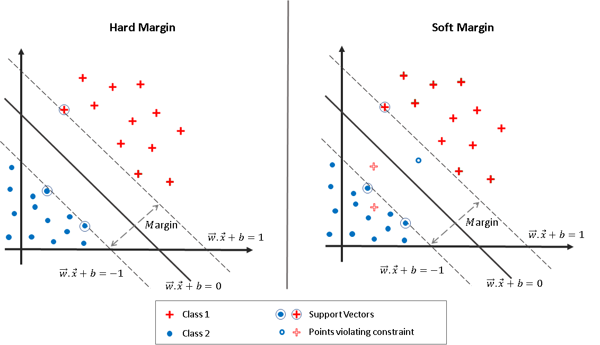

Here, the image on the left represents a hard margin classifier since none of the blue points or red points cross the "margin" boundaries around the line. The image on the right represents a soft margin classifier since some of the points are allowed in the margin region around the line even if they violate the decision rule (e.g. there are some red points in the blue point decision region and some blue points in the red point decision region). 

Occassionally, we will have to perform transformations on our data (such as squaring it) to find an optimal line, plane, or hyperplane that separates data points from each other. There are a number of possible transformations that we can apply to our data and support vector machines help us find the optimal transformation to apply that gives us a plane that best separates the data at hand. 

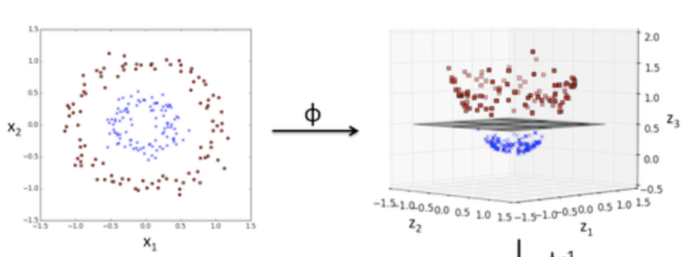
For example, in this case we can use the SVM algorithm to find the plane that best separates this data. On the left hand side, it would be difficult to find a line or polynomial that can separate the classes of this data appropriately (where the color of the point represents its class). However, if we apply a transformation to the data (in this case, a transformation called the radial basis function kernel), we can find a plane that separates this data for us. The SVM algorithm gives us the ability to find this plane. SVM can be implemented to work for regression tasks as well. 

> In the real world usage: Son et al published the usage of support vector machines in 2010 for predicting whether heart failure patients would adhere to their medication. Their input data points had predictors of gender, daily frequency of medication consumption, medication knowledge, New York Heart Association functional class, ejection fraction, Mini Mental Status Examination score, and whether or not they had a spouse. Their output was whether the heart failure patient was taking their medication or not. They were able to achieve a detection accuracy of close to 80% which is impressive given that they had a small dataset of 76 individuals. SVMs have since been used in a number of medical prediction applications, including the prediction of dementia, whether or not a patient needs to be admitted, and more. Similarly, k-nearest neighbors has been used to determine whether individuals are at risk of developing heart disease based on previous existing data on patients.  

## Decision Trees & Tree-Based Ensemble Algorithms

Decision trees help produce some of the most interpretable results in the ML world. Decision trees are not quite like actual trees. Rather, they're structured like an inverted tree with a root on top and leaves and branches that increase in number as you go further down. 

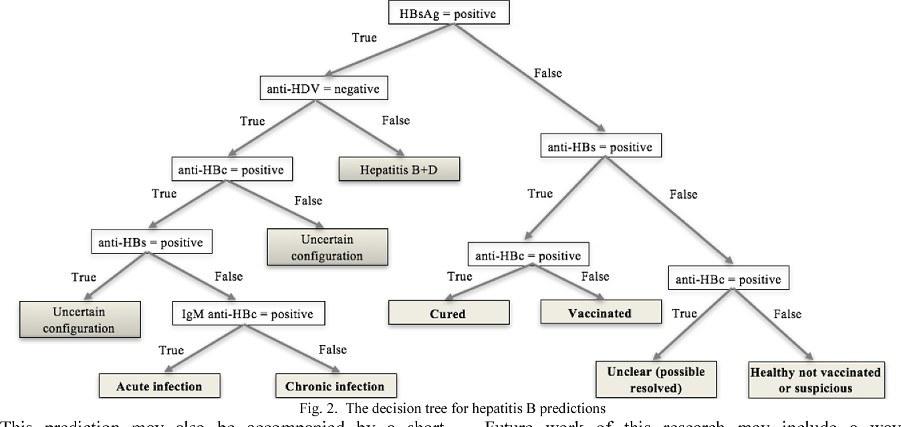 

At the top there is a root (formally called a node) and that has a left and right branch. Each branch also has a node (which also have its own left and right branches and so on). Some of these branches do not split further into other left/right branches (these are called leaf nodes). In decision tree making algorithms, a decision rule will be learned for each node of a tree. That node would be something along the lines of "If the patient has a positive Hep B surface antigen titer test go to the left branch, otherwise go to the right branch". These branches have their own decision nodes as well until they get to the point that there is a leaf node which usually gives a classification for the patient (e.g. they have a disease vs they don't have a disease) or gives some number which represents the average labeled value of other instances of your training data that reached that part of the decision tree. 

The key parts of the decision trees that need to be learned is what characteristics to "split" on (i.e. test at each node) and whether it would be worth splitting on that characteristic or not. 

### Classification & Regression Trees

Classification and Regression trees (CART), are machine learning algorithm that allow us to learn a decision tree. The algorithm works by iteratively trying out characteristics to split on. Whichever split yields the best result is the one chosen to apply to the data (making a new node in the tree with branches based on that rule). The algorithm then tries to find new splits for each of the branches. However, this algorithm is not necessarily the best since it only relies on picking the best split at that point in time rather than trying out multiple different trees to see what works the best once the entire algorithm is run. This type of algorithm is known as a "greedy" algorithm (in this case, the algorithm is greedy since it decides the split that's best once seen at a single point in the training process). 

But how do we evaluate which split is the "best". For classification tasks, we can use a term called "Gini impurity". Gini impurity can be calculated at each node by multiplying the proportion of training points at that node in one class by its complement (1-the proportion). We sum these values across all of the classes and weight values at each node to determine which splitting characteristic would lead to the lowest possible gini impurity coefficient (0 = all instances allocated to each branch are of the same class which means we have a perfect classifier; anything higher means that there are instances that are misclassified at each node). 

However, if we were to just find the best possible tree, we could get a very comlex tree with hundreds of nodes and branches if we don't penalize its growth. After all, we're trying to find a tree that is interpretable. We can institute a "stopping criterion" which places a restriction on tree growth if there aren't enough elements generated by splitting at a particular branch (e.g. if a split pushes one data point to the left and 3 to the right but our stopping condition stipulates that we must have, at minimum, 5 elements at a node, we won't split on that criterion). We can also "prune" the tree by setting a hyper parameter called "Cp" (short for complexity). This adds a term to the gini impurity score that penalizes the number of smaller trees (subtrees) created under a particular node (higher number of subtrees penalizes the growth of trees more). Both of these measures help insure that we do not engage with creating trees that are too complex and can't be used in practical decision making.

You should also be aware that there are multiple versions of decision tree algorithms. CART relies on the gini impurity score to find the best tree, others such as ID3, C4.5, C5.0 rely on another measure called "information gain". It isn't important to understand the exact details of how it works, but it is useful to know that there are other decision tree algorithms to try out on yoru dataset.

### Tree-based Ensemble Methods: Bagging, Random Forest and XGBoost

Ensemble methods in the decision tree world help optimize predictions by creating multiple trees and allowing each tree to give a "vote" on a particular outcome. The simplest of these algorithms is called Bootstrapped aggregation (aka "Bagging"). Bagging involves creating multiple trees similar to the CART algorithm; however, it bootstraps the training dataset, meaning that it randomly selects subsets of the training set to create trees. It samples with replacement, meaning that a training sample can appear multiple times. However, since the trees are all trained on subsets of the training data, it can be more robust to the data in general since it would be less prone to overfitting. In the evaluation phase, all of these trees give a "vote" on what the correct classification should be based on the branches and nodes for each tree. The majority prediction wins. 

Random forests is another machine learning algorithm that builds on Bagging. Instead of just selecting samples of the training set with replacement and building multiple trees, random forests also selects random subsets of characteristics to split on for each node in each tree. For example, if each patient in your dataset has 100 characteristics you keep track of, random forests will create many trees that will only use some subset of the 100 characteristics to split on at each node (e.g. 20, 30, 42...). The number of randomly selected characteristics can be changed to through a hyperparameter known as "k" or "mtry". Usually, mtry is set to be 1/3 of the total number of characteristics (33 in our example case), but you should try out a number of values for mtry. You can also set the number of trees to be generated in random forests (usually using more trees is better; however, returns diminish after a high value of trees that you'll need to fine tune). Some machine learning libraries also give you the opportunity to specify how "deep" these trees can be (this basically limits the amount of times a tree can branch) since trees that are too deep (and have many branches) can overfit the training data. 

XGBoost is another ensemble algorithm that produces a similar output to random forests; however, it builds these trees through a method known as gradient boosting. Random forests builds its "forest" of trees independently from each other while gradient boosting builds one tree after another, adjusting the influence each tree has on the ultimate decision. It does so by adjusting a weights assigned to each tree based on a "learning rate" hyperparameter (basically determines how much the weight can change in one training iteration). If the learning rate is too high, we may never find the optimal solution or may stumble into a somewhat optimal solution that only works on our training data. If the learning rate is too low, we may take forever to find the optimal solution. Most libraries out there will suggest values to use for your XGBoost algorithm or automatically provide them to you. XGBoost generated trees can be much better than random forests; however, they often take a while to train compared to random forests.

> In the real world usage: Chang et al showed in 2019 that C4.5 decision trees and XGBoost were used to predict clinical outcomes among patients with hypertension. The predictors they use are physical examinination indicators (sex, age, bmi, pulse rate, left arm systolic pressure, thyroid function (FT3), respiratory sleep test O2, systolic blood pressure (at examination and at night), and number of hypertensive drugs) and the output is whether the patient had a myocardial infarction, stroke, or other life threatening event. They ultimately find that XGBoost achieves the best accuracy (94.36%) and AUC (0.927) compared to normal decision tree based algorithms (C4.5 trees achieved an accuracy of 86.30%). This paper highlights how ensemble algorithms can provide a significant advantage over tree algorithms.

## Clustering/Dimensionality Reduction

Algorithms in this class are typically considered to be unsupervised learning algorithms. Accordingly, there's no real measure of accuracy or error that we can refer to using these algorithms; however, we can still get a general sense of how well they performed. Unsupervised algorithms are incredibly useful for clustering and dimensionality reduction. 

Clustering algorithms general operate to find which points of data are closesly related to each other, forming a "cluster". This can be useful for determining the locations of outbreaks and also determining how many groups of patients there are that share common characteristics in a large dataset. 

Dimensionality reduction does exactly what its name implies. These algorithms help us reduce the number of different factors we're considering to aid in the plotting and interpretation of high-dimensional data. These algorithms are often used in population genetic studies where individuals have 1000s "dimensions" (i.e. genetic locations of interest) and need to be somehow separated to explain differences in subgroups.

### k-Means Clustering

k-Means clustering works by trying to find clusters of datapoints that are closely related to each other. At a high level, the algorithm first randomly selecting "k" number of data points to be the centers of each cluster. Other datapoints are then assigned to one of the "k" clusters based on which cluster is closest to it. Once points are then assigned to a cluster, the center of the cluster must then be updated to account for all the new points that have been added (this center may not overlap with an existing point). This process of assigning points to clusters and updating the center position continues until the algorithm reaches "convergence" (i.e. the centers do not continue to change significantly and the points assigned to specific clusters do not continue to change). 

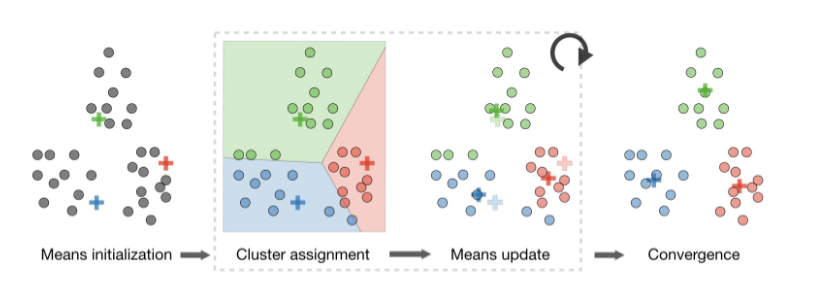

k-means obviously has one major hyperparameter which you must tune: the number of clusters (ie the number of centers) you want to find in the dataset: k. Sometimes, if you have prior knowledge about the dataset you're wanting to find clusters in, you may know what "k" you want (e.g. if you know that there are diabetic and non diabetic people in the dataset). Other times, you don't know an optimal "k" and just want to find the best possible clustering for your data (at which point you could explore characteristics of the points in each cluster to get a sense as to how the clusters are differentiated from each other). 

Finding a best k without prior knowledge can be done using using the Elbow method. It operates off the idea that we should try and find clusters that are closesly packed together aka the within cluster sum of squared errors (WSS). We can find the WSS by determining the distance of each point to the center of the cluster it is assigned to, we want to find the k for which we get the lowest WSS. However, after some number of k, the WSS typically does not decrease by a significant amount (we could set k to equal the number of points we have in our dataset; however, that may not be valuable when having something like k = 3 clusters would give us the opportunity to get a diverse cluster to analyze). We define the point at which there are diminishing returns as the "elbow" which can be identified by plotting the WSS against the k value that generated the WSS. 

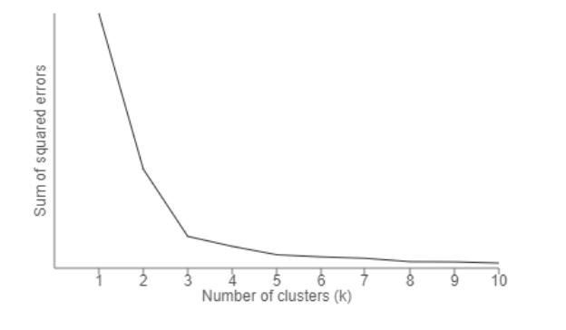

Here we can see that are around k = 3 clusters, we see an "elbow" in the graph (i.e. a sharp decrease in the WSS lost upon adding an additional cluster aka diminishing return). There are also other methods such as the silhouette method that takes into account how similar a point is to its own cluster vs how similar it is to other clusters (in this method: a silhouette score is produced for each k attempted and the highest silhouette score is considered the optimal number of clusters). Another measure called the gap statistic can also help identify the optimal number of clusters by calculating the within cluster variation with the expected values determine from a null reference distribution (generated from bootstrapping). The k that produces that highest valued gap statistic is the one with the optimal number of clusters.

Variations on the k-means clustering algorithm can also produce a hierarchical cluster where we produce a dendrogram (a tree where closely related points are closer to each other on the tree). 

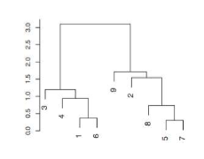

These trees are often used to measure evolutionary relationships between species or can even model the relationships between microbiota in our gut (based on similarity of dna between species found in microbiota samples). 

It is important to note that k-means clustering is sensitive to scale, meaning that we need to rescale and center our data when using these methods (similar to k-nearest neighbors). 

### Principal Component Analysis

Principal components analysis (PCA) can help us visualize high dimensional data. It does so by identifying combinations of predictors that can make new axes. We can then use these new axes to re-plot our data in a manner that helps show the degree of variation in the data itself. The final endproduct of PCA is a set of axes (called principal components) which are combinations of multiple dimensions. We can use some of these axes (usually the first two) to plot out our existing data but in a new coordinate system. In some cases, this can help data that does not appear to be differentiated to appear much more different/separable compared to just visualizing them on a single pair of axes. 

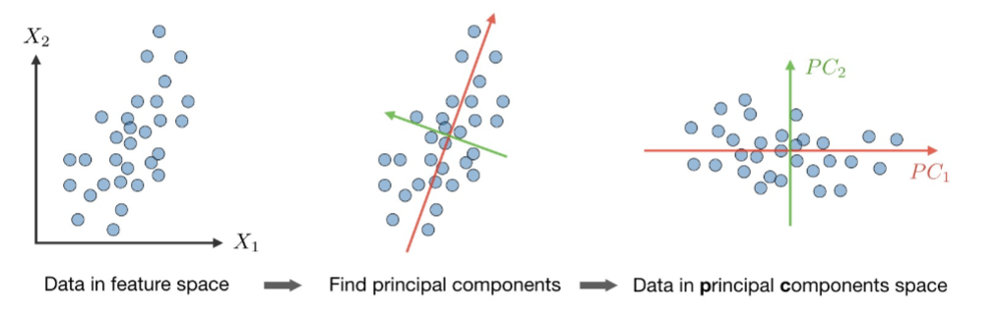

Roughly, PCA aims to find principal component axes that maximize the variance in data when projected onto that axis.  

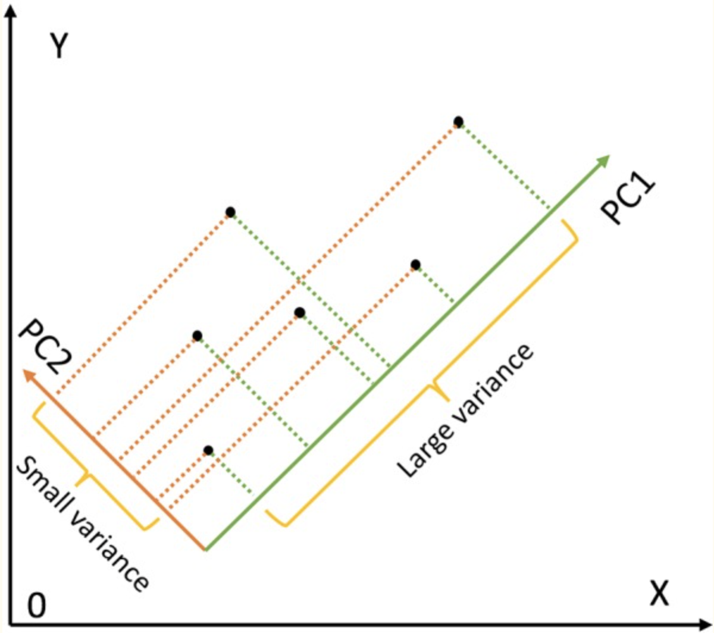

In the above image, we can see that the green line would make a good axis since it would allow us to see the differences between points clearly. This green axis is a combination of whatever characteristic is described by the X axis and a little bit of the characteristic described by the Y axis. We then continue to find other axes that can help separate the points from each other once the prior axis is applied to the data. Eventually we get a ranking of the principal components (of which there are many) followed by the % of variation they can explain. We choose to use as many principal component axes that can explain a large degree of variation until there is a point of diminishing returns (this can be assessed via a "scree plot" which looks similar to the plots generated by the elbow method in K-means clustering). 

## Artificial Neural Networks and Deep Learning

Artificial Neural Networks (ANNs) and Deep Learning (DL) are considered to be the darling of the ML world at the moment. These algorithms help extract information from input data to generate an "intermediate" representation of the input data. That intermediate representation will usually be some transformation of the input which can be used to easily "learn" which aspects of that transformed input are best predictors of the output. We saw how transforming the input played a role in getting SVMs to work so well for classifying data, but these transformations take SVM to a whole other level, routinely learning transformations that aren't usually comprehensible to humans.

When we talk about neural networks, the obvious word that pops up is "neural" indicating some relationship to a neuron. Nearly every introductory text shows how the neural network was partially inspired by a human neuron and its behavior; however, that comparison is started to diverge greatly from where neural networks stand today. Regardless, we will cover that comparison since it is helpful for motivating the basic structure of a simple neural network.

### Fundamentals (perceptron, multilayer perceptron)

Neural networks are made up of individual units called neurons. Each neuron can have multiple inputs and has an output which can be fed as input into other neurons (just as biological neurons have dendrites and axon terminals that act as multiple inputs and multiple outputs respectively). 

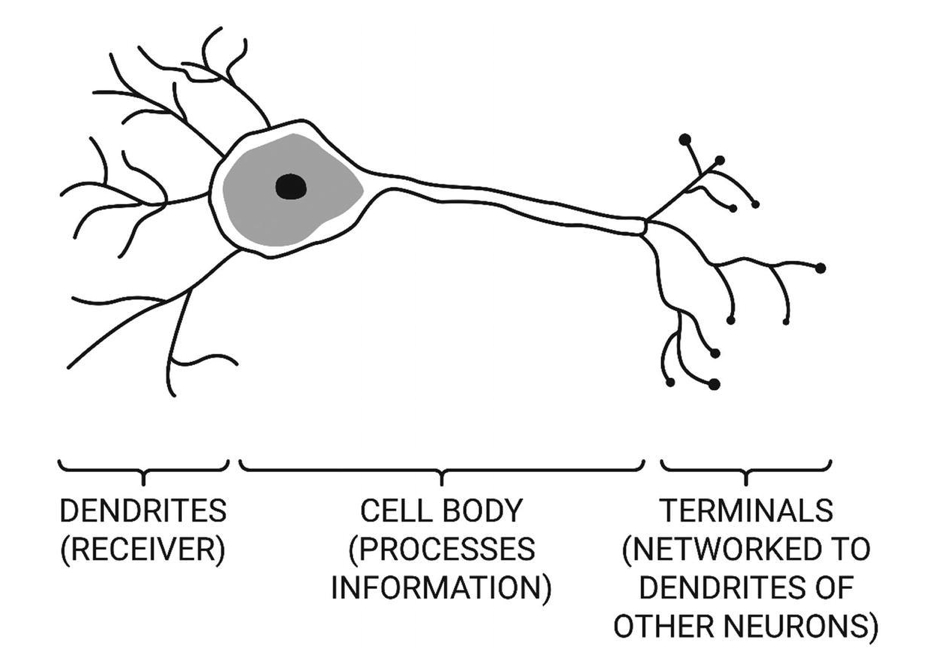

In order for biological neurons to fire an action potential, the membrane potential needs to surpass a specific threshold. Similarly, artificial neural networks can be engineered to mimic that behavior (though that may not be true in all neural networks). 

Moving away from the biological thinking behind an artificial neural network, the actual implementation of ANNs involves two primary constructs: weights and biases. For each input to an artificial neural network, a weight multiplies the input by some number. The bias is a number (either positive or negative) that is added to the sum of all the weighted inputs. Usually some function (aka an "activation function")is applied to that final sum of the weighted inputs and bias: sometimes that function is simply the identity (ie the sum itself), sometimes it a sigmoid function (constrains the final value between 0 and 1), and sometimes it could be anther function that is equal to the final sum of weights and biases only if that sum if positive, otherwise it is zero (this is called a ReLU function). 

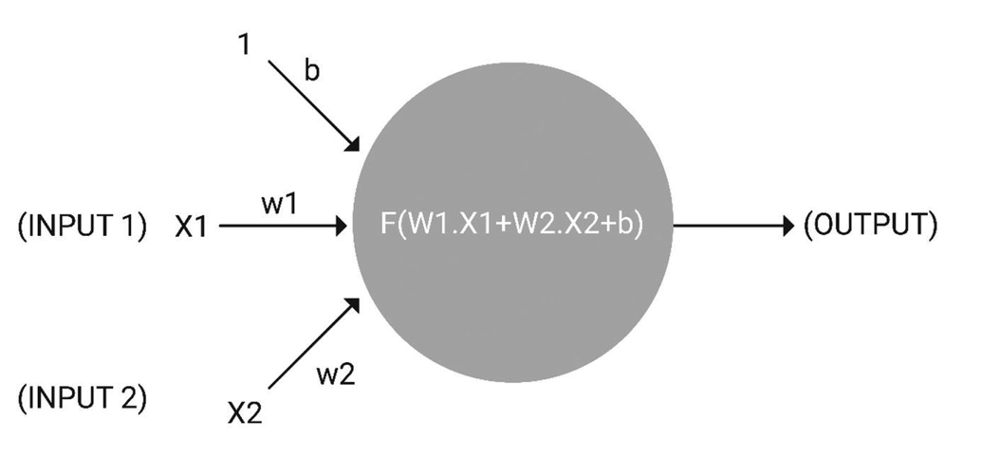

In this image we can see that this unit of the ANN (formally called a "perceptron") has two inputs: X1 and X2 and an output. It also has a bias noted as "b" and weights for each of the inputs called "w1" and "w2". We also see that a function "f" (the activation function) is applied to the sum of the weights multiplied by the inputs plus the bias to produce the final output.

Many perceptrons can be arranged together to form a layer of a neural network. Many of these layers can be chained together to form a type of artificial neural network called a multilayered perceptron aka an MLP (like in the image below).

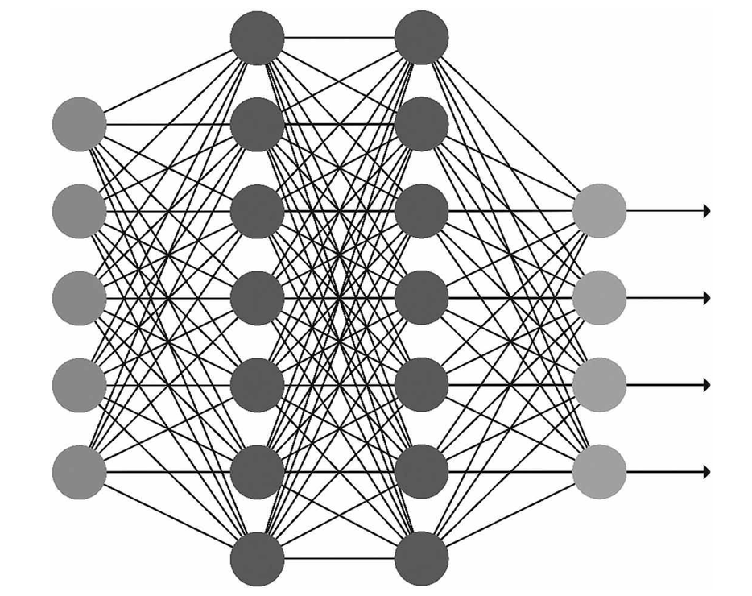

An MLP usually has a first layer that is considered to be the input layer. Each perceptron at this layer takes on a value of either one of the characteristics of a data point in tabular data (e.g. rows in a spreadsheet) or could even represent values for pixels in an image (1 perceptron per pixel). This input layer then is densely connected (i.e. each perceptron connects to all other perceptrons in the next layer one time) to the next layer of perceptrons. These perceptrons can then be fed into another layer and so on. Finally, the second to last layer is usually fed into either a single or multiple output perceptrons. A single perceptron output would be useful if we're just trying to predict a number given some input values. Multiple perceptron outputs would be useful if we want to predict a class for the input data (e.g. no diabetes, prediabetic, diabetes). In the classification task, we would find the output perceptron that produces the highest value, or can even get something akin to a probability of an input belonging to a class designated by each output perceptron (by applying a function called "softmax"). 

You may have noticed we've included quite a lot of perceptrons in this example, but what is the advantage of including so many perceptrons in our network. Consider that each neuron can take in multiple inputs and transform those inputs into an entirely different number. Each of those numbers can then feed into other neurons that output different numbers and so on. In each of the layers of the MLP we transform the input of the network into something else entirely. Some of these representations may make it easier to for these networks to find rules that work best for classification or regression tasks.

One topic we haven't touched on until now is how the network actually learns the correct weights and biases for each of these connections and perceptrons. ANNs do this through a process called "backpropagation". Essentially, a training data point (or multiple training data points aka a "batch") are set through the network and a set of outputs is recorded. For each of the outputs, the network calculates how "wrong" it was per a function that we specify ourselves called the "loss function" (e.g. for regression, that error could just be how far off the output number was from the ground-truth number squared). The goal of the network at this point is to try and find the best way to adjust each of the weights and biases present in the network to minimize the loss. The proof behind how backpropagation works can be found at multiple places online, but it does involve a fair bit of multivariable calculus. Once the network adjust its weights and biases, it goes through new training data (or may even go through the training data again) to continue to update the weights and biases.

Importantly, you may see mentions of something called a "learning rate" which is important in determining how fast neural networks can converge to an optimal solution that minimizes its error. It does so by multiplying how much each weight and bias is adjusted after seeing some training data. In most cases, we want the learning rate to be relatively low since we do not want to overshoot an optimal solution and never reach it. However, making it too slow may lead to it taking a long time for the network to converge upon a final solution. We set the learning rate itself so it is a hyperparamter. Other techniques (such as "batch normalization" which centers/scales outputs from each perceptron in the network) can also help stabilize the learning path of a neural network.

Another major hyperparameter you may have to adjust is the number of "epochs". An epoch is a hyperparameter which defines how many times the ANN/MLP will go throug the entire dataset. There is no rule as to the amount of epochs needed to train a network and it is entirely dependent on the network architecture. Some simpler networks may only require a dozen or so epochs to train. More complex networks could require hundreds of thousands. To help determine an optimal epoch to set, it is best to set a "stopping condition" on the training of your neural network (e.g. if the overall error aka "loss" of the network does not decrease by 10% after 10 epochs, stop the training of the network). This stopping condition is important to set since neural networks can overfit the training data. To also prevent overfitting, "regularization" techniques can be used (usually involving something along the lines of "dropout" aka randomly removing perceptrons from the network or L1/L2 norm regularization that penalizes large weights, similar to what we saw in LASSO/Ridge regression). 

There are also other hyperparameters that can be set by you such as batch size (number of training data points the network sees before it can update weights), optimizer choice (there are other algorithms outside of gradient descent that determine how networks learn), weight initialization (determines the first weights and biases a network has prior to any training...usually this is random), loss function (what you're trying to optimize), layer size (how many perceptrons are in each layer of the network), and much more. 

In general MLPs are components of many popular neural network architectures in at least some part. Most complicated networks for image classification will have a final 2-3 layers that are just densely connected perceptrons that aid in classification or regression tasks. MLPs on their own also can be useful for predicting tabular data. However, the scale of MLPs becomes unwieldy to deal with especially when using images as input. Considering if an image is sized 400px x 400px and used as input into a network, that means that there are 160,000 input perceptrons into this network since each perceptron represents a pixel. Furthermore, each of those perceptrons will need to connect to more perceptrons in the intermediate layers of the MLP, representing even more weights and biases to learn. After a point, it becomes computationally prohibitive to use this architecture for handling images. That's where we turn to convolutional neural networks.

### Convolutional Neural Networks

To help solve the issue of training neural networks to handle image inputs which are fairly large, researchers came up with the idea of applying "convolutions" to the input image itself. A convolution is just a linear operation that multiplies parts of the input images to a network and produces output values. The construct that determines how the multiplication takes place is a filter (also called a kernel). Multiplying input images by the filter will produce a smaller image. Doing this over multiple convolutions (ie multiple runs of the filter multiplying image input and producing an output image) can greatly reduce the size of an input and can even produce a intermediate representation (called a "feature map") of the image that the network can then learn on.

But what exactly is a filter? A filter is a set of numbers arranged into a matrix. Usually these filters are fairly small (3x3, 5x5). The numbers contained within these filters themselves are also learned by the neural network. To produce the feature map, the filter multiplies the pixel values in each 3x3, 5x5, (or whatever size the filter is) section of an input image in a sliding fashion (going left to right then top to bottom). This multiplication operation then produces another image that may be smaller than the original input image but definitely will look much different from the input image. 

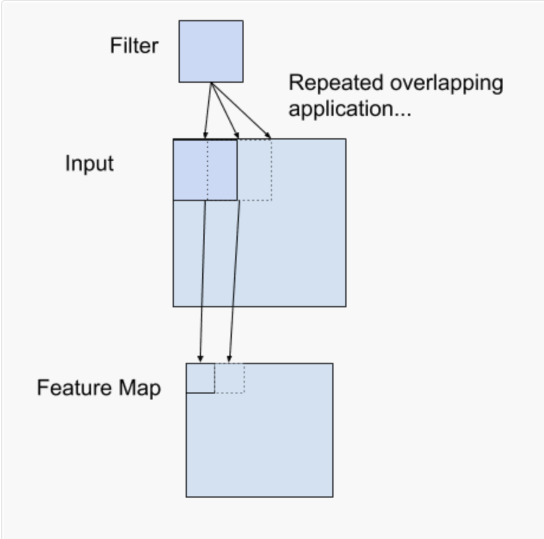

In a convolutional neural network, each layer consists of a set of filters (you can specify the number) that are applied to the image input. Given that most image inputs to a neural network are color images (that have a Red channel, a Green channel, and a Blue channel), the filters are sized to have WxHx3 elements (where W = width of the filter, H = height of the filter). There are additional parameters that describe operations of how these kernels are applied to the image. One of those parameters is called padding which helps us deal with the issue of what happens at the edges of images (if we keep moving to the right, at the right hand size of an image, the filter will continue to move over pixels that don't exist and go beyond the image bounds). We can adjust this by adding padding to our image (usually just pixels that are valued 0) which solves this problem. We can also set the stride of the filter which dictates how many pixels the filter "skips" when moving in each direction. If we keep a stride of 1, the input and output images will have the same size. If we increase the stride, we tell the filter to move over 2 pixels instead of 1 pixel at every step, reducing the size of our input. 

There are other ways to help reduce the input of input images. One method is called "Max Pooling". This is a filter that operates by passing a filter (usually something along the size of 2x2) and stride (usually 1 or 2) and only outputs a single value (the maximum valued pixel in the patch of the image the filter is on): 

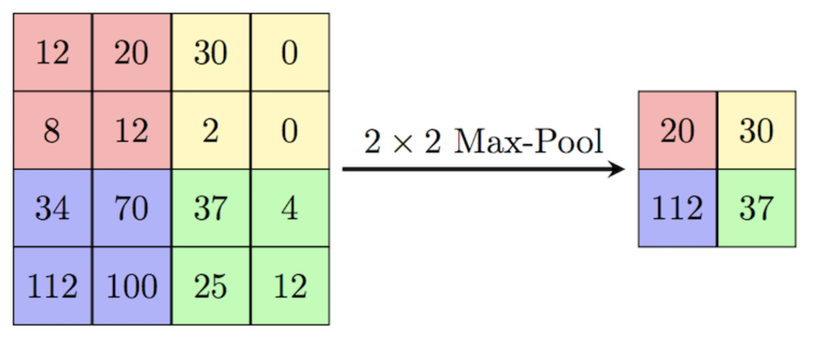

We can specify the arrangements and sets of convolutional layers we want our network to have through working with libraries that handle all of the work of setting up and managing all the filters at each step. Usually, those libraries get it down to us only needing to specify the number of filters we want at each step, the kernel size, the input image shape, the batch size (number of images used in one iteration before weights are updated), and the padding/stride. At the end of these neural networks, we will typically "flatten" the last convolutional layer by creating a layer of perceptrons that correspond to the number of pixels in the last convolutional layer output and create additional layers that are densely connected to that flattened layer. At the end, we will have a few output neurons corresponding to each of the classes we want to predict in our network. 

Convolutional neural networks have been credited with ushering in the renewed interest in AI technologies. A particular convolutional network called AlexNet was able to achieve a high degree of accuracy on a standardize image classification benchmark test called ImageNet. Google followed up with their Inception network architectures and released the trained models of these networks to the public (which was especially generous given that these networks required a lot of computational power to achieve the accuracy they did). Importantly for medical imaging applications, these convolutional networks can be retrained for doing other forms of image classifcation. This process (known as transfer learning) typically freezes the learned filter values in the initial part of the network and only retrains the last few layers (the densely connected layers). This transfer learning paradigm allows individuals to retrain networks very quickly (even on their laptops) for new image classification or regression tasks that weren't originally trained for. Importantly, transfer learning highlights how the convolutions applied to images generate an intermediate representation that is resilient to changes in classification tasks (i.e. the network is truly learning to extract salient features from an image that can be used to learn anything). 

Over the years, convolutional neural networks have had more and more layers added to them (oh right...I should mention that "deep learning" means that the networks used  for a learning task have many layers/convolutional operations). This trend has resulted in the development of networks that are very large but have marginal improvements in accuracy on standardized benchmarks. There are other network architectures called "transformers" that are at the front of state-of-the-art image classification techniques that are performing better (but usually a deep convolutional network will be sufficient for most medical imaging tasks).

### Other Networks (RCNNs, LSTMs/RNNs, GANs) and Tasks (Image segmentation, keypoint detection, image generation).

There are many other network architectures that exist for different tasks. Some of them may be useful for medical research; however, a fair amount of them have been limited to the technical sphere of AI and have yet to see wide adoption in the world of medicine. 

Recurrent Neural Networks (RNNs) and Long Short-Term Memory networks are networks that can be used for dealing with data streams or otherwise time based data. For example, the task of trying to predict likelihood of ER admission given a set of patient histories could be addressed by using an RNN or LSTM. LSTMs are considered to be more advanced than RNNs due to the fact that they solve the issue of exploring and vanishing gradients (these problems lead to the training process becoming very long or impossible). These networks have started to see their way into the world of natural language processing (i.e. interpreting text) for medical research applications.

RCNNs (or region based convolutional neural networks) are used for the task of object detection in medical imaging. These networks can be used for the process of actually finding instances of objects within images (such as lung nodules, fractures, etc). They also can be used for automating medical segmentation tasks (i.e. outlining various structures/pathologies) and even for landmark detection (i.e. finding relevant anatomical keypoints for each detected object such as the corner points of vertebral bodies for use in scoliosis detection).

GANs are used to generate images (or other data) based on pairs of images it has seen before. This network consists of two parts: a generator which is responsible for generating image proposals given some input, and a discriminator which is responsible for trying to find the errors in how those new images were generated. The generator and discriminator try to beat each other as the generator tries to "fool" the discriminator into believing the generated image is equivalent to ground truth. GANs can be used for a variety of medical applications such as the denoising of CT imaging, conversion of CT to MRI (or vice versa), and even segmentation. 

There are several other networks out there that are used for medical tasks (such as UNet and Siamese networks); however, they all operate on the same basic concepts or aim to accomplish the same tasks as previous sections have covered (UNet is optimal for segmentation and Siamese networks are good for image classification). 

With that, we have finished our tour of ML algorithms and neural networks. Before we actually go to code these networks, let's also take some time to discuss basics of how we evaluate these networks and key steps we can do to make sure that the results we report are valid.

## Other topics

### Evaluation Metrics

To provide interpretable results of the network, we have to report certain evaluation metrics to ensure the reader of our study that a network actually works as intended. 

In terms of regression metrics, the most common way to report evaluation metrics is to report the mean absolute error (which is just the absolute value of the difference between the predicted number and the ground-truth number, averaged across all test instances). However, some medical journals expect you to provide a mean squared error (MSE) which penalizes a prediction that was further away from the actual value and doesn't penalize one that was very close since we square the difference between the predicted and actual values (a variation on this is the "root mean squared error" which just takes the square root of the mean squared error).

In terms of classification metrics, the simplest one is accuracy; however, that does not paint the entire picture. Often ML algorithms output a probability of something being in a particular class along with each prediction. If you have a probability, you can generate an ROC curve (as discusssed earlier) and also report the area under the curve (the AUC). Medical researchers also try and report the sensitivity aka "recall" (defined as $$\text{Sensitivity} = \frac{\text{# of true positives}}{\text{# of  positives + false negatives}}$$)  and specificity (defined as $$\text{Specificity} = \frac{\text{# of true negatives}}{\text{# of true negatives}+ \text{# of false positives}}$$) at a cutoff threshold for probability (usually the threshold that produced the highest sensitivity and specificity in the ROC curve). You can also report precision (true positive divided by true positive + false positive) or an F1 score ($$F1 = 2 * \frac{\text{precision} * \text{recall} }{\text{ precision }  + \text{recall}}$$). 

You may also need to provide a calibration curve to show where the algorithm overforecasts and underforecasts probabilities of something being a particular class. These curves are made by splitting the x-axis up into a fixed number of bins for the possible predicted probabilities that something belongs to a particular class (this comes out of your predictive algorithm). The value on the y axis corresponds to the number of times that the class was predicted correctly. For example: if we had 100 tested data points, we can split up their predicted probabilites on the x axis into 5 segments (predicted probability < 0.20, 0.20-0.39, 0.40-0.59, 0.60-0.79, 0.80-1). For each of the test points that produce a probability that falls into one of the bins, we also count the frequency of the true class of that test point being present. Specifically, in the first bin, we would expect a 20% of points to have the true class (since the algorithm predicted these points would have a probability of 0.20). For the next bin, it would be 40% of points, etc. We plot the proportion of true instances of a class in a given bucket on the y axis. In the case that the model is predicting probabilities that are too large, we would see a value to the far right on the x axis but with a low y value (since, in reality, there weren't that many classes). Conversely, if the model is predicting probabilities that are too small, we would see a value to the left hand side of the x axis, but with a high y value. 

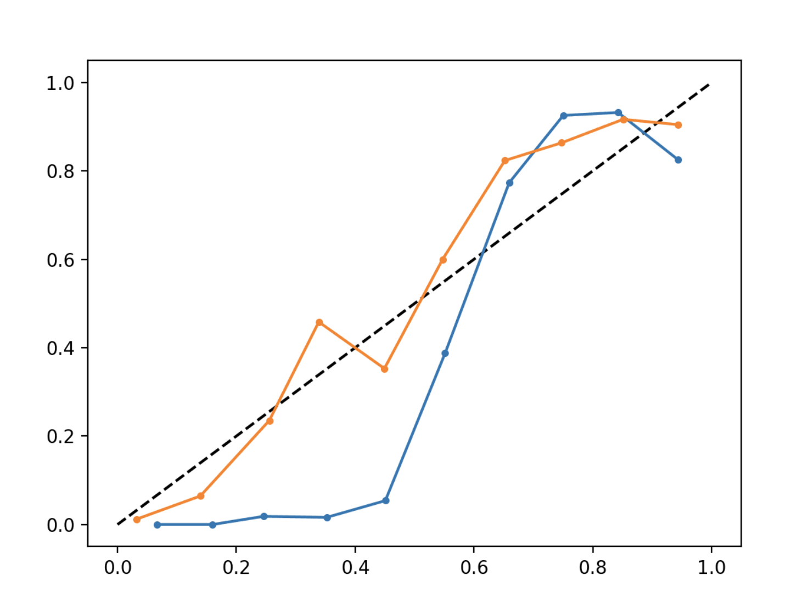

In this image, the blue curve is underpredicting probabilities for low probabilities and overpredicting probabilities for high probabilities (we judge against the y=x line). There are separate methods (such as "Platt's method" which fits a logistic regression to the uncalibrated probabilities) that you can use to calibrate these uncalibrated values (ultimately producing the orange curve which "hugs" the diagonal line). 

In general, the statistics you report are going highly depend on the ultimate task you seek to achieve. In classification tasks, the accuracy may be sufficient to report, but medical journals would also want to see an ROC/AUC to confirm the resilience of your algorithm. Sometimes you would definitely want to see the sensitivity and specificity to get a sense for how the algorithm handles true positive, false positive, true negative, and false negative cases. It is always best to step back and figure out what someone using your model would need to know before using it. Fortunately, machine learning libraries produce a number of statistics for use and can even generate some graphs for you.

### k-fold Cross Valdiation

In the prior chapter, we've talked about partitioning your training set into a training set and validation set. However, we could still be fooling ourselves as to the performance of an algorithm in this case, especially if we continually try out multiple algorithms on the same training set. For all we know, the training set and validation set we initially partitioned may be something comparatively "easier" to learn compared to the real life data. 

To solve this potential issue, we can train our algorithms and validate multiple times, but on different subsets of the data. We can do so as follows: 
1. Split the data into "k" number of segments (called folds), were k is a number you input (usually 5 or 10 is sufficient).
2. Pick k-1 folds of data to use as training data. 
3. Train your algorithm
4. Use the remaining fold as your validation data.
5. Keep track of evaluation metrics.
6. Continue doing steps 2 through 5, picking a different set of folds in step 2 to use for training.

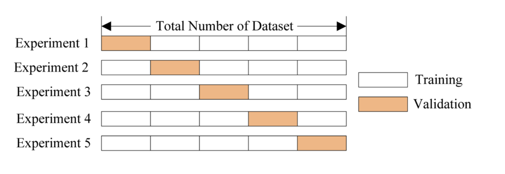

The above diagram illustrates how training and validation folds are usually picked in each iteration of k fold cross validation. 

At the end, you can use the average of whatever evaluation metric you're interested in to compare various algorithms or hyperparameter choices. Some libraries will even allow you to do a grid search (ie try out many possible combinations of hyperparameters) with cross validation to provide a rigorous set of possibilities to try out.

# Next Steps

In this section we covered a number of different machine learning algorithms and saw what algorithms worked for what sorts of data/tasks. Supervised algorithms are probably the most used in medical literature since we are often trying to determine whether an algorithm matches a physician's determination of a diagnosis or not, but unsupervised algorithms have their place in the medical world as well, especially in genetics studies. We then explored perceptron based algorithms (neural networks) and saw what a deep neural network really was (just a network with many layers of perceptrons connected to each other), and covered some of the popular classes of neural network architectures out there (with a focus on convolutional neural networks). 

In the following chapters, we'll see how to actually use these algorithms on datasets. 