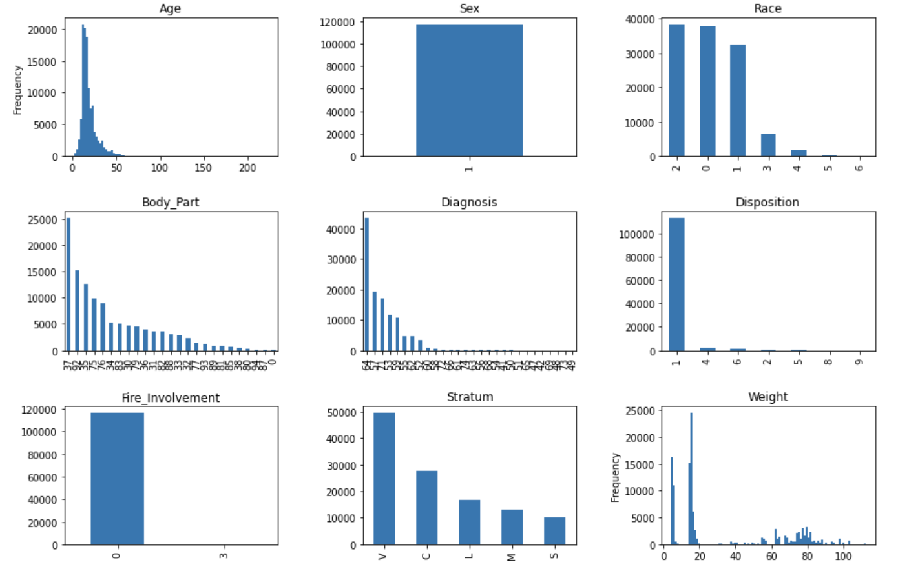

# Chapter 5

Welcome to your first in-depth look at machine learning and the code behind it. In this chapter we will be working with a dataset from the National Electron Injury Surveillance System (NEISS). This dataset, encompasing emergency room visits from 2011-2019 on basketball-related injuries, will be used in a task to predict whether an individual is admitted or not given their age, race, sex, weight, body part affected, preliminary diagnoses (from triage), and size of the care center. In the process of attempting to predict admission status, we will encounter a number of issues in machine learning including how to deal with imbalanced data, how to tune hyperparamters, and how to do feature engineering. 

In the first part of this chapter, we will be working with the popular machine learning library called SciKit-Learn to create a decision tree classifier. Then, to make our lives a bit easier, we will switch over to using another library called PyCaret which will help us try out a bunch of different algorithms and see which works best. Both of these libraries can be used in the Google Colab notebook environment we used back in chapter 3. 

With that roadmap in mind, let's get started! 

## Data Processing & Cleaning

To get started, download the NEISS dataset from [here NOTE REPLACE WITH ACTUAL LINK](NEISS.txt). You can open up this data with excel if you want to take a peek at it. There's also an associated codebook [here NOTE REPLACE WITH LINK](NEISS_FMT.txt) that outlines what the values for specific variable types mean. 

Our overall task is to determine what would make someone a likely admission to the hospital (this is the "Disposition" in the file). Thinking of the potential predictors we could use, it is possible that age, weight, sex, and race could contribute to one's admission status. Perhaps the body part injured and the initial diagnosis would contribute more significantly towards the outcome. Additionally, factors such as whether there was fire involved or not and the stratum of the hospital (small, medium, large, very large) could affect the outcome. 

With those factors in mind, let's get started with processing our data into something that can be used in the `pandas` library we used at the end of chapter 3. 

In a new colab notebook do the following: 
1. Create a new colab notebook. 
2. Under the "Runtime" menu, select "Change Runtime Type" and then under the "Hardware Accelerator" option that pops up, select either GPU or TPU (if the TPU option is available to you). These two processors typically outperform CPUs when running tasks on training sets, getting us quicker results.
3. Upload the NEISS.txt file that was linked earlier into the folder (just like we uploaded input.csv back in chapter 3). 

### Installing + Importing libraries
In the first cell of the colab notebook, you will need to install the following: 

**INPUT[CELL=1]**

```
!!pip install --upgrade scikit-learn catboost xgboost pycaret
```

> Note: for the remainder of the chapter, anything that actually goes into your codebase will be prepended with "INPUT[CELL=Numbered cell]", otherwise, it will be just prepended with "INPUT" or nothing at all. 


The output will look like a bunch of text; however, if it gives you an option at the end to "restart runtime" do it. This line basically installs upgraded versions of scikit-learn and pycaret (both of which are python libraries available for free); however, colab already has some versions of those built it, meaning that it needs to reload to register their installation. (Note, in the process of restarting the colab notebook, you will lose any variables that you have made. This is akin to starting over, just with some new dependencies). 

Next, we need to import some libraries (just as we did for pandas in chapter three). Python libraries get imported with the following rough syntax: 

```py
import libraryX
import libraryX as foo
from libraryX import subFunctionY, Z
from libraryX import blah as bar
from libraryX import *
```

The first line will import the library and give you the ability to access any submodules (think of this as parts of the library) just by using the dot operator (e.g. `libraryX.someFunction`). The second line would simply give you the ability to rename `libraryX` to `foo` in case it gets tiresome to type out the full name of the library. The third line gives you the ability to only get specific parts of the library of interest (in this case `subFunctionY` and `Z`). The fourth line does the same as the combination of the 2nd and 3rd line. It gives you the ability to import some subcomponent of the main library and rename it. The fourth function gives you the ability to import all of the parts of the library into the namespace. In this case, you will be able to access all of the function of that library without needing to prepend it with `libraryX.` (this is useful when you're only working with one library, but don't quite know the specific parts you want to use/will be using a lot parts from the library). 

To start we will import scikit learn, pandas, numpy and matplotlib.

**INPUT[CELL=2]**

```py
import sklearn
import pandas as pd
import numpy as np
import matplotlib.pyplot as plt
```

These libraries handle the following. `sklearn` is Scikit learn and that holds many functions related to machine learning in python. `pandas` (which we will refer to as `pd` in our code since we used the `as` keyword when importing it) allows us to manipulate and import data. `numpy` allows us to work with column or array based data (and give us the ability to do some basic statistics). `matplotlib` is a plotting library in python. We will import the `pyplot` submodule under the name `plt` to create some graphs.

### Reading in data and isolating columns

Next, we will actually read in our data: 

**INPUT[CELL=3]**

```py
df = pd.read_csv('NEISS.TXT', delimiter='\t')
```

If you were to look at the NEISS.txt file, you would see that it actually has a bunch of columns that are all separated by tab characters. Normally the pandas (here `pd`) read_csv function assumes that the default separator between columns (aka the delimiter) is a `,`. However, in this case, we need to specify that it is tab delimited which we can do by specifying a named parameter called "delimiter" with the value `\t` (which is a tab character). 

> Side Note: Named parameters (aka "keyword arguments") allow you to specify the name of the parameter you want to give a value for when calling a method. This is particularly useful when you are calling a method that has many parameters in it. For example, if we have a function defined as follows: 
> 
> ```
> def calculate_bmi(height, weight):
>   # insert logic for calculating bmi here
> ```
> We could call it using `calculate_bmi(1.76,64)` (to represent getting the bmi of someone who is 1.76 m tall and 64kg) or we could say `calculate_bmi(height=1.76, weight=64)` or `calculate_bmi(1.76, weight=64)`. 
> In the pandas read_csv method, there are a number of parameters which take on default values (these are parameters that have a value automatically assumed to be equal to something unless you specify otherwise), so having named parameters is a timesaver since you don't have to manually specify all the parameters needed to call the function and can selectively change the values you pass in for the parameters you do want to modify. 

The next thing to worry about is how to actually isolate the columns we want to look at. We can do that using the following statement: 

**INPUT[CELL=4]**

```py

df_smaller = df[['Age', 'Sex', 'Race', 
'Body_Part', 'Diagnosis', 'Disposition',
'Fire_Involvement', 'Stratum', 'Weight']]

# display the table so we can be sure it is what we want
display(df_smaller)
```

Upon running this cell, you should see a table with the column names equivalent to those specified. 

The first line of this code involves the selection of the columns we want to use in our prediction task. Given that we have already stored the NEISS data in a variable called `df` we can select the columns we want by doing `df[list of columns]`. In this case, the list of columns is 'Age', 'Sex', 'Race', etc. We then store this result into the variable  `df_smaller` and call `display` (which is a google colab specific function that help us view our pandas data).

### Data visualization

Next, we should try and visualize some of our data to determine what is actually in it. We can use the library `matplotlib` to help us do this. In our dataset, we have age and weight which are continuous variables. The rest of the data are categorical (even though they may be represented as numbers in the coding scheme they used in this dataset). 

Let's go ahead and create a graph for every variable to help is visualize the distribution of data: 

**INPUT[CELL=5]**

```py
fig = plt.figure(figsize=(15,10))
fig.subplots_adjust(hspace=0.4, wspace=0.4)
for idx, d in enumerate(df_smaller.columns):
  fig.add_subplot(3,3,idx+1)
  if d in ['Age', 'Weight']:
    df[d].plot(kind='hist', bins=100, title=d)
  else:
    df[d].value_counts().plot(kind='bar', title=d)
```
 
**OUTPUT**


We can see our age distribution primarily skews towards younger people in their 20s. The sex distribution is just males (1 = male in the NEISS codebook). Race is led by a category #2 (black/african american). Body_Part (which indicates the Body_Part that was injured) is led by "37" which is ankle. Diagnosis is led by "64" which is a strain/sprain (which is to be expected). Disposition (which is the variable that we want to predict) is led by category "1" which indicates that the patient was treated, examined and released. We're trying to predict whether the patient was admitted/if there was an adverse event that occurred which are codes 4,5, and 8. Fire_involvement (which codes if there was any possible fire/burns on the patient) is 0 for the majority of patients (ie no fire involvement) but 3 for a very small amount of patients (possible fire involvement). The stratum of the hospital at which the patient was seen is mostly very large hospitals. and weight distributions are primarily skewed towards the lower end of the spectrum.

Digging into the code here, the first line tells matplotlib to start the creation of a figure (matplotlib figures contain multiple subplots). Note, we refer to the plotting part of matplotlib with the short name `plt` as we covered in the import codeblock and explanation. The figsize argument specifies the width and height in inches (since these figures can be output for publications, matplotlib uses inches instead of pixels to indicate widths and heights of figures). 

In the second line, we adjust the spacing between subplots. This indicates that there is a certain amount of padding along the width of the figure (wspace) and height of the figure (hspace). This basically states that the subplots will have padding between them (the value 0.4 means that the padding will be equivalent to 40% of the average plot's width or height will be used to pad the spaces between plots). 

Next, we get into a for loop. We are looping over each of the columns in the data frame we just created that contains the age, sex, etc columns. Recall, when we use `enumerate` in our for loop syntax, we are going to get the value the loop is currently on (in this case the column name) stored in a variable (here that variable is `d`), and we also get where the for loop is in the process of looping (stored in the index variable `idx`, remember this is just a number). 

For each iteration of the loop, we will add a subplot with the `fig.add_subplot` method. This takes in the size of the subplot grid we want to create (in this case a 3x3 grid since we have 9 columns) and the numbered position we want to put a plot in (which will be the `idx` variable plus 1 since matplotlib numbers subplots starting from 1 instead of 0). Now a subplot is created and will be filled by whatever is plotted next.

In the `if else` statement, we want to handle graphing different plots since our data is not the same for all columns. Age and weight are continuous variables and are best plotted in a histogram. Categorical data (which is all of our other columns) is best represented in a bar graph. In the `if` statment, we check to see if the column name (stored in `d`) is in the array that contains the strings 'age' and 'weight'. If it is, then we will plot a histogram using the plotting methods that conveniently come along with our dataframe. We first will grab the current column using `df[d]` (gets the column with name `d`) and then call `df[d].plot` and pass in the kind of plot we want (`'hist'` since it is a histogram), a `bins` argument (which specifies how fine-grained we want our histogram, here we set it to 100), and a title for the plot (which is just the column name `d` that we can assign to the title named parameter). 

We do the same thing for the case when we fail the `if` statement and enter the `else` branch. Here we will need to call `df[d].value_counts()` to get the number of times each category appears in the dataset. We can then call `.plot` on that result and specify the kind as a bargraph (using `kind='bar'`) and also show the title of the graph (similar to before). 

At the end, we should get 9 nice looking graphs. In retrospect, it is definitely possible for us to eliminate the "sex" category since everyone has the same sex in our dataset and it cannot possibly provide us any way to differentiate people on that category. 

### Cleaning Data

Next, we need to do some data cleaning to change our Disposition column to be a binary variable (i.e. admitted vs not admitted). First, we will need to remove all entries with the number 9 assigned as the disposition since those are unknown/no data values. Next, we will have to set all disposition values that are 4,5, or 8 as 'admit's and anything else as 'notadmit's. Let's take a look at how to do that in this code.

**INPUT[CELL=6]**

```py
df_smaller.loc[df_smaller.Disposition == 9, 'Disposition'] = np.nan
df_smaller['Disposition'] = df_smaller['Disposition'].dropna()

# recode individuals admitted as "admit" and those not admitted as "notadmit"
df_smaller.loc[~df_smaller.Disposition.isin([4,5,8]), 'Disposition'] = 'notadmit'
df_smaller.loc[df_smaller.Disposition.isin([4,5,8]), 'Disposition'] = 'admit'
df_smaller['Disposition'].value_counts()
```

**OUTPUT**
There will be a bunch of messages saying "A value is trying to be set on a copy of a slice from a DataFrame", but at the end you should see the following: 

```
notadmit    115065
admit         2045
Name: Disposition, dtype: int64
```

It looks like we have a bunch of new syntax here. Let's dive into the code line by line: 

Our first task is to get rid of any rows containing a disposition value of 9 (unknown data). We can do that by first locating any rows that have 9 in that column, setting those values equal to `NaN` (not a number), and then dropping (ie removing) any row with `NaN` values. Let's see how that's done with code:

```py
df_smaller.loc[df_smaller.Disposition == 9, 'Disposition'] = np.nan
df_smaller['Disposition'] = df_smaller['Disposition'].dropna()
```

In the first line, we call the `.loc` method on our dataframe to "locate" any rows that fit a criteria that we specify. `df_smaller.loc` method takes in two inputs separated by a comma: the first input is the condition that must be satisfied to find the row and the second value is the column name to edit in the case that the condition is satisfied. On the other side of the equals sign, we specify what we want rows (that satisfy the `loc` condition) to be. Here, we set our condition to be `df_smaller.Disposition == 9` which means that we want any rows where, in the Disposition column of dataframe, the value is 9. We also will edit the Disposition column (2nd argument) to the value on the right side of the equals sign (`np.nan` which is not a number and can be used to easy remove any rows). 

In the second line, all we do is that we set the Disposition column equal to the disposition column after dropping any Not a Number values (which `np.nan` is). We do that by calling `.dropna()` on the column. 

Next, we need to set Disposition values equal to 'admit' if they are 4,5,or 8 or 'notadmit' otherwise. We will take care of the 'notadmit' case first (think about why this has to come first). 

```
df_smaller.loc[~df_smaller.Disposition.isin([4,5,8]), 'Disposition'] = 'notadmit'
```
 
This call to `loc` looks relatively similar to the previous code snippet, except we have a `~` character in our condition and the `isin` statement which is new. The `~` indicates a logical "NOT" (which means we want the opposite of whatever follows). The `isin` function tests to see if values in the specified column are in the array passed as an argument to `isin` (in this case we are looking for 4,5,8). In the case that a row satisfies this condition, we will set the value for that row in the 'Disposition' column equal to 'notadmit'. In the following line of code we do the exact opposite (just be omitting the `~`) and set its value equal to 'admit'. 

The last line of the code block just gives us the counts for each of the values in Disposition. At the end, you should have 2045 admits, and 115065 not admits.

### Dealing with Categorical Data/One Hot Encoding

An issue to be aware of in our dataset is the presence of data that looks numerical but really isn't (since all of the coded values in columns are represented as numbers). Accordingly, some of our machine learning algorithms will "think" that the data is numerical unless we specify otherwise. This specification is important to do since there is no numerical relationship between these coded values (it might be appropriate to keep them as numbers if we knew that a higher coded number indicated a higher grade outcome, i.e. the data is ordinal). 

To make sure the machine learning libraries we work with understand the categorical nature of our columns, we need to generate a "one-hot encoding" of our data. To illustrate what this process does, consider our 'Race' column. This columns has values 0,1,2,3,4,5,6, each representing a different race. To generate a one-hot encoding of our data, we will create 7 new columns (titled "Race\_0, Race\_1, Race\_2, Race\_3... Race\_6" and set the values of each of the rows equal to 1 in the column that corresponds to the original data, and 0 otherwise. For example, if we had a row where Race was "2", we would set Race\_0, Race\_1, Race\_3, Race\_4, Race\_5, and Race\_6 in that row all equal to 0. We would only set Race\_2 equal to 1. 

To make this process easier, we can just call a pandas method called `get_dummies` to generate these columns for us across all our categorical columns as follows: 

**INPUT[CELL=7]**

```py
categorical_cols = [
 'Sex', 'Race',
 'Body_Part', 'Diagnosis', 
 'Fire_Involvement', 'Stratum'] 
# make dummy variables for them
df_dummy = pd.get_dummies(df_smaller, columns = categorical_cols)

# and display at the end. Should have 117110 rows and 71 columns
display(df_dummy) 
```

**OUTPUT**
Should be something similar to this: 


All we needed to do in this case was call `pd.get_dummies` and pass in the dataframe we wanted to generate dummy variables for (here that was `df_smaller`) and the columns which we wanted to make dummy variables for (which are all the categorical columns stored in a list under the variable `categorical_cols`). We then re-assign the value of df_dummy to this new dataframe and display it at the end. As you can see in the screenshot, we went from 9 columns to 71 columns since we have many columns that have tons of different categorical values in them. 

Now we're ready to start doing some machine learning on this dataframe.

### Starting the ML pipeline

To start off, we need to specify what columns and values are our "X" (ie predictor variables) and what are our "Y" (ie outcome) variables. We can do that through these two lines of code. 

**INPUT[CELL=8]**

```
X = df_dummy.loc[:, df_dummy.columns != 'Disposition']
Y = df_dummy['Disposition']
```

The first line of code selects all the columns except for the disposition column and assigns it to the variable `X`, the second line just assigns the values in the disposition column to the variable `Y`. Pretty straightforward.

Next, we need to install and import some ML specific libraries. One library we need to install is the imbalanced-learn package which helps us use algorithms to upsample under-represented outcomes in the training process. We can do that with the following line of code.

**INPUT[CELL=9]**

```sh
!pip install imblearn
```

Next, we import some ML specific libraries and functions 

**INPUT[CELL=10]**

```py
from sklearn.model_selection import train_test_split, GridSearchCV, cross_validate
from sklearn.utils import resample
from imblearn.over_sampling import SMOTE
from collections import Counter
```
 
 Going line by line: 
 * `train_test_split`, `GridSearchCV`, `cross_validate` from the sklearn.model_selection module take care of (1) splitting our dataset into a training set and testing set and (2) Doing grid search with cross validation and (3) doing cross validation without gridsearch (respectively). 
 * The resample function from `sklearn.utils` helps us resample data (which will come in handy as we try to over-represent our under-represented class). 
 * Next, we will import `SMOTE` from the `imblearn.over_sampling` library. SMOTE is an algorithm that selectively oversamples the minority class in a dataset. SMOTE stands for "Synthetic Minority Oversampling Technique" and it basically will select two data points in the minority class in your dataset, draw a "line" between them in higher dimensions, and pick a random point along the line to create a new data point belonging to the minority class. This results in the generation of new data in the minority class, resulting in a more balanced dataset.
 * The "Counter" function allows us to quickly count frequencies of unique data points in a columns. 

> Side note: Why oversample in our training set? In our dataset, we only have < 2% of cases that constitute admission. It is entirely possible that we could end up with a classifier that only learns to guess that everyone should not be admitted. This would lead to a high accuracy (98%) but a very low sensitivity (ie high # of false negatives). If we oversample in our training set, we can somewhat guarantee that the ML algorithm has to deal with the oversampled number of training data points rather than completely ignore them.

Now, let's split up our training and testing data and oversample the minority class of our training data. 
 
 **INPUT[CELL=11]**
 
```py 
X_train_imbalanced, X_test, y_train_imbalanced, y_test = train_test_split(X, Y, test_size=0.30, random_state=42)

oversample = SMOTE()
X_train, y_train = oversample.fit_resample(X_train_imbalanced, y_train_imbalanced)

print(Counter(y_train))
print(Counter(y_test))
```
 
**OUTPUT**:

```
Counter({'notadmit': 80548, 'admit': 80548})
Counter({'notadmit': 34517, 'admit': 616})
```

 The first line of this function calls the `train_test_split` method which takes in the X and Y variables we created earlier, allows you to specify the size of the test set with `test_size` (a proportion) and a `random_state` which allows anyone to reproduce the same results you got (whatever value you set this to doesn't matter). 

This method call resultsin the production of four values, the train and test X data and the train and test Y data in that order (which I store in the variables `X_train_imbalanced`, `X_test`, `y_train_imbalanced`, `y_test`). 

Next, we need to convert our train imbalanced datasets to something that is actually balanced using the SMOTE oversampling method.

In the 2nd line of this code snippet, we make a new instance of the SMOTE sampler using `SMOTE()` and assign it to the variable `oversample`. We then call the `fit_resample` method on the `oversample` variable (passing in the imbalanced X and y training data) to generate the balanced X and y training data (which we store in `X_train` and `y_train`). 

Lastly, we print out  the call to `Counter` on our training y and testing y data which gives us the number of notadmit and admit values in our training data (first printed line) and testing data (second printed line). In our first line we see that the notadmit and admit classes have same number of datapoints, which is what we wanted (ie class balance). In the test set, we preserve the original distribution of data (since we want to preserve real world conditions when evaluating it). 

### Training a Decision Tree Classifier: 

Now that we have our balanced data, we can finally train a classifier. Let's go with a decision tree classifier (this is scikit learn's version of a classification and regression tree). 

**INPUT[CELL=12]**

```py
from sklearn import tree

scoring = ['accuracy', 'balanced_accuracy', 'precision_macro', 'recall_macro', 'roc_auc']
clf = tree.DecisionTreeClassifier(random_state=42)
scores = cross_validate(clf, X_train, y_train, scoring=scoring, return_estimator=True)
clf = scores['estimator'][np.argmax(scores['test_recall_macro'])]
```

In the first line, we import the tree module from scikit learn which contains the logic for creating a decision tree. In the second line, we set a variable `scoring` equal to a list of the names of metrics we want to see in our cross validation results (here we are getting the accuracy, balanced accuracy, precision, recall, and AUC). In the 3rd line, we instantiate a Decision tree classifier (with `tree.DecisionTreeClassifier`) and pass in a `random_state` named argument equal to a number to ensure reproducability. We assign this untrained DecisionTreeClassifier to the variable `clf`. 

Next, we call the `cross_validate` function with the following arguments: 

* the classifier which in this case is going to be `clf`. 
* The training dataset predictors: `X_train`
* The training dataset labels: `y_train`
* The scores we want to get for each cross validation fold: our scoring list.
* Whether or not we want to get the trained decision trees for each cross validation folds (which we do, so we set `return_estimator` to `True`).

Calling this line will take a minute or two to run since it will be training a decision tree on our data. The results of the cross validation (and the trained models) will be stored as a dictionary in the variable `scores`. 

The last line of this block will save the best performing classifier (defined as the one that has the highest recall) in a variable `clf` so we can use it later. To access the best performing classifier, we will select an element from the list stored under the 'estimator' key of the `scores` variable (which is a dictionary). The element selected will depend on the index number that corresponds to the highest recall score (Note that recall scores are stored in a list under the key `'test_recall_macro'` of the `scores` variable). We get the index of the maximum element using the numpy (accessed via the keyword `np`) argmax method. For example, if we found that the maximum recall score was 0.97 at the index 3 of the list of recall scores, `np.argmax` would return 3, which would set `clf` equal to the 4th element (recall we start counting from 0) of the `scores['estimator']` array. 

Next, to see the average scores for accuracy etc. from the cross validation, we can print out the training statistics.

**INPUT[CELL=13]**

```py
for k in scores.keys():
  if k != 'estimator':
    print(f"Train {k}: {np.mean(scores[k])}")
```

**OUTPUT**

```
Train fit_time: 2.1358460426330566
Train score_time: 0.9156385898590088
Train test_accuracy: 0.9815949541399911
Train test_balanced_accuracy: 0.9815949560564651
Train test_precision_macro: 0.9821185121689133
Train test_recall_macro: 0.9815949560564651
Train test_roc_auc: 0.9838134464904644
```

All the above code does is loops through all the keys in the `scores` dictionary and, if the key is not equal to `estimator` (which contains a list of the trained decision tree classifiers), just print out "Train" followed by the statistic we are reporting followed by the mean of the values from the `scores` array under the key we're currently on in the for loop iteration. 

Overall, we can see that the algorithm did quite well on the training dataset...but there is a major caveat we will see later on.

### Grid Searching

We could also try out multiple values for various hyperparameters and do cross validation to determine what may be the best using the function `GridSearchCV` as follows: 

**INPUT[CELL=14]**

```py
tree_para = {'criterion':['gini','entropy'],
             'max_depth': [1,2,4]}

clf = GridSearchCV(tree.DecisionTreeClassifier(), tree_para, cv=5, verbose=1, n_jobs=-1)
clf.fit(X_train, y_train)
clf = clf.best_estimator_
```

We just create a disctionary with a list keys equal to a list of values to try out for various hyperparameters. Here we try out using a gini purity function or an entropy purity function and also try out multiple values for "Max Depth" which tell us what is the maximum number of nodes we can come across when going down the tree. 

We then create a `GridSearchCV` instance which will take in the following arguments: 

* The classifier to fit (in this case a decision tree classifier)
* The parameters to try out (will try out all combinations of the parameters specified in `tree_para`)
* `cv=`: The number of cross validation forms to use
* `verbose=` Whether or not to output training status as it is happening
* `n_jobs=` number of processing jobs to run (-1 indicates that we should use all the processing power available to us). 

Running clf.fit will actually train the classifer and we can store the best performing classfier at the end by setting `clf` equal to `clf.best_estimator` since that is where the best performing classifier is stored.

Note, running the above block takes a while to do (and you can definitely skip doing so). 

Next, let's see how well our decision tree classifier actually performs. 

### Evaluation

First, let's see if we can take a look at a basic confusion matrix. A confusion matrix plots out the predictions organized by their true label which helps us calculate sensitivity and specificity. 

**INPUT[CELL=15]**

```py
from sklearn.metrics import plot_confusion_matrix

plot_confusion_matrix(clf, X_test, y_test, values_format = '')
```

**OUTPUT**


The code itself is pretty straightforward. We first import the `plot_confusion_matrix` function from the scikit learn metrix module. Then we call the function, passing in the trained classifier (stored in clf), the test predictors (`X_test`), the test labels (`y_test`), and a named parameter indicating that we should print out the full numbers rather than the default scientific notation (just specified using empty string `''`). 

We can see here that our classifier didn't do so well as we thought. The sensitivity is  133/(133+483) = 0.215. The specificity is 33753/(33753 + 764) = 0.977 (look back at sensitivity and specificity formulas to see how we got these numbers from the confusion matrix). Since the sensitivity is so low, we can't trust this classifier to catch all the "positive" events that happen in our dataset (where "positive" means admission status) since it only gets roughly 1/5 admission decisions correct if the patient truly does need to be admitted.

But, what's the issue here? Didn't we see earlier that our training cross validation scores were pretty close to 1 for recall (which is the same as sensitivity)? Well, it looks like our scoring function may have thought that the "notadmit" class was the "positive" class (if we recalculate using that criteria, we get a sensitivity close to 0.98). 

Let's dive deeper into these evaluation metrics: 

**INPUT[CELL=16]**

```py
from sklearn.metrics import classification_report, plot_roc_curve

y_pred = clf.predict(X_test)

print(classification_report(y_test, y_pred))

plot_roc_curve(clf, X_test, y_test)
```

**OUTPUT**

```
              precision    recall  f1-score   support

       admit       0.15      0.22      0.18       616
    notadmit       0.99      0.98      0.98     34517

    accuracy                           0.96     35133
   macro avg       0.57      0.60      0.58     35133
weighted avg       0.97      0.96      0.97     35133

```


In the first line of code, we import methods that will help us evaluate the classification accuracy of this Decision Tree Classifier: 
* `classification_report` will give us a summary of important metrics for our classifier
* `roc_curve` will give us the ability to do an ROC analysis on our predictions
* `auc` will calculate an AUC from the ROC results
*`plot_roc_curve` will plot the ROC curve.

In order to call the `classification_report` function, we need to pass in the true classifications and the predicted classifications. We get the predicted classifications by calling the `.predict` method on our trained classifier. In this case, we have stored our final trained classifier in `clf`, so we can just call `clf.predict` and pass in our test predictors (stored in `X_test`). 

Next, we print out the classification report. The method that generates this report (`classification_report`) takes in the true classifications and the predicted classifications. As we can see from the results that are printed out, if we choose 'admit' to be the positive class, the recall is 0.22 (which we calculated earlier). However, if the true class is 'notadmit', the recall is 0.98 (also like we calculated earlier). 

Lastly, we can plot the roc curve by calling `plot_roc_curve`. This method takes in the trained classifier (`clf`), `X_test` and `y_test` variables. In the bottom right of the generated graph, we get the AUC which is 0.61. 

### Visualizing the Tree

In the case that you did run the grid search with cross validation, you may also visualize the tree (if you did not, it is unlikely that you could feasibly run the following since the tree is very complex). 

**INPUT[CELL=17]**

```py
import graphviz
if (clf.tree_.node_count < 100):
  dot_data = tree.export_graphviz(clf, out_file=None, 
                                  feature_names=X.columns,
                                  class_names=['admit','notadmit']) 
  graph = graphviz.Source(dot_data) 
  graph.render("neiss")
```

**OUTPUT**


We import the graphviz library which allows us to visualize trees. Then, we check to see if there are < 100 nodes in the tree (which will be true in the case you ran the grid search since we limited the depth of the tree to be, at maximum, 4). The following lines of code are graphviz specific lines that do not particularly mean anything of note outside of preparing the tree for exporting. Once you run the block, you'll a file in the folder menu of colab titled "neiss.pdf" (if you don't see it, click the folder icon on the left hand side, then click on the folder icon with a refresh symbol on it). 

Note at the bottom of tree, we see that there are several terminal boxes (called leaves). Each of these leaves has a value called a gini coefficient. The higher this value us, the lower the purity of the leaf (meaning that this branch of the decision tree could not make a good decision as to the class of data). 

### This seems like a lot to do...

Throughout this process, we've written dozens of lines of code, and that's just for one classifier. What if we want to try out a bunch of different classifiers. Do we have to rewrite these lines and handle the tuning/grid search ourselves? Well...maybe. However, there are several libraries out there that can help with this process. We'll explore the usage of PyCaret (a python port of the Caret machine learning package for R). 

## Moving to PyCaret

PyCaret handles the process of model selection by automatically trying out a bunch of different models and giving us the ability to easily select the models we want to tune further based on whatever statistic we want to optimize (e.g. accuracy, AUC, precision, recall). 

To get started, let's just import all of the classification methods in pycaret under `*` so we can call them without adding the pycaret classification submodule name in front of each method call. 

We also need to change the types of our columns and adjust our output labels to work with pycaret.

**INPUT[CELL=18]**

```py
from pycaret.classification import *

df_smaller['Body_Part'] = df_smaller['Body_Part'].astype('category')
df_smaller['Diagnosis'] = df_smaller['Diagnosis'].astype('category')
df_smaller['Sex'] = df_smaller['Sex'].astype('category')
df_smaller['Race'] = df_smaller['Race'].astype('category')
df_smaller['Fire_Involvement'] = df_smaller['Fire_Involvement'].astype('category')
df_smaller['Stratum'] = df_smaller['Stratum'].astype('category')

df_smaller.loc[df_smaller.Disposition == 'admit', 'Disposition'] = 1
df_smaller.loc[df_smaller.Disposition == 'notadmit', 'Disposition'] = 0

print(Counter(df_smaller['Disposition']))
```

**OUTPUT**

```
Counter({'1': 2045, '0': 115065})
```

The first line imports all of the classification related methods in pycaret into the main namespace (allowing us to directly access them). The following two lines set the type of the categorical columns (`Body_Part`, `Diagnosis`, etc) to 'category' using the `.astype` modifier on dataframes. We assign the resulting transformation back to the original column type. 

We also need to change the 'admit' and 'notadmit' variables in our 'Disposition' column to either a 1 or 0 (where 1 is the positive class). We've used this syntax before, but if it is unfamiliar, go back up when we originally processed the dataset.

Next, we need to set up a pycaret experiment.

**INPUT[CELL=19]**

```py
grid=setup(data=df_smaller, target='Disposition', verbose=True, fix_imbalance=True, 
           bin_numeric_features=['Age', 'Weight'], log_experiment=True, 
           experiment_name='adv1', use_gpu=True, fold=5)
```

**OUTPUT**

There will be an interactive component that asks you to verify the types of the variables. It should look like the following: 


Press enter and then take a look at the output. There will be a table with two columns "Description" and "Value". Make sure that the following are true: 

* Target = Disposition
* Target Type = Binary
* Label Encoded = 0: 0, 1: 1
* Transformed Train Set = (81976, 101)
* Transformed Test Set = (35134, 101)
* Fold Number = 5
* Use GPU = True
* Fix Imbalance Method = SMOTE

Going through the code, we call pycaret's setup function. We pass in our data `df_smaller` and specify the target variable to predict `Disposition`. We also say that we want to see all output (with `verbose=True`), we want to fix any class imbalances (`fix_imbalance=True`), and we also want to "bin" numeric features Age and Weight (i.e. put them into individual numbered bins and learn on that rather than the raw number, which is better for some algorithms). We also want to log our experiment which we name 'adv1' and use our GPU. Lastly, we specify that we only want to do 5 fold cross validation (default is 10) to save some time. 

So now that we are done with setting up the pycaret experiment, let's actually run some models: 

**INPUT[CELL=20]**

```py
topmodels = compare_models(n_select = len(models()))
```

**OUTPUT**


The training statistics for a number of ML algorithms. **NOTE** This step will take a long time (roughly 30 minutes). Grab a cup of tea/coffee while you're waiting.

The `compare_models` method will actually run all the available models in pycaret's library for classification. All the models available can be accessed by calling the `models()` method (there are 18 in total). We also pass in an `n_select` parameter to select the top "N" number of models, where "N" is the number we specify. Since it would be best to keep all of the trained models, we specify "N" to be number of models (which can be accessed with a `len(models())` call). We assign this to the `topmodels` variable.

After that is done running, we will get a list of all the models that have been trained. Note that this list will be fairly long, but it is up to you to figure out the one that would be most appropriate for the task. You should try and find a model that balances accuracy, AUC, and recall (with recall being the highest priority item to value). 

For me, the best models were a Gradient Boosting Machine (gbm),  AdaBoost (ada), and Logistic Regression (lr). They ranked as the 6th, 7th, and 8th highest accuracy models. I can access them by indexing into the topmodels variable (which is just list that stores a trained model at each index).

> Side Note: We've covered some of these algorithms before, but not gradient boosting machines and adaboost.  
> Adaboost is an algorithm that creates many decision trees that have a single split, ie they just have two leaf nodes and a single decision node. These are called "decision stumps". These decision stumps each receive a vote in the process of determining the prediction. These trees votes receive a vote that is proportional to their accuracy. As the algorithm sees more training samples, it  will add new decision stumps upon the algorithm encountering difficult training datapoints (ie data that doesn't lead to a strong majority). Adaboost keeps adding decision stumps until it can handle these difficult training data points which receive a higher weight in the training process (i.e. are "higher priority" to learn correctly). 
> Gradient boosting operates similarly to adaboost; however, it does not assign a higher weight to difficult to learn datapoints. Rather it will try and optimize some loss function and iteratively add/weight individual tree votes based on whether they minimize any loss (through a gradient descent process). 

**INPUT[CELL=21]**

```py
gbm = topmodels[5]
ada = topmodels[6]
lr = topmodels[7]
```

We can also plot various results from the each of these models using the `plot_model` function (which takes in the trained model as the first argument and the plot type as the second argument). Here are a couple of graphs for the gradient boosting machine

**INPUT[CELL=22]**

```py
plot_model(gbm, 'auc')
```


**OUPUT**


We can see that the AUC is close to 0.89 which is great. Let's take a look at the confusion matrix: 

**INPUT[CELL=23]**

```py
plot_model(gbm, 'confusion_matrix')
```

**OUTPUT**


These results seem to be pretty decent. The sensitivity (aka recall) is (476/(476+146) = 0.765) which is a massive improvement over what our decision tree classifier produced.

We can even go so far as to combine multiple models together. This method (called blending) allows us to train another model that takes outputs from the component submodels and generates an output. This effectively reduces the total feature space the blended model has to learn on from 9 columns to just the number of models you're blending, making learning more efficient. It can also help to visualize this as allowing each model to have a "vote" on the outcome and training another model to learn which votes to value more/less. Let's take a look at how to make one blended model: 

**INPUT[CELL=24]**

```py
blender = blend_models(estimator_list=[gbm, lr, ada], method='auto')
```

Here we are blending the gradient boosting machine, logistic regression, and adaboost models together to make a blended model and are storing it in the `blender` variable.

We can then evaluate the predictions using the `predict_model` function. 

**INPUT[CELl=25]**

```py
predict_model(blender, probability_threshold=0.43)
```

**OUTPUT**

```
Model	          Accuracy	AUC	    Recall	Prec.	F1	    Kappa	MCC
Voting Classifier 0.8333	0.8916	0.8135	0.081	0.1474	0.119	0.2232
```


Note, we can change the probability threshold at which we define something as being a case. In this case, decreasing the probability threshold from the default (0.5) to 0.43, leads to a higher recall (0.765 vs 0.81) at the slight expense of accuracy (83.3% instead of 85%). 

### Extra: Exporting/Loading a model

If you want to save the final model, it is as simple as doing the following

```py
save_model(insert_model_variable_here, 'modelfilename')
```

You can then find that model in your colab file menu (refresh it if you don't see it). 

Additionally you can load the model back into memory from the file by calling the following: 

```py
model_variable = load_model('modelfilename')
```

(Note: you would have to re-upload the model file to the colab environment if you run this line in a separate session since colab files do not persist). 

# Recap and What's Next

Over the past chapter, we've covered how to train a model from scratch in scikit-learn. We specifically explored how to configure a Decision Tree classifier. In the process, we also did some preliminary data exploration, cleaned our data and formatted it for use in machine learning applications, and went through the process of tuning hyperparameters for our final tree and evaluating its efficacy (and figuring out what metrics we should value more than others). 

We then went on to use pycaret to help automate the model selection process and saw how to combine multiple models together to create a blended model. For the vast majority of tabular data (ie data that is just a spreadsheet usually), it is much easier to start with exploring machine learning algorithms rather than attempting to use those algorithms from scratch. This fact makes it fairly straightforward to start exploring the usage of these ML algorithms in medical research and even clinical outcomes prediction (just as we did for this dataset).

However, machine learning algorithms typically do not work well for image based data, mainly because it is difficult to capture location based information within the image itself. To tackle that task, we need to take a look into convolutional neural networks which we will explore in the next chapter.

