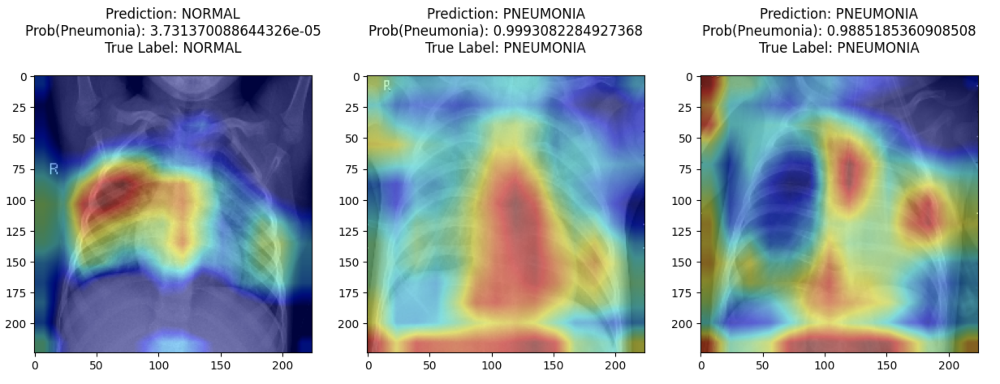

# Chapter 6

Now that we've taken a look at basic machine learning algorithms and how they work, let's turn over to looking at neural networks. In this chapter, we are going to be tackling an image classification challenge: trying to use chest x-rays to detect pneumonia in patients (i.e. assign a status of "pneumonia" or "normal" to each image). We'll also see how we can visualize what the neural network "pays attention to" when evaluating images (via using a technique called "Grad-CAM"). 

To get started, we need to find a suitable dataset for this task. Luckily, a website called Kaggle regularly hosts machine learning competitions (some of which are related to medical image classification tasks). As part of these competitions, organizations (usually companies, but also governmental bodies such as the NIH) provide public datasets for usage. We'll be using the following dataset for this chapter: [https://www.kaggle.com/paultimothymooney/chest-xray-pneumonia](https://www.kaggle.com/paultimothymooney/chest-xray-pneumonia). 

The relevant tasks for this project are as follows: 

1. Download the dataset into a Colab notebook using the Kaggle API.
2. Split data into training, validation, and testing set and visualize the distribution of normal and pneumonia cases.
3. Create data generators (you'll find out what this is later on in the chapter) for each of our data subsets and augment our training/validation images.
4. Create a small neural network termed "smallnet" for our image classification task.
6. Set up network "callbacks" to adjust neural network parameters during the training process and log progress statistics.
7. Train smallnet.
8. Use an existing neural network (VGG16) and customize it for our dataset (via a process known as "transfer learning").
9. Train VGG16.
10. Visualize an activation map from both models using GradCAM on a test set + evaluate both modles. 

With all of that in mind, let's get started! 

### Colab Setup

Make sure that you change your runtime type to a "GPU" for this chapter. In a new colab notebook, go to Runtime > Change Runtime Type and change CPU or TPU over to GPU on the dropdown menu.

### Downloading Data

First we need to download the images that we are going to use.

We will be using this kaggle dataset: https://www.kaggle.com/paultimothymooney/chest-xray-pneumonia. 

To quickly download the dataset, you will need to do the following: 

1. Create a Kaggle.com account
2. Click on your profile picture (in the upper right hand corner).
3. Click on 'Account'
4. Scroll down to the 'API' section
5. First click "Expire API Token". Make sure that a notice pops up saying that API tokens were expired or no API tokens exist.
6. Then click "Create New API Token", doing this should make a kaggle.json file which is automatically downloaded to your computer
7. Upload the kaggle.json file to google colab. 
8. Run the following lines of code.


**INPUT[CELL=1]**

```sh
!pip install kaggle
!mkdir /root/.kaggle
!cp kaggle.json /root/.kaggle/kaggle.json
!chmod 600 /root/.kaggle/kaggle.json
!kaggle datasets download -d paultimothymooney/chest-xray-pneumonia
!unzip chest-xray-pneumonia.zip
!rm -rf chest_xray/__MACOSX
!rm -rf chest_xray/chest_xray
```

**OUTPUT**
Many many lines of text that isn't too relevant to describe in detail. However, let's go through what all of the above actually does.

In prior chapters, we've sometimes used the `!pip install somelibrary` line in our code. But what is that `!` actually doing in this case? Well, commands such as `pip ...` aren't actually python code. They're rather commands that you would normally feed into a command prompt or terminal (this is a separate program on your computer that allows you to access files and run scripts just by typing a few keywords). The `pip install` command will actually call a separate program to find a python library from online, download it to your computer, and install it so that you can use it. Here, we're installing the `kaggle` python library which allows us to interact with the kaggle.com website programmatically. But why go through all the effort of doing that when the chest-xray challenge page has a big button that allows us download the entire dataset? Well, that dataset is quite large (several gigabytes) and it would take a while to download to our computer. Furthermore, we would need to then upload that dataset back to the colab notebook, which can be very timeconsuming. Rather, we can use the kaggle python library to automatically download a dataset to colab (or wherever you are running a python notebook). 

Let's go through all of the other lines of the above code snippet: 

**Line 2** will create a folder named `.kaggle` at the location `/root/` (Note, `mkdir` is short for "make directory" which is a handy way to remember that it is for making folders since a directory is just another name for a folder). But why should we create a folder at such a location? Kaggle's library actually requires us to store that kaggle.json file (we downloaded from their website) inside of the `/root` file under the `.kaggle` subfolder. Also, a minor side note: the `/root` folder is a folder that is present at the system level. Most of the folders that you interact with are present at the user level (e.g. Desktop, Downloads, Photos, etc). 

**Line 3** copies the kaggle.json file we have in the colab main directory to the .kaggle subfolder of the /root folder. It also makes sure that its name is still `kaggle.json` in that location. (Notice how we specify locations in these commands as folder/subfoldername/subsubfoldername/. these are called file paths and are convenient ways of reffering to specific locations rather than continually mentioning something is a subfolder of another folder. Also note, `cp` is short for copy (also an easier way to remember it).

**Line 4** alters the "permissions" of the kaggle.json file. File permissions are system level restrictions that allow us to specify exactly what a user can and can't do with a typical file. Here, we set the file permissions of the kaggle.json file to be `600` which means that it can be read from and written to. We won't be doing any writing to the file itself, but it's just nice to keep there in case you would ever need to edit the file directly. 

**Line 5** Will call the kaggle library command line tool (the part of the kaggle library that can be interacted with from the command line rather than a python program), and will download the dataset matching the name `paultimothymooney/chest-xray-pneumonia` (note the `-d` in the full command is used to specify that the files associated with the dataset should be downloaded). 

**Line 6** is used to unzip the zip file that was downloaded in the prior step. This will lead to the creation of a `chest_xray` folder in the main colab directory. 

**Lines 7 and 8** remove two subfolders called `__MACOSX` and `chest_xray` in the `chest_xray` folder. The contents of these subfolders contain copies of the main dataset anyway, so it is unnecessary to keep storing them in our colab session.

### Splitting data

At the end of running these commands, you should have a folder called 'chest_xray' with three subfolders called 'test', 'train', and 'val'. If you attempt to look at the individual folders, you'll see that the 'train' folder has two subfolders called 'NORMAL' and 'PNEUMONIA' (same with 'val' and 'test'). The train NORMAL and PNEUMONIA folders have many images (.jpg files) and so does the test folder. However, the 'val' folder only has a few images in both of the NORMAL and PNEUMONIA folder. These folders contain the training, validation, and test data for training our neural network; however, since there is so little validation data, it would be best for us to try and re-split the data ourselves to ensure an better split between training, validation, and test data. 

To do so, we'll basically do the following: 

1. Get the paths (aka file locations) of all of the images in the chest_xrays folder.
2. Re-split the data so that 20% of it is used for testing. 
3. Verify we did things correctly and didn't disturb the distribution of data by plotting the frequency of normal vs pneumonia images in the training dataset and testing dataset.

So that should take care of making sure that our train/test split is adequate. We'll handle how to make a validation split later on, but let's see the code: 

**INPUT[CELL=2]**

```py
import numpy as np
import matplotlib.pyplot as plt
import pandas as pd
from imutils import paths
from sklearn.model_selection import train_test_split

def generate_dataframe(directory):
  img_paths = list(paths.list_images(directory))
  labels = ['normal' if x.find('NORMAL') > -1 else 'pn' for x in img_paths]
  return pd.DataFrame({ 'paths': img_paths, 'labels': labels })

all_df = generate_dataframe('chest_xray')

train, test = train_test_split(all_df, test_size=0.2, random_state=42)

print(train['labels'].value_counts())
print(test['labels'].value_counts())
```

**OUTPUT**

```
pn        3419
normal    1265
Name: labels, dtype: int32
pn        854
normal    318
Name: labels, dtype: int32
```

The first five lines of code are just used to import some libraries that will help us for this task (and others down the road). There is one new library we haven't seen before called `imutils`. It is used for handling images and provides a handy module called `paths` that will find all of the images within a folder (and all of its subfolders). This will be very useful in getting us a list of all the images. 

In general, the code is structured so that we first call a method we define called `generate_dataframe`. This makes a pandas dataframe that contains two columns: one with the paths to all the images, and the other column saying what is the label of that image (normal or pneuomonia). 

Then we will split that data using the `train_test_split` method from scikit learn and specify that we want 20% of our data to be allocated to the test set. Lastly, we'll print out the count of each class in the training and testing set we just generated. Let's take a further look at the `generate_dataframe` method since that one is not something we've encountered before.

The `generate_dataframe` method takes in a single argument called `directory`. This gets passed to the `paths.list_images` method which returns to us an a python generator (you don't really need to know what this is other than the fact that it can make a function that behaves like a for loop). However, we don't really want a generator; we just want a list of the file paths. To get that, we simply wrap the `paths.list_images` call in a `list()` call and that returns our image paths containing all of the images in all of the subfolders of the directory we called `generate_dataframe` with. 

Next, we need to find the actual labels associated with each of these images. As mentioned earlier, each image lives within a folder named either NORMAL or PNEUMONIA. So, all we need to do is look in each of our image paths and see if the word "NORMAL" appears: if it does, it is a normal image, otherwise it is a pneumonia image. We can do that by using a list comprehension: 

```py
['normal' if x.find('NORMAL') > -1 else 'pn' for x in img_paths]
```

which is basically the equivalent of

```py
new_list = []
for x in img_paths:
    if x.find('NORMAL') > -1
        new_list.append('normal')
    else:
        new_list.append('pn')
```

A small reminder: the `.find` function on the string filepath (temporarily stored in the variable `x`) will return -1 if the phrase passed to `.find` is not found, otherwise it returns something greater than -1. 

At this point, we now have a list of image paths and we have a list of labels. It would be nice to have this in a dataframe with two columns (one for paths and one for labels) since it works well with other methods in the library we will use to build our neural networks. To do that, all we need to do is call the `pd.DataFrame` method and pass in a dictionary with keys equivalent to the column names and respective values equal to the lists making up those columns. 

We can then call `generate_dataframe('chest_xray')` to get a dataframe of all of the images. The `train_test_split` method will split up our dataframe as well (and will try to ensure that both classes have the same distribution of labels). Lastly, we will print out the frequency of labels in the newly generated `train` and `test` dataframes by calling `.value_counts()` on the `'labels'` column for each. 

We can continue by plotting out the counts as well: 

**INPUT[CELL=3]**

```py
fig = plt.figure(figsize=(10,3))
for idx, x in enumerate([train, test]):
  fig.add_subplot(1,2,idx+1)
  x['labels'].value_counts().plot(kind='bar')
```

**OUTPUT**


We can see here that the distribution of normal vs pneumonia (here called 'pn') images in the train and test datasets is basically the same. Importantly, we see that pneumonia data is over-represented relative to the normal data which could bias our network if we don't account for that.

Now that we have our training and test datasets created, we can get started with actually working with the neural network building library `tensorflow` and `keras` (which is contained within tensorflow). We'll first get started by creating an ImageDataGenerator that allows the network to easily get training, validation, and testing images.

### Creating Data Generators and Augmenting Images

Data generators are the way that our network can actually use the training and test data we have stored in our dataframes. Since our dataframe only contains the path to the image and the label, we would ideally like some way of automatically reading those images into the computer's memory so that our soon-to-be-made neural network program can actually learn on it (or be evaluated on images). 

The neural network libraries we are using give us the ability to create an `ImageDataGenerator` which will allow us to specify data augmentations (random transformations to our images that provide us the ability to continually generate images that are all unique rather than training on the exact same images) and give us the ability to specify a dataframe from which to load images from. 

> Side note: Why do we need to augment our images? The way that the neural network trains is that it goes through all of the training images one time (usually in groups of images called 'batches'). Each training run over the entire imaging set is called an "epoch". Some neural networks will need multiple epochs to actually train to a point that is viable for real world usage, but training on the same images again and again runs the risk of overfitting to your training data.  We can use the `ImageDataGenerator` to randomly alter the source training images for each epoch. We can specify random transformations to the image (called "augmentations") such as rotating it by a certain maximum number of degrees, flipping it horizontally, shifting it left/right, or changing its brightness. We'll use some of these augmentations in our scripts.

Let's set up a method that allows us to create all of the generators we need (ie training, validation, and test generators). 

**INPUT[CELL=4]**

```py
from tensorflow.keras.preprocessing.image import ImageDataGenerator

def create_generators(train, test, size=224, b=32):
  train_generator = ImageDataGenerator(
      rescale=1./255, rotation_range=5, width_shift_range=0.1,
      height_shift_range=0.1, validation_split=0.2
  )
  test_generator = ImageDataGenerator(rescale=1./255)
  
  baseargs = {
      "x_col": 'paths', 
      "y_col": 'labels',
      "class_labels": ['normal', 'pn'], 
      "class_mode": 'binary',
      "target_size": (size,size), 
      "batch_size": b, 
      "seed": 42
  }
  train_generator_flow = train_generator.flow_from_dataframe(
    **baseargs, 
    dataframe=train, 
    subset='training')
  validation_generator_flow = train_generator.flow_from_dataframe(
    **baseargs, 
    dataframe=train, 
    subset='validation')
  test_generator_flow = test_generator.flow_from_dataframe(
      **baseargs, 
      dataframe=test,
      shuffle=False)
  
  return train_generator_flow, validation_generator_flow, test_generator_flow
```

**OUTPUT**

There won't be any output since we're just defining a method here. We'll call it after we go through what it does.

Here, we define a method called `create_generators` that takes in our train and test sets. We also specify two other arguments `size=224, b=32`. These are "default named arguments" (they function as normal arguments but will only have the specified value unless the method call specifies otherwise). `size` and `b` will be used to dictate how the images should be resized and what is the "batch size" (i.e. the number of images a neural network will see at each training step of the epoch) for each generator.

Next, we create two instances of the `ImageDataGenerator`, a training image data generator and a testing image data generator. In the training image data generator, we specify a number of arguments as follows:

* `rescale` is a number multiplied by each pixel in the image. We set this equal to `1./255` which just means that we multiply everything by 1/255. That number was chosen because most neural network architectures are scale sensitive, meaning that it becomes difficult for a network to learn on the full range of pixel values (0-255). Instead, we can rescale our image pixels to values between 0 and 1 (which multiplying the entire image by 1/255 does). 
* `rotation_range` is the first augmentation parameter we have. Since we have it set equal to 5, we will randomly rotate each image by anywhere between 0 and 5 degrees in the clockwise or counterclockwise direction. 
* `width_shift_range` and `height_shift_range` are the 2nd and third augmentation parameters. They shift the image width and height by 0-10% (0.1) of the image width and height, respectively. 
* `validation_split` is the parameter that splits up our training set into a training set and a testing set. Since we have its value specified as 0.2, 20% of what we originally defined as the training set will be allocated to a validation subset. 

For the test image data generator, we only need to rescale our image (since we want to test on actual images without any additional transformations). 

Instantiating a `ImageDataGenerator` object isn't enough to actually get the data generator to read images from our dataframes. To do that, we have to call `.flow_from_dataframe` on each of data generators we currently have (a train and test data generator). With that, let's dive into the second segment of the above code: 

```py
...
  baseargs = {
      "x_col": 'paths', 
      "y_col": 'labels',
      "class_labels": ['normal', 'pn'], 
      "class_mode": 'binary',
      "target_size": (size,size), 
      "batch_size": b, 
      "seed": 42
  }
  train_generator_flow = train_generator.flow_from_dataframe(
    **baseargs, 
    dataframe=train,
    subset='training')
...
```

Here, we've defined a dict that has multiple keys and values. This dict is then passed to our function but is represented as `**baseargs`. What does the `**` do? It actually expands out our dictionary into named arguments so that each key and value of the dictionary is a named argument name and value. So the above is the equivalent of saying: 

```py
train_generator_flow = train_generator.flow_from_dataframe(
    x_col='paths', 
    y_col='labels',
    class_labels=['normal', 'pn'], 
    class_mode='binary',
    target_size=(size,size), 
    batch_size=b, 
    dataframe=train, 
    subset='training')
```

It's just a little bit more convenient to use the `**` syntax since we will be repeating these parameters across each of the generators. 

Each of the arguments does the following: 

* `dataframe` specifies what the source dataframe is that contains the data for where the images are located and their associated labels. 
* We also need to specify which column contains the image path (`x_col` argument) and which one contains the label (`y_col` argument). 
* Additionally, we need to specify the class labels (argument `class_labels`) as a list (note: class names get internally converted to a 0 or 1, the first element of the list will be treated as a 0 and the second element will be a 1). 
* Since we are only dealing with two categories to predict, we can specify the outcome (via the `class_mode` argument) should be treated as a binary variable (if we're predicting multiple things, we can use `categorical` as the `class_mode`). 
* We also can also resize our images to a width and height specified in a tuple as the argument to `target_size`. Here, we've set `size` equal to 224, meaning we'll feed 224px x 224px images into our neural network (this will become important later on). 
* We also set the batch size (ie the number of images we present to the neural network at once) via the `batch_size` variable. We're setting the batch size to 32, but this can be as small or as large as you want (larger batch sizes take up more memory, smaller batch sizes take up less memory, but could cause the network to learn slower since it only sees one image at a time before updating its weights). 
* Additionally, for the training and validation generators we make, we can specify what subset of the data to select from. Recall that when we made the `ImageDataGenerator` stored in the `train_generator` variable, we specified a validation split of 0.2. This allocates 80% of the dataframe rows to the training subset and 20% to the validation subset. Since we're making a fully "flowed" training generator, we want to select the training subset of this training generator, which we can do with the `subset` argument. 
* Lastly, we can ensure reproducability of the data splits by specifying a "seed" argument (this is just equal to a random number, but anyone who runs flow from dataframe with this number should get the same split of images we do). 

We store the `train_generator` that has had `.flow_from_dataframe` called on it in the `train_generator_flow` variable. 

We also set up the "flowed" validation generator similarly to the "flowed" train generator, except we specify the `subset` to be the `'validation'` subset of the original train generator. 

Lastly, we set up the "flowed" test generator similarly to the other two, except we don't include the `subset` argument and set the source dataframe as the `test` dataframe. Additionally, we disable the shuffling of images in the dataset. Normally, all of the images are shuffled on each epoch ensuring the network isn't exposed to images in the same order; however, this behavior makes it harder to evaluate images (will lead to incorrect labels being used to evaluate the image). 

Now, let's see if everything worked by calling the `create_generators` method and displaying some images from our training generator:

**INPUT[CELL=5]**

```py
train_generator, validation_generator, test_generator = create_generators(train, test, 224, 32)

imgs = train_generator.next()
fig = plt.figure(figsize=(10,10))
for i in range(16):
  fig.add_subplot(4,4,i+1)
  image = imgs[0][i]
  label = 'PNEUMONIA' if imgs[1][i] == 1 else 'NORMAL'
  plt.imshow(image)
  plt.title(label)
```

**OUTPUT**


We first called our `create_generators` method with the `train` and `test` datasets as well as 224 and 32 for the image size and batch size respectively (though we could have omitted these two arguments since they have default values in the method definition). 

The next section of the code samples one batch of images from the train generator (using `train_generator.next()`) and creates a figure. We store these images in the `imgs` variable. `train_generator.next()` returns two lists: the first list contains all the images and can be accessed using `imgs[0]`, the second list contains the corresponding labels and can be accessed using `imgs[1]`. 

Next, we'll display the first 16 images from this training batch (note there are 32 images in the batch overall).

`for i in range(16)` makes a for loop that runs 16 times (and `i` increases by 1, starting from 0). For each iteration of the for loop, we add an subplot to the image by specifying three numbers: the first two numbers define the grid of subplots (4x4 to accomodate all 16 images) and the last number specifies which number subplot (starting at 1) the image will be plotted in. 

To get the image to plot, we will access the `i`th index training image which is stored in `imgs[0][i]`. We will also get the label of the image from `imgs[1][i]` and store its value as 'PNEUMONIA' if the label is equal to 1, otherwise it will be store it as 'NORMAL'. 

Finally, we show the image (which plots it into the subplot) using `plt.imshow` method and set the plot title with `plt.title`, passing in the label we set before.

As you can see, some of the images are slightly rotated and shifted and all seem like plausible images we may see in the test set (which is the aim of data augmentation). 

Now that we've set up our data generators for use in the neural networks, let's actually specify how the neural networks are structured. 

### Your first convolutional neural network: SmallNet

Neural networks are typically specified using the following general steps: 

1. Specify the structure of the network (i.e. all of the individual layers that go into it). 
2. Compile the network and specify how it learns (via an optimizer), how its penalized for bad learning (via a loss function), and how it measures its progress (via  metrics). 
3. Specify callbacks which determine if anything should be recorded at the end of each epoch, when the model should be saved, and how some parameters should change.
4. Train (aka fit) the model. 

The overall structure of our program will be as follows (note, this is just a rough sketch and not actual code). 

```py
def make_modelname():
    # specify model layers and compile model
    # return compiled model
def get_callbacks():
    # return list of callbacks
def run_model(train_generator):
    model = make_modelname()
    callbacks = get_callbacks()
    # fit the model
    model.fit(train_generator, callbacks)
```

In this section, we'll tackle steps 1 and 2. To do that, let's specify a neural network architecture we'll call "SmallNet" since it has relatively few parameters to train on. Before we do that, we need to import several methods. 

**INPUT[CELL=6]**

```py
from tensorflow.keras.models import Sequential, load_model
from tensorflow.keras.optimizers import Adam
from tensorflow.keras.layers import Dense, GlobalAveragePooling2D, Conv2D, MaxPooling2D, Flatten, Dropout
from tensorflow.keras.callbacks import ReduceLROnPlateau, ModelCheckpoint, TensorBoard, EarlyStopping
from tensorflow.keras.metrics import Recall, Precision, AUC
from tensorflow.keras.applications import EfficientNetB4
from tensorflow.keras.utils import plot_model
from datetime import datetime
```

* The first line imports a model type called a "Sequential" model from the Keras machine learning library. It also imports a "load_model" method we will use later when attempting to retrain a model that has been saved to disk
* The second line imports an optimizer called "Adam". Adam will adaptively change the learning rate of the neural network so that it adjusts how quickly it adjusts its weights.
* The third line imports a variety of layers (think of these as sections to the neural network). We'll use all of these in the creation of "SmallNet"
* The fourth line imports some callback methods. `ReduceLROnPlateau` will drop the learning rate if the permance of the network stagnates, `ModelCheckpoint` allows us to save the network after the completion of each epoch, `TensorBoard` allows us to visualize the training progress of our network, and `EarlyStopping` allows us to stop the training of the network early if there is no improvement whatsoever (helps us avoid overfitting).
* The fifth line imports some metrics to monitor during the training of the network.
* The sixth line imports a neural network architecture called `VGG16`. We will adjust a pretrained version of this network to work for our task.
* The seventh line imports a method called `plot_model` which gives us the ability to visualize the structure of our neural network
* The last line just gives us the ability to get the current date and time (we'll need this when creating logs for training progress). 

Now that we've defined the imports we need, let's get to specifying our "smallnet" architecture.

**INPUT[CELL=7]**

```py
def make_smallnet():
  SIZE = 224
  model = Sequential()
  model.add(Conv2D(32, (3, 3), activation="relu", input_shape=(SIZE, SIZE, 3)))
  model.add(MaxPooling2D((2, 2)))
  model.add(Conv2D(32, (3, 3), activation="relu"))
  model.add(MaxPooling2D((2, 2)))
  model.add(Conv2D(32, (3, 3), activation="relu"))

  model.add(Flatten())
  model.add(Dense(32, activation="relu"))
  model.add(Dense(1, activation="sigmoid"))

  model.compile(optimizer=Adam(learning_rate=1e-2),
                loss='binary_crossentropy', 
                metrics=['accuracy', Recall(name='recall'), 
                        Precision(name='precision'), AUC(name='auc')])

  return model
```


This method will be used to return a "compiled" model in our final training method (note: a "compiled" model is just a model that is ready to be trained). This network architecture contains multiple layers ordered in a sequential manner (i.e. each layer feeds into next one directly), we call this a Sequential convolutional neural network. This convolutional neural network (CNN) is split up into two main components: a convolutional part and a dense part. 

In the convolutional part (before the line that says "Flatten()"), we create 3 convolutional layers and two max pooling layers. The first convolutional layer is specified with the `Conv2D` method from the keras neural network library. 

Let's break down this statement a bit further: 

```py
Conv2D(32, (3, 3), activation="relu", input_shape=(SIZE, SIZE, 3))
```

The first argument `32` specifies the number of convolutional filters we want to train. Recall that these filters slide over an image from left to right and multiple the pixels that the filter is on by whatever values are learned in the filter. We're doing this process 32 times. 

The filter size is specified by the 2nd argument `(3,3)` meaning that a 3px x 3px square is going to be moving around our image and doing multiplication. 

The `activation="relu"` argument specifies the activation function of the convolutional layer. This is basically a function that is applied to the resulting values coming out of the image convolutions. In this case, we use the "relu" activation function which will keep positive values and set any negative values to 0. We need activation functions since that is what allows the network to do gradient descent (i.e. figure out what's the best way to adjust weights to minimize loss). 

The last argument specifies what the input shape is for the image. Here, we have it set to `(SIZE, SIZE, 3)`. From the method body, `SIZE` is a variable we set equal to 224, which corresponds to the size of the input images we get from our training generator. The "3" represents the fact that our image is an RGB color image. Even though X-ray radiographs just have intensity values and no color, the Kaggle contest organizers saved the X-ray DICOM images to a .jpg format, which converts them to RGB color images (even though they appear as gray to our eyes). The "3" represents that there are actually 3 images stacked upon each other for each image: one image containing the "red" values for the image, another containing the "green" values, and the last containing the "blue" values. If we had raw intensity values, we would have changed the "3" out for a "1". We wrap this `Conv2D` method call in a `model.add` which will actually add this convolutional layer (created by `Conv2D`) to the Sequential CNN model we're making. 

> Side note: When we're actually training this layer of the network, the neural network will need to learn several hundred parameters just for this layer alone. The specific number of parameters (think of these as the weights and biases of the perceptrons...though there aren't any in the convolutional filters) is 896. How do we calculate that number? Well, each of the filters is 3x3x3 (the first two "3"s indicate the width and height of the filter; the last 3 represents the fact that we're operating on a 3-channeled color image) in size where each unit of the filter is a parameter to learn. Additionally, there is a general "bias" term that must be learned for each filter as well. We have 32 of these filters to learn, meaning that there are $32*((3*3*3)+1) = 896$ parameters to learn. If we have outputs from the prior layer, we'll also need to learn parameters to determine their weight. The general formula for the parameters to learn in a convolution block is $$\text{# parameters} = \text{# filters}*((\text{filter height}*\text{filter width}*\text{# of filters in previous layer}) + 1)$$

The second layer we're adding to our network is a "Max Pooling Layer" (aka maxpool). All this layer will do is downsize our image by looking in specific blocks of our picture and only keeping the highest valued pixels. In this case, since we pass the numbers `(2,2)` to the `MaxPool2D` layer, we are going to break up the image output from the previous convolutional layer into little 2x2 sections (non-overlapping). This layer will then pick out the highest valued pixel within each of the 2x2 sections. There aren't any parameters to learn since this operation is just an algorithmic step to downsize our input. 

We'll repeat the convolution -> maxpool operations in order one again and follow up with a last convolution layer. Adding more convolutions to our network can produce potentially better results; however, we need to make sure that we don't add too many maxpool layers, since each time they are applied, the image is downsized by two. Speaking of...what is the size of our image at the end of these operations? 

After the first Conv2D operation, our input 224 x 244 image will be converted to a 222 x 222 x 32 image. Why did we lose 2 pixels on either side and add an "x32"? Well, the convolution filters that pass over the image must always pass over valid parts of the image (i.e. we can't have a situation where some parts of the filter are on the image and some parts are off the image). Additionally, since we have 32 convolutional filters, we're essentially creating 32 new images for a single input image. This leads us to the following general formula for how to calculate dimension changes in convolutions: 

$$
dnew = [(d-k+2p)/s]+1
$$

Here $d$ is the size of the original dimension we want to find the new dimension size for (e.g. width), $k$ is the size of the kernel along the same dimension, $p$ is the padding parameter, and $s$ is the stride parameter. The output of the formula is the $dnew$ dimension size. Let's try calculating our new width. Since our width input dimension size is 224, $d$ is 224. $k$ is the width of our filter which is 3. Padding ($p$, the number of pixels we add to the edges of our image) is 0 (this is default unless otherwise specified). Stride ($s$, how much the filter moves over on each step) is just 1. Pluggin it in: [(224-3+2*0)/1)]+1 = 222. Since our input height is the same as the input width and the filter height is the same as the filter width, our new height is 222. The x32 comes from the fact that there are 32 filters, each creating a new image. 

After the Max pool operation, our dimensions will go down by half. In the case that our original dimensions are odd numbered, we round down. So that means that our new dimensions after the maxpool layer would be 111 (222/2) for the width and height and 32 for the channels (aka number of images that were produced from a convolution).

The next convolution layer is the same as the first, but this time we increase the number of channels from 32 to 64. Running through the math, the new width and height dimensions will be [(111-3+2*0)/1]+1 = 109. The new number of channels will be 64, producing a final dimension of 111 x 111 x 64. We then follow that up with a maxpool, which brings dimensions down to 111/2 = 54.5 (round down) = 54 (final size = 54 x 54 x 64). Next, we have another convolution operation that keeps the number of channels the same, so the final dimensions are 52 x 52 x 64. As you can see, each maxpool operation can reduce our image size and we can't go below a 1x1 image (also note that convolutions can downsize an image if the stride is > 1). 

The total number of parameters to learn for the 2nd convolution is 18496 ($64*((3*3*32)+1$) and the number of parameters in the 3rd convolution is 36928 ($64*((3*3*64)+1)$). As you can see, we already have over 56,000 parameters to learn and we aren't even done specifying our network. 

The next block of code will take the convolved images we have (a 64 channel image with dimensions 52 x 52) and "flatten" it so that they now represent individual perceptrons. In fact, we create 173,056 ($ = 52*52*64$) perceptrons in total. This is done just with the call to `model.add(Flatten())`. 

Next, we densely connect the 173,056 perceptrons to 64 perceptrons (by specifying `model.add(Dense(64...))`). This connects each of the 173,056 perceptrons to each of the 64 perceptrons, forming a total of 173065*64 connections (these are parameters we need to learn). Additionally, we'll need to learn a bias for each of the 64 perceptrons, so that brings the total number of parameters to learn for this layer up to 11075648. We also set a relu activation function on this layer (sets negative outputs to 0, doesn't alter positive outputs). This leads us to the final line of code for this dense layer `model.add(Dense(64, activation='relu'))`. Note, all of the aforementioned layers: `Conv2D`, `MaxPool2D`, `Flatten`, and `Dense` come from the `tensorflow.keras.layers` submodule (which contains many many other layers for you to check out). 

Finally, we have the last layer of our network. This is the only one that is actually constrained to be a specific value since the output of this layer is what we'll be using to evaluate a prediction. We will set up a dense layer but only have 1 output perceptron. That means that all the 64 perceptrons from the previous layer will be connected to this one output layer (and we need to learn 64 weights + 1 bias parameter = 65 parameters for this layer). We'll also set a "sigmoid" activation function on this layer (constrains outputs from 0-1 along an "S" curve, ref image below for comparison between sigmoid and relu functions). 


> Side note: Consider the pre-activation function output of a neuron as the "x" value fed into these functions. In the sigmoid function, no matter what x value we put in, the y-value will always be in the range of 0 to 1. In the relu function, if we input a positive x value, we get a positive y-value out. If x is negative, we get 0 out. There are many other activation functions out there such as identity, binary step, logistic, tanh, arctan, leaky relu, softplus, and more. you can try out several different 

But why do we choose our output to just be a single perceptron that has a sigmoid function attached to it? Our classification task is a binary classification meaning that there are only two possible outputs. Really, this can be represented with a single value in the range of 0 to 1, hence we only need one output to represent it. If the output value is below some threshold (such as 0.5), we'll consider the output to be normal and otherwise it would be a pneumonia. A perfect prediction would yield an output value of either 1 or 0 (pneumonia or normal); however, that rarely happens. But the raw output value from the perceptron can also be considered a probability that something is considered to be a pneumonia case (since the output is constrained between 0 and 1), which is useful to give a "confidence" that the image is pneumonia. In the case that you adapt this network for some other task, you should set the number of dense outputs to the number of distinct categories you have if the number of categories is > 2. 

The last segment of code consists of the model compilation statement. This statement contains information about what is the loss function of the model (`loss='binary_crossentropy'`), what is the optimizer used to dictate its learning rate (`optimizer='adam'`), and what metrics should be reported on each training step (the list starting with `metrics=['accuracy', ...]`.

The loss function is set to `binary_crossentropy`. Recall that a loss function is used to quantify how wrong the neural network is and, more importantly, is a critical component in determining how the neural network adjusts its weights and biases in the backpropagation process. The binary crossentropy formula is as follows: 

$$
-\frac{1}{N}\sum_{i=1}^N y_i \log(p(y_i)) + (1-y_i)\log(1-p(y_i))
$$

This looks complicated, but what it actually does. Let's say that the neural network last perceptron outputs 0.73 for some sample. This sample is actually a pneumonia sample, so if our network was the best it could possibly be, it should be outputting a 1. Clearly the network needs to improve to get to that point and accordingly, it should be told how "wrong" it is. We can do that using the binary cross entropy formula. Ignoring the summation term for the moment, Let $p(y_i)$ equal 0.73 and let $y_i$ equal 1. Also, we're going to use a log base 2 rather than base 10. The loss is going to be $1*\log(0.73)+(1-1)\log(1-0.73) = -0.31$. Note, we need to flip the sign since loss is typically referred to as a positive number that should be minimized, so the final loss is $0.31$. Let's try out another example. Let's say that the last perceptron outputs a value of 0.73 but for that an image that is truly normal. This is *really* bad since the network should ideally output a "0" in this case. Let's see what the loss would be: $0*\log(0.73)+(1-0)*\log(1-0.73) = -1.309$. Flipping the sign, we get a final loss of $1.309$. 

We just saw how having a close prediction yielded a lower loss compared to a really far off prediction. This is the exact behavior we want since our neural network aims to always decrease the output of the loss function for each batch. For all the images in a batch (taken care of by the $\sum_{i=1}^N$ term), we simply sum up their losses and takes its average and multiply it by -1 (taken care of by the $-\frac{1}{N}$). If you were going to predict multiple categories, you'd use a 'categorical cross entropy' loss function which is very similar to the loss function described above. For regression tasks (e.g. predicting degree of spinal curvature from a radiograph), you could use a mean squared error loss (difference between predicted and actual value squared). 

Moving onto the optimizer. The optimizer we're using is called "Adam" which is short for adaptive moment estimation. For each of the parameters in our model, it will change the learning rate (ie how much the weights or biases associated with the parameter will change) based on whether the parameter is associated with frequent features (in which case it will keep learning rates low) or infrequent features (in which case it will keep learning rates high). There is a lot more nuance into what makes the "Adam" optimizer work and how it is different from some other optimizers such as stochastic gradient descent, adagrad, rmsprop, etc; however, it isn't worth going into (but if you want to look at it [here](https://ruder.io/optimizing-gradient-descent/) is all the math behind those). In general, it is popularly used and, more importantly, it is readily available in the keras library so that we only need to specify a single line that says `optimizer='adam'` when we compile the model.

Lastly, we specify metrics we want to keep track of at ever training step and then return the model from the method. The metrics are specified in a list argument to the compile method and are as follows: 'accuracy' (which is recognizable by keras with just the string itself), Recall, Precision, and AUC. The names are self explanatory and will just print out the accuracy, recall, precision, and area under the curve (for the roc curve) at each training step in the model. For the last three metrics, we can specify a "name" parameter that dictates how they show up during the training process as the model metrics are printed out. Also note that the last three metrics are all coming from a keras submodule called `tensorflow.keras.metrics`. 

Now that we've set up smallnet, we're just one step away from training the network. Before we do that, we need to set up some callbacks which will allow us to monitor the progress of the network, save its best training cycle, stop it if it doesn't improve, and kick it out of any learning rate plateaus.


### Callbacks: Tensorboard, Early Stopping, Model Checkpointing, and Reduce Learning Rates

We're going to define a method called `get_callbacks` that returns a list of callbacks for use later in the training process. Let's see what that method looks like: 

**INPUT[CELL=8]**

```py
def get_callbacks(model_name):

  logdir = (
      f'logs/scalars/{model_name}_{datetime.now().strftime("%m%d%Y-%H%M%S")}'
  )
  tb = TensorBoard(log_dir=logdir)
  es = EarlyStopping(
        monitor="val_loss",
        min_delta=1,  
        patience=20,  
        verbose=2,
        mode="min",
        restore_best_weights=True, 
    )
  mc = ModelCheckpoint(f'model_{model_name}.hdf5', 
                      save_best_only=True, 
                      verbose=0, 
                      monitor='val_loss', 
                      mode='min')

  rlr = ReduceLROnPlateau(monitor='val_loss', 
                          factor=0.3, 
                          patience=3, 
                          min_lr=0.000001, 
                          verbose=1)
  return [tb, es, mc, rlr]
```

The `get_callbacks` method just takes in a single argument called `model_name` and this is just the name of the model which will help us while saving some files related to the model (to ensure that it doesn't overwrite anything else that exists on our file system). 

The first callback we're going to use is the TensorBoard callback. Tensorboard is a visualization tool which we'll see later on. But it basically allows us to see how the training process went by giving us the ability to monitor the various metrics we defined. This is what tensorboard looks like:


And it can be loaded either before or after you start you training process by running the following cell (but we won't do that until we're done training everything).

```sh
%load_ext tensorboard
%tensorboard --logdir logs
```

If you notice, at the top right, we're viewing the scalars panel which is the set of all the different metrics we have. Tensorboard will automatically read from a directory (specified by `--logdir FOLDERNAME`, in this case `logs`) and try to find tensorboard log files. Those tensorboard logs files are only generated if you pass the tensorboard callback to your neural network when you set it up for training, otherwise, it doesn't have anything to plot. Those log files will contain all of the metrics (aka scalars) at every timepoint along the training and validation process. Tensorboard will then plot those curves for you to view (which can be helpful to determine if your network is actually still improving or not). 

All we need to specify for the tensorboard callback is the filepath of the directory where the logs should be kept. Since we may be running our network multiple times, we want to make sure that previous runs aren't overwritten. We can do this by including the date and time the network was run in the folder path. The `datetime` library provides a submodule called `datetime` that has a `.now()` method on it which allows us to get the current time as a python object. We can convert it to a string by calling `.strftime()` on `datetime.now()` and passing in the following string `"%m%d%Y-%H%M%S"` which if shorthand for printing the month (%m), day (%d), and year (%Y), followed by a "-" sign and then the current hour (%H, 24 hour time), minute (%M), and second (%S). If I run this on July 26 at 12:24 PM and 36 seconds, the resulting string would be 07272021-122436. We interpolate this value into the general string `"logs/scalars/{model_name}_{the date + time}"`. 

The second callback is the EarlyStopping callback. As the name may imply, it will stop the training of the network early (meaning that if we set our network to train 100 epochs, this callback could stop its training at the end of the 32nd epoch if certain conditions are met). Why would we want to do that? It is very useful to prevent overfitting for our model. If we monitor the validation loss and don't see it improve by 1% over 20 epochs, that likely means that the network is done learning all it can. `monitor="val_loss"` tells the callback to keep an eye on the validation loss, `min_delta=1` tells the callback to see if it has improved by 1% (in the downward direction as dictated by `mode='min'`) after `patience=20` epochs. `verbose=2` is used to print out when it stops the network early. Lastly, we will set the model back to the best point (specified by `restore_best_weights=True`). 

The third callback is the `ModelCheckpoint` callback. This callback will save a version of the model to colab's filesystem every epoch (with some caveats). The first argument is just what the name of the model filename should be (in this case it would be `'model_smallnet.hdf5'` since `model_name` will be 'smallnet' (stay tuned for where we pass this argument in). However, we've also specified a `save_best_only=True` argument, meaning that we will only save the model at the end of each epoch if it beat out the previously saved model. How do we determine what model won? We look at the validation loss (specified in the argument `monitor='val_loss'`) and will pick whichever is lower (`mode='min'`). After we're done training the model, we could download the model_smallnet.hdf5 file and re-upload it to colab/run it on our local machine if we want to. 

The last callback is the `ReduceLROnPlateau` callback. In general, a learning rate that is too high will result in the network failing to converge. In most cases, the adam optimizer should be able to adjust the learning rate on its own, but sometimes, it will need some forced decrease in the baseline learning rate to continue optimizing further and getting the network to continue learning. It will reduce the learning rate by a factor of 0.3 (`factor=0.3`) if the validation loss has not changed for 3 epochs (`monitor='val_loss'`, `patience=3`) and will continue to do so until the learning rate is 0.000001 (`min_lr=0.000001`). It will also print when it lowers the learning rate (`verbose=1`). 


Now that we've defined all our callbacks, let's get started with defining how the training happens! 

### Defining the fit method and fitting smallnet

We're going to make a single method that calls the make smallnet method and the get callbacks method while also training the network. We'll also see how we can get a summary of the model (ie all the layers it has) and a plot of how all the model layers feed into each other. Here's the definition for that method. **NOTE** we will be coming back to this method later, so you'll need to edit it in a couple of sections (I'm denoting that it is a work in progress by noting a WIP tag next to the cell number): 

**INPUT[CELL=9][WIP v1]**

```py
def fit_model(train_generator, validation_generator, model_name, 
              batch_size=32, epochs=15):
  
  if model_name == 'smallnet':
    model = make_smallnet()
    
  model.summary()
  
  plot_model(model, to_file=model_name + '.jpg', show_shapes=True)
  
  model_history = model.fit(train_generator,
                            validation_data=validation_generator,
                            steps_per_epoch=train_generator.n/batch_size,
                            validation_steps=validation_generator.n/batch_size,
                            epochs=epochs,
                            verbose=1,
                            callbacks=get_callbacks(model_name))
  return model, model_history
```

All this method does is the following:

1. It takes in the train and validation generators we made earlier. These will be used during the model fitting process (data will be trained on the training generator images, it will be evaluated at each epoch on the validation generator images). 
2. It checks to see if the `model_name` we pass in is equal to `'smallnet'`. If it is, we will call the `make_smallnet()` method which returns a compiled keras model to us (which we will store in `model`). 
3. We will then print out a model summary (using `model.summary()`) which contains information about the number of layers, sizes of each layer, and number of parameters to be trained.
4. Then we'll call a method `plot_model` (defined in the `tensorflow.keras.utils` submodule) and pass in our `model`, the filename we'd like to save the `plot_model` results to (just the model name appended with a `.jpg` to indicate it is an image afile) and the `show_shapes=True` argument (which makes the diagram a bit fancier). This will produce the following image of our model once we call it (this will be in the colab files directory, refresh it if you don't see it): 


Notice how it has all of the layers we specified: the 3 convolutional layers, the two max pooling layers, the flatten layer, and the two dense layers. It also has an input layer that is added by keras to represent the image input.

Lastly, we call `model.fit` which actually trains our model. It takes in the training generator, the validation generator (`validation_data=validation_generator`), and also requires information about the number of steps we need for training and validation. A step is considered to be one run through a batch of images, so all the steps would be the number of batches. We can get that just by calling `generator_name.n` (gets us the total number of images) and dividing it by `batch_size` (a default named argument in the method declaration). `steps_per_epoch` is equal to the number of batches in the training generator and `validations_steps` is equal to the number of batches in the validation generator. We set `verbose=1` to get progress notes on training, and set the callbacks to the result of the `get_callbacks()` method call (which just returns a list of the callbacks we wanted to keep track of). 

The `model.fit` call returns the history of the model (which is just what the metrics were at each epoch for the training and validation sets). At the end of the method, we return the trained model (in `model`) and its history `model_history`.

Now that we've specified the method to train the smallnet network, let's actually train it. Note: running the next cell will take approximately 30 minutes.

**INPUT[CELL=10]**

```py
small_model, small_model_hist = fit_model(train_generator, 
                                          validation_generator, 
                                          'smallnet', epochs=15)
```

**OUTPUT**


In this output we can see some interesting things. For one thing, in the first part (before the "Epoch"), we get the model summary (generated from `model.summary()`). It looks like our calculation for the number of parameters and dimensions per layer from earlier was correct! This model summary is useful to help you determine if you're on the right track and have specified your model correctly. 

After you saw that, you'll see the training process begin. We specified that our we should train our network for 15 epochs. Within each epoch, there are 117 steps which represents the 117 training batches we have. After each step, you'll see the 'loss' and other metrics update: these are the training metrics the network reports after it sees all the images in each step (ie one batch). At each epoch (i.e. a run through all 117 training batches), you'll see that the `loss` printed out will start to decrease over time. Here we saw it go from 0.56 to 0.25 to 0.1659 in jury 7 epochs. We also see the training set accuracy (`accuracy` in the printed text) go from 77.69% to 93.28%. You can also see all of the other metrics we specified: recall, precision, and AUC. If you scroll your output to the right after an epoch is finished training, you'll also see those same metrics on the validation set (those metrics are prepended with the `val_` string). If you see these validation metrics deviate far from the training metrics, that's a sign that you're overfitting your network.

You'll also see in the above output that at epoch 5, we reduced our learning rate to 0.0003 since the ReduceLRonPlateau callback condition was triggered. This was because the validation loss `val_loss` was plateauing (it went from 0.43 -> 0.20 -> 0.24 -> 0.21 -> 0.25) rather than constantly decreasing. This happened again at epoch 14 for me, but it might not happen for you. After the decrease in learning rate, the `val_loss` started decreasing again, and I also saw that `val_accuracy` increased quickly.

We can even view the training session by starting up a tensorboard with the following: 

**INPUT[CELL=optional but after 10]**

```
%load_ext tensorboard
%tensorboard --logdir logs
```

At the end of the training session, metrics were as follows: 

* validation accuracy: 0.9402 
* validation recall: 0.9608 
* validation precision: 0.9580 
* validation auc: 0.9794

These are excellent statistics on a network we defined on our own! Before we get to evaluating the performance of this model, let's go ahead and define another model that could potentially beat out our 94% accuracy: 

### Your second convolutional neural network: Transfer Learning with VGG16

SmallNet was great for this task; however, there are other neural network architectures that are tried and tested rather than the relatively simple toy one we just made. One of these architectures is called VGG16. Admittedly, it is a bit old by Deep learning standards (it was made back in 2014); however it blew its competition out of the water on the ImageNet classification challenge (learn how to classify 14 million images into 1000 classes). VGG16 contains 13 convolutional layers and 3 dense layers, netting a total of over 14 million parameters to train. Since it did so well on the imagenet contest, it is likely that the weights and biases "learned" how to extract salient image features that were generalizable to the 1000 different classes it was originally trained to classify images into. As a result, it may be useful for us to somehow leverage the existing weights and biases to make our classification task better since VGG16 seems to have done such a good job recognizing images in general. 

However, the issue is that we can't use VGG16 directly. Unfortunately, the ImageNet challenge didn't contain any training images using x-rays and definitely didn't have a class for pneumonia vs normal. But maybe there's some way to keep the main convolutional part of the network and just remove the last layer of the network which (as we covered in the smallnet discussion) was where we get the classification values from. Just like smallnet had a last-layer perceptron for each class (just 1 in this case) so to does VGG16 have a last-layer set of perceptrons (exactly 1000) for classifying imagenet images. If we just rip out the last dense layer with 1000 perceptrons from the VGG16 model that was trained on the ImageNet challenge, we could leverage the convolutional weights that were internal to the network (i.e. the weights that were really good at extracting image features to learn on). This process of using weights from a previously trained network for a new purpose is known as "transfer learning".

> Side Note: Another possibility would be to just take the VGG16 architecture and train it from scratch. Unfortunately, it takes a long time to converge to a point where it accurately predicts data and is better suited to be trained on much larger datasets. As we'll shortly demonstrate, it is actually sufficient to train the network on the pre-existing weights to get a very good accuracy.

Let's see how to do that. After the cell  where you defined the `make_smallnet()` method (cell 7) insert the following `make_VGGnet` method:

**INPUT[CELL=New Cell after Cell #7]**

```py
def make_VGGnet():
  SIZE = 224
  m = VGG16(weights = 'imagenet', 
                include_top = False, 
                input_shape = (SIZE, SIZE, 3))
  for layer in m.layers:
    layer.trainable = False

  x = Flatten()(m.output)
  x = Dense(4096, activation="relu")(x)
  x = Dense(1072, activation="relu")(x)
  x = Dropout(0.2)(x)
  predictions = Dense(1, activation="sigmoid")(x)

  model = Model(inputs=m.input, outputs=predictions)
  ## Compile and run
  
  adam = Adam(learning_rate=0.001)
  model.compile(optimizer=adam,
                loss='binary_crossentropy', 
                metrics=['accuracy', Recall(name='recall'), 
                        Precision(name='precision'), AUC(name='auc')])
  return model

```

Going line by line:

* We define the size of the input image we're going to accept in the variable `SIZE` which will be passed into other methods. We'll keep it at 224 since that is the default input size for the VGG16 model
* We then instantiate a new VGG16 model object by calling `VGG16`. We specify that we want to use use the weights from the imagenet dataset (`weights='imagenet'`), we don't want to include the last layer of the network that was used to make the 1000 classifications (`include_top=False`) and we want to input 224 x 224 x 3 images (`input_shape = (SIZE, SIZE, 3)`, note the 3 represents the fact that the image has 3 color channels). We store this network instance in the variable `m`.
* Then we loop through all the layers in the network (`for layer in m.layers`) and set the `trainable` property on each layer to `False`. This will stop the weights learned in the imagenet competition from being altered (aka "freezing" the weights), which is exactly what we want since we need to preserve the ability of VGG16 to extract image features like it did in the imagenet dataset.
* We then define some additional layers to add to the network. Note, when we made smallnet, we did this with `model.add`. In this case, I want to show you a different way to do it that you may see more often online: 
* First, we'll flatten the output layer of the altered VGG16 model we have stored in `m` by calling `Flatten()(m.output)`. This syntax may seem weird, but what Flatten is doing is actually returning a method that accepts a single input, the output of the prior layer to append this flatten layer to. We assign the updated model to the variable `x`. 
* Then we'll create a densely connected layer with 4096 perceptrons that has an relu activation function attached to it, passing in `x` to continue adding that layer to the model (`Dense(4096, activation="relu")(x)`). We'll assign this value back to `x`
* Similarly, we'll make another densely connected layer with 1072 perceptrons.
* We'll add in a "Dropout" layer which will randomly zero out 20% (`Dropout(0.2)`) of the input weights from the previous layer to the next layer randomly at each step in the training process. This helps prevent overfitting since some weights are left out of some parts of the training process (since their weight is set to 0 by the dropout layer) each time a training step is completed. 
* Then, we'll add in the single perceptron Dense layer that is similar to what we had as our last layer for Smallnet. We assign this to the variable `predictions`
* Lastly (before compiling the model), we need to tell keras that this is a normal model by instantiating a plain `Model` object with the input size (`inputs=m.input`) and the outputs (which contains all of the prior layers). Currently, we have the layers stored in `predictions`, so we pass it to the `outputs=` named parameter.

To compile our network, we need to use a non-default version of the Adam optimizer (just to show you how you could specify parameters on optimizers that aren't necessarily the default). We use the `Adam` optimizer from `tensorflow.keras.optimizers` and set its initial learning rate to 0.001, resulting in the final line `adam = Adam(learning_rate=0.001)`. We pass in the same loss and metrics to this model.compile method as we did for SmallNet and return the model from this method.

To run this method, we'll need to change our `fit_model` method a little bit, and...while we're at it, let's also give ourselves the ability to take a trained version of a model we generated and continue training it: 
 

**INPUT[CELL=9][FINAL]**

```py
def fit_model(train_generator, validation_generator, model_name, 
              batch_size=32, epochs=15, model_fname=None):
  if model_fname == None:
    if model_name == 'smallnet':
      model = make_smallnet()
    if model_name == 'vgg':
      model = make_VGGnet()
    model.summary()
    plot_model(model, to_file=model_name + '.jpg', show_shapes=True)
  else:
    model = load_model(model_fname)

  ...# REST IS THE SAME! 
  model_history = model.fit(train_generator,
                            validation_data=validation_generator,
                            steps_per_epoch=train_generator.n/batch_size,
                            validation_steps=validation_generator.n/batch_size,
                            epochs=epochs,
                            verbose=1,
                            callbacks=get_callbacks(model_name))
  return model, model_history
```

First off, we've specified a new method argument called `model_fname`. This argument will take in the string filepath to a trained model. If it isn't specified, its default value is None and we go into the first part of the `if else` branch at the beginning of the method. In here, we've added another `if` statement to check to see if the `model_name` is 'vgg' (if it is, we call the make VGG method we just made). 

If we do happen to have a model we've trained that we want to train further, we can do that by specifying an argument to `model_fname`. Recall that we generated a pretrained model with the filename `model_INSERTMODELNAME.hdf5` each time our `ModelCheckpoint` callback triggers (ie whenever we have a "best" epoch). If you check in your colab notebook file pane, you should see that you have a `model_smallnet.hdf5`. 

Now that we've actually set up our vgg net to be called from the `fit_model` method we just edited, let's call it: 

**INPUT[CELL=11]**

```py
vgg_model, vgg_model_hist = fit_model(train_generator, 
                                      validation_generator, 
                                      'vgg', epochs=15)
```

**OUTPUT**

```
Model: "model_2"
_________________________________________________________________
Layer (type)                 Output Shape              Param #   
=================================================================
input_6 (InputLayer)         [(None, 224, 224, 3)]     0         
_________________________________________________________________
block1_conv1 (Conv2D)        (None, 224, 224, 64)      1792      
_________________________________________________________________
block1_conv2 (Conv2D)        (None, 224, 224, 64)      36928     
_________________________________________________________________
block1_pool (MaxPooling2D)   (None, 112, 112, 64)      0         

...LOTS OF OTHER LAYERS THAT ARE OMITTED....
=================================================================
Total params: 121,872,289
Trainable params: 107,157,601
Non-trainable params: 14,714,688
_________________________________________________________________

...EPOCHS ALSO OMITTED
```

Wow, we have over 107 million parameters to train. The Non-trainable params are the weights that we froze when we called `layer.trainable = False` on each of the original VGG16 layers. The remaining 107,157,601 parameters are the ones we defined in our dense layers (a couple of dense layers add several million parameters very quickly!). 

If we look at the training progress, we see that it tends to go a little bit more smoothly (only trips the ReduceLRonPlateau callback once) and we generally see higher accuracies and AUCs which is great! I got a final validation accuracy of 96.58% which is an improvement from 93.28%. 

Let's compare how the training process went for both of these networks before we dive a bit deeper into evaluation metrics:

In case you aren't able to use tensorboard (it is sometimes buggy) you can plot out the history for training vs validation accuracy and loss for both networks using the following method: 

**INPUT[CELL=12]**

```py
def plot_history(history):
    
    fig = plt.figure(figsize = (18 , 6))

    fig.add_subplot(1,2,1)
    plt.plot(history.history['loss'])
    plt.plot(history.history['val_loss'])
    plt.title('model loss')
    plt.xlabel('epoch')
    plt.ylabel('loss')
    plt.legend(['train loss', 'valid loss'])
    plt.grid(True)
    plt.plot()
    
    fig.add_subplot(1,2,2)
    plt.plot(history.history['accuracy'])
    plt.plot(history.history['val_accuracy'])
    plt.title('model accuracy')
    plt.xlabel('epoch')
    plt.ylabel('accuracy')
    plt.legend(['train acc', 'valid acc'])
    plt.grid(True)
    plt.plot()
```

All we do here is define a method called plot history which takes in a model training history which we get as one of the values returned from `model.fit` and (in turn) `fit_model()`. We create a figure, add a subplot (there will be two images, arranged in 1 row with 2 columns). The first image will plot the `history.history['loss']` and `history.history['val_loss']` arrays which are the training and validation loss at the end of every epoch. We title that plot "model loss", set the x axis label to "epoch" and the y label to "loss". We also give a legend for each of the lines: the first line will be called "train loss" and the second line will be called "valid loss" (matplotlib knows what legend item to match up to which line based on the order the lines were plotted with `plt.plot()`. Lastly, we choose to show a grid and plot that data. We repeat the same process for another graph but do it for training accuracy and validation accuracy. Let's see what the result is after calling it: 

**INPUT[CELL=13]**

```py
plot_history(small_model_hist)
```

**OUTPUT**


**INPUT[CELL=14]**

```py
plot_history(vgg_model_hist)
```


We can see that the VGG network actually seems to have had a difficult time around epoch 11. This probably coincided with the reduction in the learning rate. However, we can see that the validation and accuracy curves follow each other relatively closely, indicating that we aren't overfitting so far. 

Now that we've viewed the training curves, let's take a look at what the network actually pays attention to when it evaluates the images with a technique called Grad-CAM. 

### Visualizing Outputs with Grad-CAM

Grad-CAM is an algorithm that allows us to generate heatmaps that show which parts of the image contributed most to the network's ultimate classification decision. It is possible to get a great deal of intuition based on the grad cam images and seeing how they work. Without further ado, let's get started.

We'll be using a library called VizGradCam. Unfortunately, it isn't available on the pip package management system, so we'll need to download it directly from the author's Github page (this is a website that hosts code that anyone can view aka open-source code). We'll do that with the following block:

**INPUT[CELL=13]**

```sh
!git clone https://github.com/gkeechin/vizgradcam.git
!cp vizgradcam/gradcam.py gradcam.py
```

**OUTPUT**

```
Cloning into 'vizgradcam'...
remote: Enumerating objects: 64, done.
remote: Counting objects: 100% (64/64), done.
remote: Compressing objects: 100% (57/57), done.
remote: Total 64 (delta 30), reused 24 (delta 7), pack-reused 0
Unpacking objects: 100% (64/64), done.
```

If you see that, you're all set. We've downloaded the VizGradCam code and have taken out the file that contains the functionality we need and copied it to our main directory.

Next, we'll define a method that allows us to get gradcam outputs and also prints out our predictions + their confidence. 

**INPUT[CELL=14]**

```py
from gradcam import VizGradCAM

def display_map_and_conf(model, test_generator):
  imgs = test_generator.next()
  fig = plt.figure(figsize=(15,5))

  for i in range(3):
    fig.add_subplot(1,3,i+1)
    image = imgs[0][i]
    label = 'PNEUMONIA' if imgs[1][i] == 1 else 'NORMAL'
    VizGradCAM(model, image, plot_results=True, interpolant=0.5)
    out_prob = model.predict(image.reshape(1,224,224,3))[0][0]
    title = f"Prediction: {'PNEUMONIA' if out_prob > 0.5 else 'NORMAL'}\n"
    title += f"Prob(Pneumonia): {out_prob}\n"
    title += f"True Label: {label}\n"
    plt.title(title)

```

This method will take in a trained model and a test generator (we defined it earlier). It will grab one batch of images from the test generator (`test_generator.next()`) and then create a figure for us to plot gradcam results to. 

For the first three images (`for i in range(3)`) in our batch of images (stored in `imgs`), we will add a subplot to our figure (start counting at 1) and then grab the image from our batch (`imgs[0][i]` contains the i-th image of the batch) and the associated label (contained in `imgs[1][i]`; we also recode the label to be "PNEUMONIA" if the label == 1 or "NORMAL" otherwise to aid in interpretability). 

Next, we call the VizGradCam method from the library (we imported it at the top of the file using `from gradcam import VizGradCAM`), passing in our trained model, the image we want to visualize, and two named arguments `plot_results` (which plots the results to matplotlib) and `interpolant` (determines the relative brightnesses of the overlay). 

Next, we get the prediction of the probability that the image is pneumonia. We do that by using a method called `model.predict` and passing in the image. However, our model normally expects images to be in the form of a batch, so we need to reshape the image (by calling `.reshape` on the `image`) into a 1 x 224 x 224 x 3 image (the "1" refers to the batch size). The result from the predict call is a probability in an array nested within an array, which we can get by calling `model.predict(...)[0][0]` (where the first `[0]` gets us to the first array and the second `[0]` gets us to the nested array). 

Next, we'll make a title for the graph by string interpolating three separate strings. We append each string to each other by just adding to the variable title with a `title +=` which is the equivalent of doing `title = title + ...` (also small side note: the `\n` is a special character to make a new line). For our prediction class, we define something as pneumonia if it has a probability of > 0.5 otherwise it isn't pneumonia.

We call the method as follows: 

**INPUT[CELL=15]**

```py
display_map_and_conf(vgg_model, test_generator)
```

**OUTPUT**



**INPUT[CELL=16]**

```py
display_map_and_conf(small_model, test_generator)
```

**OUTPUT**


Areas in red are areas that the network paid more attention to, areas in blue are areas that the network paid less attention to. In general, we can see that the vgg net tends to focus on anatomical structures such as the pleura in the first image. However, it also tends focused on the heart in the second image. And in the last image, it focused on various lobs of the lung, but also random parts of the edges as well. The smallnet seems to have focused on areas towards the edges in the first image, the label saying "A-P" at the upper left quadrant of the second image, and the ribs of the third image. 

Overall, it seems like VGG is focusing on more anatomically relevant structures; however, it seems that it would need much more training before these heatmatps could be used to actually aid radiologists in suggesting what areas they should pay attention to. What is especially concerning however is the fact that the SmallNet focused on the A-P label in the image, possibly indicating that something about the letter labeling present in x-ray images could be hinting the network towards determining the classification rather than something about the anatomy itself. Seeing these differences is why it is important to run gradcam! Now onto network evaluation.

###  Evaluating Performance of SmallNet vs VGG16

When we made our basic Decision Tree classifier in the last chapter, we were able to use scikit-learn to get some statistics about model performance such as precision, recall, accuracy, AUC, and an ROC curve.

Since we need to get these statistics for both networks, we'll just create a single method that will automatically print these statistics and show relevant graphs. 

**INPUT[CELL=17]**

```py
from sklearn.metrics import (roc_curve, auc, classification_report,
RocCurveDisplay, confusion_matrix, ConfusionMatrixDisplay)

def get_stats(model, generator, model_name):
  preds = model.predict(generator)
  pred_classes = [1 if x >= 0.5 else 0 for x in preds]
  true_vals = generator.classes
  print("CLASSIFICATION REPORT")
  print(classification_report(true_vals, pred_classes, target_names=['normal','pn']))
  cm = confusion_matrix(true_vals, pred_classes)
  disp = ConfusionMatrixDisplay(confusion_matrix=cm, display_labels=['normal','pn'])
  disp.plot(values_format='')
  fpr, tpr, thresholds = roc_curve(true_vals, preds)
  auc_val = auc(fpr, tpr)
  print("AUC is ", auc_val)
  display = RocCurveDisplay(fpr, tpr, auc_val, model_name)
  display.plot()
  plt.show()
```

This method called `get_stats` takes in the trained model, a generator to run these statistics on (the test generator), and the name of the model which will be used in the plotting of the ROC curve.

The first line of the method gets the predictions of the model on the passed in generator (which will be our test generator). These predictions are values in the range of 0-1. For some of our statistics, we'll need to force these continuous decimal values to one class or another, so (in the second line), we use a list comprehension statement to loop through all of the prediction probabilities. If the prediction probability is >= 0.5, then we will say that it is class 1 (which is our Pneumonia class); otherwise, it will be class 0. We store these prediction classes in the `pred_classes` variable. For our metrics, we also need the true classes of each of the values in our generator, which can be accessed using `generator.classes`. 

Next, we're going to display a classification report. First we print out to the user that there is a Classification Report coming. Next, we print out the results from the `classification_report` method in the scikit-learn metrics submodule. This method call takes in the true class labels, the predicted class labels, and what are the class names (a list). 

We will also generate a confusion matrix using the `confusion_matrix` method (also from scikit-learn's metrics submodule). The confusion matrix method takes in the true class labels (stored in `true_values` and our predicted classes (stored in `pred_classes`). However, if we want to actually see a confusion matrix plot (rather than the number of true positives, true negatives, false positives, and false negatives), we need to instantiate a `ConfusionMatrixDisplay` object (also comes from scikit-learn metrics), passing in the result of the confusion matrix call and a parameter `display_labels` with the names of our classes. We store the result of this ConfusionMatrixDisplay call in the variable `disp` and then call `disp.plot` passing in the argument `values_format=''` to make sure that we print out the raw number (default is to print numbers in scientific notation). 

Next, we'll want to print out the AUC and the ROC plot. To do so, we'll first call the `roc_curve` method from scikit, passing in the true class labels (`true_vals`) and the prediction probabilities stored in `preds` (since the ROC curve generation process needs access to the raw class probabilities). The `roc_curve` method returns three values, a list of false positive rates, a list false negative rates, and a list with the associated probability cutoff thresholds for each of those rates. We can get the AUC using the `auc` method (passing in the `fpr` and `tpr` variables from the `roc_curve` call) and then can print out the resulting AUC value. Lastly, we call the `RocCurveDisplay` method to generate an ROC plot. This method only requires the false positive rate and true positive rate lists, the AUC value, and the name of the model (which will be displayed in a legend item next to the AUC). We then call `.plot()` on the result from this call and show the final plots. 

Now that we've set up the method to print out evaluation metrics, let's actually call the method. To give ourselves the best evaluation metrics, let's use the model that had the lowest validation loss. In most cases, that should be the current model variables you have (`vgg_model` and `small_model`); however, in some cases the most recent model state may not be the best one. However, recall that we set up a `ModelCheckpoint` callback that would only save a model on each epoch if it beat out the previous epoch. That means that we have our best models saved to the colab file system and just need to load it into memory! Let's do that in the following block of code: 

**INPUT[CELL=18]**

```py
small_model_ld = load_model('model_smallnet.hdf5')
vgg_model_ld = load_model('model_vgg.hdf5')
```

The `load_model` method is coming from the tensorflow.keras.models submodule and takes in a file path to the model you want to load in. If you look back at our ModelCheckpoint definition, it saves models under the name `model_{model_name}.hdf5`, so we just need to pass in `model_smallnet.hdf5` to load in the best SmallNet model and pass in `model_vgg.hdf5` to load in the best VGG16 model. 

We can get the model statistics as follows: 

**INPUT[CELL=19]**

```py
get_stats(vgg_model_ld, test_generator, "vgg")
```

**OUTPUT**


**INPUT[CELL=20]**

```py
get_stats(small_model, test_generator, "smallnet")
```


As we can see from this report, the VGG net has a higher accuracy (0.96 vs 0.93), precision for the "pn" (pneumonia) class (0.98 vs 0.97) and recall (aka sensitvity) for the "pn" class (0.96 vs 0.93). The AUC for the VGG network is 0.988 and is slightly higher than the AUC for the SmallNet network (0.978). In general, we would pick the VGG network for future usage since it exhibited better overall statistics in our use case; however, the gradcam results from earlier would some pause for determining whether it is actually generalizable (since VGG was focusing on the edges of images in addition to relevant anatomical locations). 

At this point it would probably be best to download both of your networks. They will be in the file tab of colab and end with the file extension `.hdf5` (which is what keras uses to store the weights of the model). The smallnet model file is approximately 130 MB in size (which isn't too large); however, the VGG16 model is 1.3 GB in size which is huge! In general, as the size of the network increases, the file size containing the weights of that network will also increase (and accordingly, it'll take longer to load everything into computer memory/may push up against your computer's memory limits if it is very large). 

Now that we've done a formal evaluation, let's see how we could use our model without defining generators.

### Evaluating on "External" Images

Here is a self-enclosed code block that can give you the ability to output predictions for any image so long as the image is uploaded to the colab file system. 

**INPUT[CELL=21]**


```py
from tensorflow.keras.preprocessing.image import load_img, img_to_array
from tensorflow.keras.models import load_model
import numpy as np

def predict_image(model, img_path):
  img = img_to_array(load_img(img_path, target_size=(224,224,3)))
  img = img * (1./255)
  img = np.expand_dims(img, axis=0)
  pred = model.predict(img)
  label = 'PNEUMONIA' if pred >= 0.5 else 'NORMAL'
  print("prediction: ", label, "P(Pneumonia): ", pred[0][0])
```

Some of these import statements are things we've already imported, but I'm just putting these here in case you want to skip to the end of the notebook and run a trained model. The first line of the method will load in an image and convert it to an array with the target size for our networks (in this case 224x224x3). We then need to multiply this image by 1/255 since we did this during the training process and our network has learned based on these rescaled images. Then, we'll expand the dimensions of the image to mimic the natural input of our network which is a batch. By calling `np.expand_dims(img, axis=0)` we're creating a fake batch with just one image in it. At this point, the image can be fed into the `model.predict` method. We get the prediction probability and store it in `pred` and then create an interpretable label (either pneumonia or normal based on whether the probability is >= 0.5 or not). Lastly, we print out these predictions to the screen. 

To execute the method, we run the following code: 

**INPUT[CELL=22]**

```py
m = load_model('model_smallnet.hdf5')
predict_image(m, 'chest_xray/train/NORMAL/IM-0410-0001.jpeg')
```

**OUTPUT**

```
prediction:  NORMAL P(Pneumonia):  0.0043188934
```

We needed to load in the model into memory first (so you would need to have uploaded it back to the colab notebook if you got disconnected). Then we just call the `predict_image` method, passing in the loaded model and the path to image. 

With that, we're done! 

## Things to Improve & Recap

Our model is by no means perfect (as we saw from our gradcam results). Furthermore, some of the contestants in the Kaggle competition using the chest x-ray images pointed out that the test dataset has some mislabeled images, possibly biasing our overall accuracy statistics. Additionally, we also saw that our training and test sets had a class imbalance, in the direction of more pneumonia images. In the real clinical setting, it may be more likely that we have a plurality of normal x-ray images but not very many pneumonia images. We could have adjusted for this class imbalance by passing in a `class_weights` argument to the `model.fit` call in our `fit_model` method (you should check out the keras documentation on how to do this!). The class weights method would give more weight to an under-represented class so the network behaves as if both classes have similar distributions in the dataset.

To fix our gradcam issues, we can try to continue training our network as follows:

```py
vgg_model_cont, vgg_model_hist_cont = fit_model(train_generator, 
    validation_generator, 'vgg', epochs=100, model_fname='model_vgg.hdf5')
```

This will continue training the version of the model we have stored in `model_vgg.hdf5` for another 100 epochs. We can continue even longer; however, colab will randomly stop execution if you are using the colab environment for a long period of time (the free tier only allows 12 hours of computation at a single time). Also, if our validation loss isn't decreasing, our `EarlyStopping` callback will kick in to stop training, making sure that we aren't overfitting.

There are some additional "wishlist" items that would take a fair amount of time to implement, but are nonetheless necessary for usage in the medical sphere. First, our input images are .jpg files; however, most of the X-ray files are saved in a format called 'DICOM' images. There are python libraries out there such as `pydicom` that will allow you to read in raw DICOM files. However, the process of getting these images to something that can be used isn't so straightforward since DICOM images contains pixel values that are intensities in the 10,000+ value range, far about the 255 max for any regular image. We can use something like the following lines of code to convert DICOM images to PNGs which can then be used in our training pipeline: 

```py
import pydicom 
from PIL import Image
import numpy as np
import cv2

def read_dicom_to_png(image_path):
    ds = pydicom.dcmread()
    img = np.array(Image.fromarray(ds.pixel_array))
    mean, std = img.mean(), img.std()
    img = np.clip((img-mean)/std, -2.5, 2.5)
    img = ((img - img.min()) * (1/(img.max() - img.min()) * 255)).astype(np.uint8)
    img = cv2.cvtColor(img, cv2.COLOR_GRAY2BGR)
    cv2.imwrite('output.png', img)
```

Going roughly line by line, we read in the image using `pydicom.dcmread()`. We then convert the resultant pixel values (stored in `ds.pixel_array`) into an Image object and convert that into an array (using `np.array(Image.fromarray(...))`. We need to do this step since the image manipulation libraries in python don't natively understand dicom pixel values. We then get the mean and standard decision of the image (with `img.mean()` and `img.std()`) and "clip" (i.e. set bounds) any pixel values 2.5 standard deviations above/below the mean (using `np.clip`). These values will then be mapped to the range 1-255 using the formula in the 5th line of our method. We will then convert the image to a 3-channel color image using `cv2.cvtColor`. Lastly, we'll write the image to disk using `cv2.imwrite`. 

There are other image formats to be aware of (such as NifTI images); however, they'll all follow the same general set of steps to convert images into something you can use to train your networks (i.e. load format-specific image using format reader library, convert to Image array, clip values, rescale to 1-255, convert to color image, save). 

Lastly, another "wishlist" item would be to get a radiologist's opinion on the accuracy of the network predictions. Ideally, if we have a team of radiologists viewing these images as well, we can assess inter rater reliability (via Kappa statistics) to determine if the radiologists and agree with each other and whether those results agree with the network predictions or not. 

Regardless, we've made enormous strides in this chapter. In the process of setting all this up, we also learned how to load in image data, clean it, and use generators to augment our image data. We then went through the process of constructing a convolutional neural network from scratch, implementing the concepts we covered in the 4th chapter in the process. Through constructing SmallNet, we saw what convolution operations did to our image size and the overall number of parameters we learned. We also explored concepts such as loss functions and activation functions. We then saw how we could use callbacks to monitor our training process and alter things like learning rate to encourage further training progress or even halt the training process altogether. We then went on to use transfer learning to repurpose VGG16 from detecting 1000 different image classes to our pneumonia classification task. We then trained these networks and evaluated their accuracy, precision, recall, and AUC in addition to seeing how they "think" (i.e. visualizing the outputs with GradCAM). 

Now that we know exactly how these convolutional neural networks are created and what they can actually do, let's discuss other areas of ML for you to learn on your own, general considerations to keep in mind while implementing AI algorithms in the medical field, and how to continue learning on your own. 