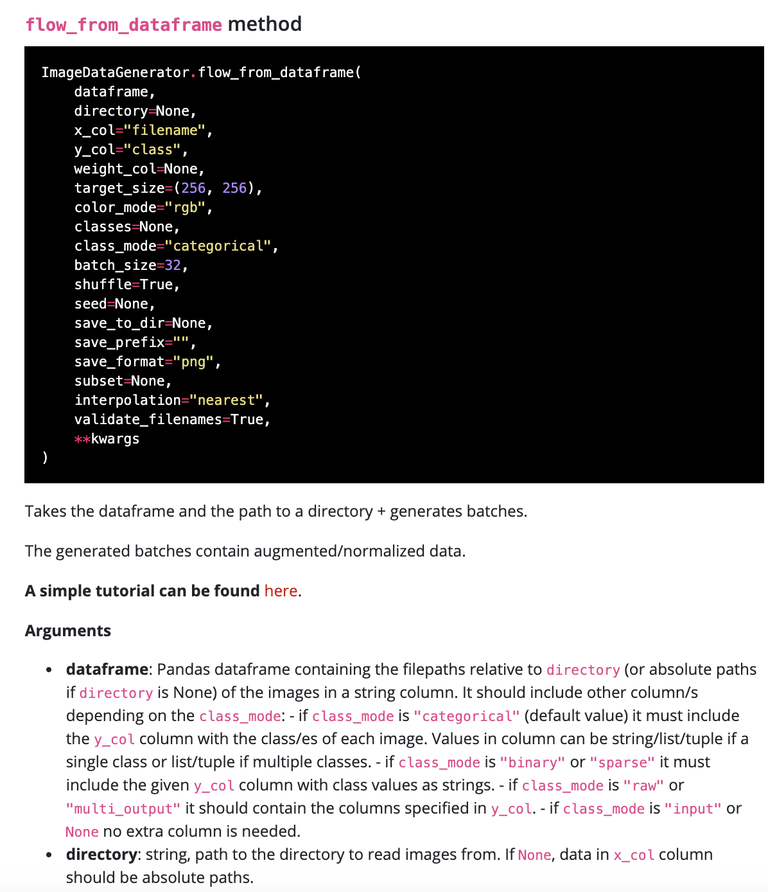
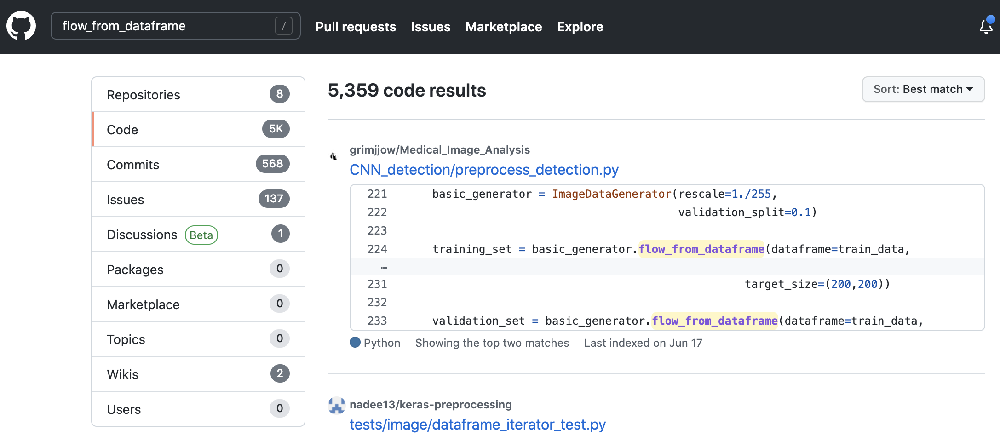

# Chapter 7

Over the past couple of chapters, we've gone through the code of what mades something "AI", but all of this content is just a small sample of the world of ML/AI in general. Though a lot of the tools you use to make these algorithms will be the same (such as scikit-learn, keras, and tensorflow), the implementations will be vastly different depending on the task. However, the general structure we set up for making deep learning models (i.e. make generators -> define model -> define callbacks -> train) does apply to a number of different deep learning based tasks. Since we don't have time to talk about everything, we'll instead talk about how to start your own projects, how to understand errors, and what to do when you encounter those errors. 

Stepping outside of the realm of concepts directly related to coding, we'll wrap up our chapter with three sections related to concepts you should consider when developing and deploying these algorithms to the real world. Concepts such as how to protect patient privacy are incredibly relevant these days, especially as medical imaging tasks require lots of data to run correctly and we need to ensure that people's information is protected in the process/they agree that their information can be used in the training of algorithms. We'll then move onto covering some caveats associated with ML in the medical sphere, including general guidelines on how to spot "AI snake oil" and preventing algorithmic bias (a concept that describes how programs can prove to be detrimental to some individuals). Lastly, we'll cover some of the things that you should report if you choose to take on AI research and deploy trained models to the real world.


### Starting your own projects 

Most of the content in this book isn't only available in the book itself. Everything I've laid out here come from a combination of code documentation, question and answer forums online, tutorials/guides written by companies doing AI work, and some of my prior classes. Needless to say, it is very hard (and arguably pointless) to actually create truly "original" code. Most of the things that you are aiming to do will exist online in some form or another; however, it is up to you to find what tools exist online and how those tools can be adapted to the problem you're trying to solve.

Take the chest-xray classification problem. If you look up online how to detect pneumonia in chest x-ray images using AI, you'll likely be directed to some research papers and the kaggle competition where the dataset lives. You could take a look through some of the competition code (will be available under the "Code" tab for most kaggle competitions); however, you may find yourself wading through a lot of poorly documented code that is fairly opaque and difficult to read. 

Instead, you could try and generalize your problem. There's arguably nothing special about the fact that our input images are chest x-rays and we want to find out if it is pneumonia or not. Rather, we could generalize and say "I want some ML/AI algorithm that can take in an image and output a classification". If you type in "ML/AI image classification tutorial keras" into google, you'll get a lot of well documented code examples and tutorials running you through exactly how to make a classifier neural network. If you add "transfer-learning" to that search query, you'll likely find mentions about VGG16 as well. It is up to you to actually determine how to a) choose the tutorial (or tutorials) that you'd like to follow and b) adapt the tutorial code to fit your purpose. Regardless, the key lesson is that generalizing your problem can lead you to find something that can be adapted to your use case. 

### Debugging

Okay, now let's say that you've found a tutorial that shows you how to use VGG16 to classify images and you start writing up the code. However, when you start running things, you start seeing messages being printed out containing the word "Error". Let's take a look at an example of what that error might look like: 

**INPUT**

```py
def make_network(network_name):
    print("making model", networkname)

make_network('vgg')
```

**OUTPUT**

```
-------------------------------------------------------------------------
NameError                                 Traceback (most recent call last)
<ipython-input-1-699ebc7cd358> in <module>()
      2     print("making model", networkname)
      3 
----> 4 make_network('vgg')

<ipython-input-1-699ebc7cd358> in make_network(network_name)
      1 def make_network(network_name):
----> 2     print("making model", networkname)
      3 
      4 make_network('vgg')

NameError: name 'networkname' is not defined
```

This message seems rather cryptic and confusion. However, let's take a look and see what this is saying. In general, the best way to read an error from python is to start at the bottom. In this case "NameError: name 'networkname' is not defined". Okay, so python seems to think that the variable 'networkname' doesn't exist (ie it is not defined). Alright, but don't we define it by passing in a value into the `make_network` method? Okay, let's look at the next line above the "NameError" line. Hm, so it seems like there is a networkname being mentioned in our print statement...but wait, it seems like `networkname` is not the same as `networkname`. It seems that we have made a typo! If we went further up the error message, we would see exactly what method calls resulted in the error happening (in this case, the call to `make_network('vgg')`). But since we know that there's an error due to a typo, we can just find our method to be the following:

```py
def make_network(network_name):
    print("making model", network_name)

make_network('vgg')
```

And everything will work as intended. 

There are also cases when it becomes very difficult if not impossible to actually interpret the error message yourself. At that point, it would be best for you to turn to google and, in particular, a website called StackOverflow. However, it does take a little bit of experimentation to get to the point that you can type your error into google and get back something sensical. Here are some general guidelines on how to format your questions: 

1. Remove all specific information. If we typed in "NameError: name 'networkname' is not defined" into google, we're probably going to get a lot of "false positive" results from stack overflow dealing with internet networks rather than neural networks. That's because we made our query too specific. The likelihood that some other programmer came up with the exact same variable naming scheme and had the exact same NameError pop up is incredibly low. Instead, if you type in "NameError: name is not defined" you might get some more results since all NameError messages will have those words in common. 
2. If you think that a library that you are using is involved, type that into your query as well. In this case, we aren't using any special libraries or calling any methods on our libraries, so it wouldn't make any sense for us to add things. But if we came across any other error after running a scikit learn function, it would be best to format your query as "General Error Message Here, scikit learn"
3. In the case that you aren't able to find anything above, you could potentially open up a new question on Stack Overflow and hope that someone takes notice to answer it. To do so, you should open up a stack overflow account and ask a question. In the question body, you should provide as much information you can about the script you are running, what you did to invoke that script/method, and any additional data you are using to help others reproduce the problem. You should also past in the exact error message that pops up. Most of the individuals on these forums want to help others, but they need question askers to do their fair part and share information as well so no one is wasting their time going back and forth to get more information. 

In the worst case scenario, you may find yourself without any help in figuring out what's going wrong. Though this situation is rare (it's more indicative of the fact that it may be difficult to word your question in a manner that would return search results), it is still something you should know how to handle. When I find myself in this situation, I have always found that re-coding the method or segment of code, using different variable names, and only going one segment at a time is incredibly beneficial. It forces you to take a step back and examine everything line by line. 

There are also some more insidious errors that can arise, such as those when training or evaluating ML algorithms. For example, when I  wrote the code to evaluate SmallNet and VGG16, I kept on getting accuracies and AUCs that were very far off from the validation AUC/accuracy of the last epoch of the network (validation AUC 0.97 vs final AUC of 0.54). My stack overflow queries included the following: 

* "AUC calculation sklearn vs Keras"
* "Keras validation AUC different from sklearn AUC"
* "Test Generator AUC Keras far off from validation"

It was that last query that clued me into the real solution to the problem. But my first two queries were motivated by the initial thought that the AUC that keras calculates in the Callback metrics was using a different algorithm than the AUC calculated by scikit-learn called in our evaluation method. While those searches did yield some information that indicated that Keras and scikit implement AUC calculations differently, I didn't see something that explain the very large difference in AUCs I was noticing. I then saw that the evaluation code I was using was using the test generator and decided to look into whether a generator shuffles data. That could contribute to how our AUC droppped to 0.54 (which is the equivalent of randomly guessing). The running hypothesiss is that when I pass in the test generator and call the model.predict method, the test generator may shuffle values and then, when I get the actual class names, I would be getting the newly shuffled classnames rather than the original ones associated with the images I wanted to predict. Sure enough, I came across a stack overflow answer that said "Make sure you set shuffle=False on your generator". It turns out that generators have a `shuffle=True` parameter enabled by default and I forgot to set `shuffle=False` on the test set in the code. Once I did that, the evaluation results matched with the validation results! 

That was an example of a logical error. It is an error that may not yield any actual errors, but produces unexpected results. The best way to deal with those errors is to start out with the most likely hypotheses and start to go down into more and more specific ones. Again, re-implementing your code may help here, but also going through the documentation for all the methods you call can be very useful. 

Speaking of going through the documentation, here's an example of what you could expect to see. 


> From: https://keras.io/api/preprocessing/image/#flowfromdataframe-method 

Here, you can see an example of how to call this method and the list of default arguments (any arguments that have an `keyword=value` pair listed). If you don't manually specify a new value for those default arguments, the program will assume you want to use the defaults. Following the code, there will be a short description of the method followed by the list of arguments with associated descriptions. If you're lucky, you may find that some library authors go so far as to give you example code that uses the method itself.

In the case that documentation for a library is minimal, chances are that some other people might have used the library before. You can leverage the power of Github, a website that hosts open sourced code, to search through people's prior usage of that code. Just type in a method name into the search bar and click the "Code" tab of results. Any publicly available code that contains that phrase will show up in the code results and you can see how they actually use it. In this case, we see that querying for `flow_from_dataframe` on github turns up a result that has code associated with a repository (aka a project) titled `Medical_Image_Analysis` which could lead us to look at their code a bit more for inspiration.



You can also attempt to copy code if you are really stuck, but only do so if you truly understand what is going on. Also, if you are going to take some code from github, visit the repository first and check out a file called "LICENSE.txt". That will outline exactly what you can do with that code and what rights you have to reproduce it (if any). 

Now that we've spent some time in the weeds figuring out how to make projects on our own and learning how to debug, let's start to consider the implications of AI and subjects that must be considered while making AI based solutions in medicine.

## Considerations

This is by no means a comprehensive list of considerations one should take whenever determining whether or not to pursue an AI based project; however, it touches on some of the most pressing topics in the AI sphere right now.

### Patient Privacy

When we talk about patient privacy in the medical context, the number one concept that comes to mind is HIPAA. Though it may not apply to all use cases, the guidelines that HIPAA advocates for in terms of security and data anonymization still should apply to any projects taking on the medical applications of AI. Above all, patient privacy protections should be put into place to not only ensure that AI developers do not leak data to the outside world but also to ensure that the algorithm does not learn on private patient data that would render it useless in the real world. 

What exact protections should be put in place to ensure patient privacy? First, any identifying imaging information should be stripped from imaging headers. For example, by default DICOM files will record information about the patient identifier number, the patients age, date of birth, and weight unless configured otherwise. Data used to train neural networks will often reside on someone's computer or server, non-anonymized DICOM headers could prove to be very useful to any malicious actors who want to access data. In addition to scrubbing information from DICOM headers and other relevant clinical files, the servers and hard disks that this data resides on should be encrypted and password protected with a tightly controlled access list.

In terms of training an algorithm, it is entirely possible that the algorithm itself can actually "leak" information to the outside world just through regular use. Some machine learning algorithms, such as natural language processing algorithms (NLP), generate "new" data as its output. E.g. NLP algorithms can be used to do text generation (e.g. generate medical notes); however, NLP algorithms that are overfit to their training data could just be [leaking some bits of that training data](https://arxiv.org/pdf/2004.00053.pdf) which can be used to identify individuals. Carefully choosing what algorithms to train and making sure that information is not being overfit can prove to be useful in combatting this issue.

Speaking of areas where the ML algorithm produces counter-intuitive results, let's talk about algorithmic bias.

### Algorithmic Bias

Algorithmic bias refers to the idea that AI algorithms (and other procedural algorithms) can produce biased results. Particularly in the context of race and social inequality, algorithmic bias is a major concern while training medically relevant machine learning algorithms today. To see why this may be an issue, consider the situation where we may be training a classifier to detect melanomas on skin. 

To train our network, we may turn to popular online imaging repositories of moles. We download this repository of images, create a classifier just as we did for the pneumonia dataset, and then evaluate its accuracy. It turns out to be over 90% accurate which is great. We then take this trained algorithm to our hospital system/dermatologists and ask them to use it and they end up reporting that the algorithm produces predictions on melanoma status that agree with the dermatologist...but only for individuals with lighter skin. When the patient had darker skin, the algorithm completely failed to produce valid results. We might try to find reasons why this may be. Perhaps the lighting was bad, but that seems to be unlikely. Then we turn to the original dataset and find that the vast majority of images were taken on light skinned individuals. We have, perhaps unintentionally, made a biased algorithm. The bias arose from the fact that the training data was not representative of the true patient population and our network, accordingly, learned that bias in its training process. 

To help combat bias, we should try to stratify the evaluation of our algorithms across a vareity of demographics in our ultimate patient population. In this situation, we can use the Fitzpatrick skin type scale to assign each patient a skin tone (I = lightest, VI = darkest) and evaluate the accuracy of classification for each category. From there, we can use a cochran armitage trend test (or any other statistical test of your choice) to determine if there is a significant trend (e.g. accuracy goes down as category number increases) or not.

This situation isn't just theoretical, this is an issue that is playing out in the real world right now. Google rolled out an application called "Derm Assist" in March of 2021. The results of it have yet to be seen; however, researchers are already raising concerns about its ability to work in individuals who have darker skin tones since the images used to train the dataset only have (as far as we know) 2.7% type V skin tones and < 1% type VI skin tones. While we don't know the ultimate efficacy of this predictive application, we can think of some ways to prevent algorithmic bias from affecting end users.

The first way is to prevent bias in our datasets from happening in the first place. To do this, we need to be mindful about what policies may cause someone to contribute to the dataset vs not contribute. E.g. if data used to train the algorithm is volunteered, we should make sure that volunteers are all able to contribute data without barriers in their way (e.g. lack of technology, lack of time, etc). We could also make sure to get our data from several different hospital systems rather than a single hospital since some hospitals may be located in areas that are not socioeconomically or racially diverse. 

The second way to prevent bias is to selectively augment under-represented cases in our dataset. While the programmatic way to do this is beyond the scope of this chapter, there are several image augmentation libraries out there (such as `imgaug`) that will allow you to specify how often some image should be augmented based on its characteristics. If we find that a particular group is under-represented in our dataset, we could use this method to increase its representation in the dataset overall.

The last way to prevent bias is to make sure that evaluation is done on an entirely separate hold out set rather than a testing set that was part of the same data you used originally. Though this is more time consuming (as you'll need to find multiple datasets), it should validate the performance of your algorithm on a set of patients it was never actually trained on, potentially exposing shortcomings in your algorithm in general. If you do not have access to another dataset, you could create a limited roll-out of your algorithm and monitor results across demographic subgroups to determine how it is operating before launching it to the general public.  

Now that we've covered algorithmic bias and how it could produce unexpected results, let's talk about how AI based solutions can overpromise yet under-deliver in the real world.

### Snake Oil + Creating Trust in the Real World

One of the upsides and downsides of AI is the fact that there is a lot of funding associated with solutions that employ AI, especially in the medical field. However, nefarious actors have started to claim that their technology uses "AI" when it really doesn't or they even go so far as to tout an AI solution to a problem that has a well known algorithmic solution already. Unfortunately, some hospital administrators have fallen prey to these claims and end up wasting millions of dollars. 

In general, these snake-oil claims operate on the "hype" associated with AI in the past few years. News cycles that are taken up by algorithms that can do things like reverse image searching, and facial recognition can easily lead the public to think that AI is already tackling "hard" problems and can be easily extended to do medical diagnosis at the level of a physician. While AI systems are actually exceeding the accuracy of some physicians, they only tend to do so in very specific subtasks (such as pneumonia detection on X-ray images). 

But how do we actually predict snake oil claims? We can go back to the earlier parts of this section: generalizing the problem. Let's take a popular AI problem that is believed to be bordering on snake-oil (with a slight medical twist): predicting physician job success prior to a physician being hired. What would the inputs and outputs be to our training algorithm? The inputs would probably be various characteristics of current providers at the time they were hired and the outputs would be their job success (perhaps measured in terms of % salary increase after a set period of time). It is possible that an algorithm could have been trained to predict this with high accuracy, but where would the data be coming from? It would likely be coming from a few healthcare systems, or, perhaps more likely, the developer company itself. At that point, we need to ask questions about the validity of the algorithm in our use case (as covered in the algorithmic bias section). Furthermore, we need to realize the network will only predict "accurate" outcomes for individuals who were actually hired by company/healthcare system and thus, it may not perform well at other healthcare systems/companies that have different valued skills among providers.

In order to generate trust in the real world, it is necessary to try and explain as much about the AI process as possible. Concepts such as the general ML task used for the task, the data used to train the algorithm, and its evaluation statistics are all essential to report. Wherever possible, model outputs should be explained to some extent (just as we showed in our GradCAM results from the previous chapter). The last point is especially valued in the medical world since AI still tends to be treated as "black box" that has no degree explainability. 

Speaking of explaining: Let's talk about how to talk about AI in general when you're in the situation of leading an AI based project in your healthcare system.

### How to talk about AI

In some cases, you may find yourself in the position where you are either directly implementing an AI algorithm or are in charge of doing telling others what the aims of the project are. When working with programmers, it is important to be as explicit as possible. Let's walk through an example of how to specify a problem: our chest x-ray classification problem from last chapter. If we're explaining what we want to do to a programmer, these are the questions we'll need to have answers to: 

* What is the goal of this project? 

> To predict pneumonia status from chest x-ray images.

* What is the input and output for this AI? Do you have any suggestions for a potential architecture?

> The input will be chest x-ray images and the output should be a single world "NORMAL" or "PNEUMONIA" with a confidence level attached to it. It would also be nice to show exactly what parts of the image contributed the most to the ultimate classification decision. Since this is an image classification problem, it is probably best to use a convolutional neural network or something similar that is good at classifying images.

* What data will be used to train this network? How can I download it? What is its general format? Is this data already labelled? Can I trust the labels?

> We will be using the Kaggle chest-xrays dataset. These can be downloaded from the kaggle competition website (send them a link). The images are .jpg files and do not need any additional processing before they can be used as inputs to a neural network (if they were DICOM images, you should specify that here). They are already labeled as normal vs pneumonia and images are already in folders labeled with the appropriate class. The labels can be trusted in most cases, but it is likely that we need to get another physician to look at the test data and make sure that it is accurate. 

* What metric do we want to optimize? 

> We want to optimize accuracy, but also want to make sure that we have very minimal false negatives (i.e. we want a very high sensitivity) since it would be deletorious to miss a pneumonia case.

* Where will this network actually be run? Who is the person I can contact to get it to run in that setting? What are the constraints of that platform?

> Ideally, we would like to have this network integrated into our PACS system so it can give us predictions instantly without us needing to execute a separate script. Person X can tell you what you need to do to get your outputs into a format that can be understandable. (Note this wasn't covered in the last chapter; however, this is also a major pain point for developers since not everyone is going to be running colab notebooks to get outputs from your network. In some cases, PACS systems may not allow separate scripts to be executed, which makes the programmer's job difficult. In this situation, it may be best to compromise by saying that you'd be willing to train physicians how to use any custom piece of software the developer makes).

* Will you need this network to continue to be trained? How will you identify which new training samples to add?

> Yes, we would like this network to continue to be trained. Ideally, any application with this model should flag results where the model does not agree with the physician and use that case as a training sample. (Note, we didn't cover this explicitly in the last chapter, but you can continue to train a network on a different dataset as well, you just need a new train generator made). 

Once you answer these questions, you should be able to get to the point that you can specify exactly what you need from a developer who is working on your project. Much of the development pain points that come up in the programming process usually are due to misunderstood expectations and being explicitly clear about these solutions can lead you to the point that you can provide your developer with enough information to do their task.

## Wrap up

As we've seen in this chapter and the prior chapters, AI is not really magic and we can understand how these programs learn and produce the results that they do. While this book didn't touch much on the potentials of AI in general, the concepts covered in programming/computer science topics, some basic ML algorithm types, and implementation details for ML algorithms and simple/more complicated convolutional neural networks will provide enough of a basis for you to start exploring on your own. Even with the two major projects covered in this book, a whole world of medical research is open to you. With SciKit-Learn and PyCaret, you can evaluate a different dataset and try and optimize a classification task. With Tensorflow and Keras, you can use transfer learning to run image classification on a disease that has not been covered in medical imaging literature yet. With the skills established in the last chapter, you'll also be ahead of your peers and know what to look out for when evaluating AI solutions that are presented to you. You even have some basic examples of what answers to have prepared when taking on an AI based project yourself. 

Overall, this book is meant to serve as a seed for further knowledge growth, and I hope that you can continue learning how to use some of the AI based algorithms to benefit patients in the medical setting.
